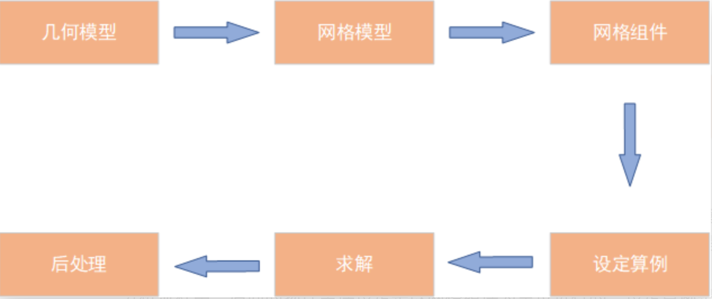

# 三、仿真流程

基于CAE分析的标准流程，FastCAE规定了一套完整的CAE仿真分析流程，如下图所示。基于FastCAE开发的CAE软件在操作流程也需要遵循这个基本分析流程。



其中，几何模型可以通过几何建模与标准文件导入的形式获取；网格模型则是对几何模型进行网格剖分得到，也可以通过导入网格文件的形式获取。网格组件指的是网格模型的一部分，可以在FastCAE中通过交互的方式创建组件，在网格文件导入时也可以生成相应的组件，分析流程中，后面的物理条件设定是以网格组件为单位进行的。设定算例是指创建算例并设定相应的参数，包括物理条件与其他控制参数等。求解的过程是调用相应的求解器进行求解的过程，求解器的求解过程中产生中间文件与结果文件，后处理就是对结果文件进行可视化渲染的过程，后处理过程可以输出图片和动画。

下面将根据这个基本流程对软件的具体功能进行介绍。

fastcae支持的格式：

​	几何模型格式：包括*.stp，*.step，*.igs，*.iges，*.brep五种格式

​	网格格式：包括：**key、su2、cgns、msh、neu、vtk、stl、inp(Abaqus)**和**dat(Tecplot)**几种格式，其中**neu**只支持三角形和四边形网格。网格导出功能支持**neu**和**vtk**两种格式。