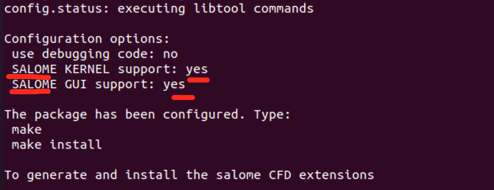

# Code_saturne 安装并集成到salome


> 系统：ubuntu 20.04
>
> 前提：想要把code_saturne集成到salome，需要先安装code_saturne，在安装salome，在安装code_saturn_extensions进行整合。

## 1.codesaturne安装


官网：https://www.code-saturne.org/cms/web/

github：https://github.com/code-saturne/code_saturne

> 此处我们选用`v7.0`版本，直接下载源码tgz包和git clone都可以，此处我们使用git clone方式

```shell
cd ~
mkdir salome
cd salome
# 下载代码
git clone https://github.com/code-saturne/code_saturne.git
cd code_saturne
# 切换7.0版本
git checkout v7.0
# 预先执行一些准备工作
./sbin/bootstrap
```


出现如上错误，是因为缺少依赖包，安装一下即可：

```
sudo apt-get install automake autoconf libtool
# 重新执行
./sbin/bootstrap
```


> 注意：我们在安装之前先去看一下官网的前置条件：https://www.code-saturne.org/cms/web/download/prerequisites
>
> `唯一需要的强制性先决条件是 C/C++/Fortran 编译器（例如 GNU 编译器集合）和 Python 解释器。`
>
> ```
> # gcc已经有了，下边安装下Fortran
> sudo apt-get install gfortran
> ```
>
> **安装完后，会存在/usr/bin/f95命令，该命令后续需要使用**

> Pyqt5：根据官网还需要安装python3和pyqt5工具包的支持，注意ubuntu20.04默认安装了3.8.10版本的python，所以可以省略，直接安装pyqt5即可。
>
> 注意：pyqt5不能使用pip3命令安装，如果安装了容器跟绑定python的命令产生冲突，因为pip3是和python3绑定的，如果同时存在python2，那么可能还有一个pip和python2绑定，那么平时使用的/usr/bin/python命令就可能会在python2和python3之间切换，就可能导致通过pip3安装的pyqt5在使用python2时出问题，因为pip并没有安装过pyqt5.
>
> ```
> # 这样安装就没问题了
> sudo apt-get install python3-pyqt5
> ```
>
> 
>
> **`注意：经过测试apt安装pyqt5有些问题需要使用如下操作：`** **[后续会纠正此处，不应该使用pip3安装pyqt5，但安装pyqt5-dev-tools是没问题的]**
>
> `pip3 install PyQt5`
> `sudo apt-get install pyqt5-dev-tools`
>
> 
>
> 当然了，如果要基于pyqt5设计界面，还需要安装：**qt designer**
>
> ```
> sudo apt-get install qt5-default qttools5-dev-tools
> 
> #安装完后，命令行输入：designer就可以进行界面设计了
> ```
>
> `注意：`ui设计完保存后是.ui的文件，那么想看python代码的话，可以进行转换，即ui转python代码：
>
> ```
> # ui文件转为python代码：在designer中设计完界面后,保存为demo.ui. 在命令行使用
> pyuic5 -o demo.py demo.ui
> # 就可以自动将ui转为python代码了
> ```

> Mpich：除了以上工具包，还需要mpich工具包，其中的/usr/bin/mpicc命令有用。
>
> ```
> sudo apt-get install mpich
> ```

> cmack：这个是后边安装时遇到问题才知道
>
> ```
> sudo apt-get install cmake
> ```
>
> 

> 执行安装脚本：在code_saturne目录执行如下命令，当然这里我认为不指定python3.8也是没问题了，即直接执行./install_saturne.py
>
> ```
> python3.8 install_saturne.py
> ```
>
> 
>
> 从图中可知，我们需要执行三条命令，创建目录->进入目录->执行脚本
>
> ```
> mkdir /home/parallels/salome/code_saturne_build
> cd /home/parallels/salome/code_saturne_build
> /home/parallels/salome/code_saturne/install_saturne.py
> ```
>
> 
>
> 此时的信息时，已经生成了配置，需要进行一定的配置然后重新执行安装命令
>
> ```
> #========================================================
> # Setup file for Code_Saturne installation
> #========================================================
> #
> #--------------------------------------------------------
> # Download packages ?
> #--------------------------------------------------------
> download  yes
> #
> #--------------------------------------------------------
> # Install Code_Saturne with debugging symbols
> #--------------------------------------------------------
> debug     no
> #
> #--------------------------------------------------------
> # Installation directory
> #--------------------------------------------------------
> prefix    /home/parallels/Code_Saturne/7.0.5-patch
> #
> #--------------------------------------------------------
> # Optional architecture Name (installation subdirectory)
> #--------------------------------------------------------
> use_arch  no
> arch      Linux_x86_64
> #
> #--------------------------------------------------------
> # C compiler and optional MPI wrapper
> #--------------------------------------------------------
> compC     /usr/bin/cc
> mpiCompC  /usr/bin/mpicc
> #
> #--------------------------------------------------------
> # Fortran compiler
> #--------------------------------------------------------
> compF    /usr/bin/f95
> #
> #--------------------------------------------------------
> # C++ compiler and MPI wrapper for optional packages
> #
> # Required only for static builds using the MED library
> # or for build of optional modules such as MEDCoupling
> # support.
> #--------------------------------------------------------
> compCxx     /usr/bin/c++
> mpiCompCxx  /usr/bin/mpicxx
> #
> #--------------------------------------------------------
> # Python interpreter.
> #--------------------------------------------------------
> python    /usr/bin/python3
> #
> #--------------------------------------------------------
> # Disable the Graphical user Interface ?
> #--------------------------------------------------------
> disable_gui  no
> #
> #--------------------------------------------------------
> # Disable frontend (also disables GUI) ?
> # May be useful for debug builds and HPC cluster builds
> # installed side-by side with a full build.
> #--------------------------------------------------------
> disable_frontend  no
> #
> #--------------------------------------------------------
> # Optional SALOME platform install path.
> #
> # This is the path for the main SALOME directory,
> # not the application directory.
> #
> # If Code_Saturne is built with SALOME support,
> # running "code_saturne salome" will launch the
> # associated application, containing the CFDSTUDY module.
> #--------------------------------------------------------
> salome    no
> #
> #--------------------------------------------------------
> # Optional packages:
> # ------------------
> #
> # MED / HDF5  For MED file format support
> #             (used by SALOME and by Gmsh).
> #
> # CGNS / HDF5 For CGNS file support
> #             (used by many meshing tools).
> #
> # Scotch (includes PT-Scotch) for parallel partitioning.
> #
> #   For Linux workstations, HDF5, CGNS, and even MED
> # packages may be available through the package manager.
> # HDF5 is also often available on large systems.
> # When building with SALOME, the platform distribution's
> # packages may be used, by setting in the matching entry
> # 'yes' under the "Use" column and simply 'salome' under
> # the path column.
> #
> # Scotch and Pt-Scotch are available in some Linux
> # distributions, but may be built with options
> # incompatible with non-threaded Code_Saturne runs.
> #
> #   To install CGNS the CMake
> # configuration/installation tool is required
> # (it is available in most Linux distributions).
> #--------------------------------------------------------
> #
> #  Name    Use   Install  Path
> #
> hdf5       no    no       None
> cgns       no    no       None
> med        no    no       None
> scotch     no    no       None
> permitis   no    no       None
> #
> #========================================================
> ```
>
> 其中我们有几个需要关注的配置：
>
> `compC     /usr/bin/cc`
>
> `compF    /usr/bin/f95`
>
> `compCxx     /usr/bin/c++`
>
> `mpiCompCxx  /usr/bin/mpicxx`
>
> `python    /usr/bin/python3`
>
> 以上4个配置，是因为我们已经安装了对应的依赖包，所以会自动把对应的path生成出来，如果有缺失记得自行安装对应的依赖包。
>
> 
>
> **以下几个配置是我们要修改的：**其中后边的None不配置会在安装时自动生成，避免我们指定反而出问题
>
> salome    `yes`
>
> hdf5       `yes`    `yes`       None
> cgns       `yes`    `yes`       None
> med        `yes`    `yes`       None
> scotch     `yes`    `yes`       None
>
> permitis   `yes`    `yes`       None    `## 注意此属性从官方下载的tar包中有，但是github 7.0分支的源码中没有，注意一下。`
>
> `注意：salome  yes 表示code_saturne要集成到salome中使用，但是如果安装时报错了，就先把他改成no`

> `重新执行安装：`
>
> 
>
> 出现这个错误，则需要将salome yes改回salome no
>
> 
>
> 以上问题是由于国外网站下载不稳导致下载失败，没什么好解决方法：1.翻墙 2.还是翻墙
>
> -> 本人通过翻墙机器离线下载后，本地提供http服务(mac自带apache服务器，直接sudo apachectl start即可启动，将文件放入/Library/WebServer/Documents目录即可通过127.0.0.1/文件名下载，注意Documents目录要授权777才可以)，然后修改install_saturne.py中的下载地址，此处要下载的包是最后我们配置yes的四个工具包：
>
> `hdf5、cgns、med、scotch`
>
> 
>
> **修改配置文件如下**：vi ~/code_saturne/install_saturne.py
>
> ```
> 				# HDF5 library
> 
>      self.packages['hdf5'] = \
>          Package(name="HDF5",
>                  description="Hierarchical Data Format",
>                  package="hdf5",
>                  version="1.10.6",
>                  archive="hdf5-1.10.6.tar.gz",
>                  url="http://10.150.60.22/ftp/HDF5/releases/hdf5-1.10/hdf5-1.10.6/src/hdf5-1.10.6.tar.gz")
> 
>      p = self.packages['hdf5']
>      p.config_opts = "--enable-build-mode=production"
> 
>      # CGNS library
> 
>      self.packages['cgns'] = \
>          Package(name="CGNS",
>                  description="CFD General Notation System",
>                  package="cgns",
>                  version="4.1.2",
>                  archive="CGNS-4.1.2.tar.gz",
>                  url="http://10.150.60.22/CGNS/CGNS/archive/v4.1.2.tar.gz")
> 
>      p = self.packages['cgns']
>      p.config_opts = "-DCGNS_ENABLE_64BIT=ON -DCGNS_ENABLE_SCOPING=ON"
> 
>      # MED library
> 
>      self.packages['med'] = \
>          Package(name="MED",
>                  description="Model for Exchange of Data",
>                  package="med",
>                  version="4.1.0",
>                  archive="med-4.1.0.tar.gz",
>                  url="http://10.150.60.22/Salome/other/med-4.1.0.tar.gz")
> 
>      p = self.packages['med']
>      p.config_opts = "--with-med_int=long --disable-fortran --disable-python"
> 
>      # ParMETIS
> 
>      self.packages['parmetis'] = \
>          Package(name="parmetis",
>                  description="ParMETIS",
>                  package="parmetis",
>                  version="4.0.3",
>                  archive="parmetis-4.0.3.tar.gz",
>                  url="http://10.150.60.22/gkhome/fetch/sw/parmetis/parmetis-4.0.3.tar.gz")
> 
>      # SCOTCH
> 
>      self.packages['scotch'] = \
>          Package(name="scotch",
>                  description="PT-Scotch",
>                  package="scotch",
>                  version="6.1.0",
>                  archive="scotch_6.1.0.tar.gz",
>                  url="http://10.150.60.22/scotch/scotch/-/archive/v6.1.0/scotch_6.1.0.tar.gz")
> 
> ```
>
> `注意：`url的修改只是改了http+ip部分，中间的目录结构没有边，因为如果改变了，安装时会有问题，脚本会根据中间目录生成一些目录，所以不能改，比如不能改成http://10.150.60.22/scotch_6.1.0.tar.gz，改成这样就会安装失败。
>
> 
>
> `Bug:注意如果提示找不到hdf5库，多半是因为python命令的问题，保障当前python=python3，并且安装了python2，同时python3的pip3也安装了即可。`


### 问题：pyqt5

前边我们说过通过apt install安装pyqt5会比较好，但是却出现找不到的问题，所以此时我们通过`pip3 install PyQt5`来安装。

安装之前我们可以通过`/usr/bin/python -m pip install --upgrade pip`来对pip版本进行升级，因为python默认使用的是python3，所以pip也是指的pip3。

=>安装完pyqt5后再次执行：install_saturne.py


我们继续安装：

```
sudo apt-get install pyqt5-dev-tools
```


### 权限问题

因为我们全程都是在当前用户目录下~做的操作，而过程中有些文件可能被赋予了root权限，所以在操作前我们先将当前用户目录的所有权重置一下

```
chown -R parallels:parallels /home/parallels
```


### 一个细节

最后安装完成后setup配置文件中我们让其自动安装的模块的path会自动赋值，如下：


### 路径别名配置


接下来根据图中提示，我们可以配一下环境变量，方便我们使用，打开~/.bashrc，将配置添加进去即可，最后通过source ~/.bashrc即可。

```
vi ~/.bashrc

# 添加如下配置
cspath=/home/parallels/Code_Saturne/7.0.5/code_saturne-7.0.5/arch/Linux_x86_64/bin
alias code_saturne="$cspath/code_saturne"

# 加载配置
source ~/.bashrc

# 可以通过命令查看参数
code_saturne
```


最后我们启动gui图形界面：

```
code_saturne gui
```


## 2.salome安装


下载地址：https://www.salome-platform.org/?page_id=15

我们这里使用9.8版本：https://files.salome-platform.org/Salome/Salome9.8.0/SALOME-9.8.0-native-UB20.04-SRC.tar.gz

```
cd ~/salome
wget https://files.salome-platform.org/Salome/Salome9.8.0/SALOME-9.8.0-native-UB20.04-SRC.tar.gz
tar -zxvf SALOME-9.8.0-native-UB20.04-SRC.tar.gz
cd SALOME-9.8.0-native-UB20.04-SRC
# 查看文档
vi README
```


`执行检测脚本：`

```
./sat config SALOME-9.8.0-native --check_system
```

需要安装的包如下：

```
Check the system dependencies declared in the application
   - python3-pil : OK
   - python3-pyqt5 : OK
   - pyqt5-dev : OK
   - pyqt5-dev-tools : OK
   - python3-certifi : OK
   - python3-chardet : OK
   - python3-click : OK
   - cmake : OK
   - python3-dateutil : OK
   - libfreetype6 : OK
   - python3-idna : OK
   - libxml2 : OK
   - python3-markupsafe : OK
   - libglu1-mesa-dev : OK
   - readline-common : OK
   - python3-tz : OK
   - python3-requests : OK
   - libbsd0 : OK
   - libbz2-1.0 : OK
   - libc6 : OK
   - libdrm2 : OK
   - libegl1 : OK
   - libexif12 : OK
   - libexpat1 : OK
   - libfontconfig1 : OK
   - libgl1 : OK
   - libglu1-mesa : OK
   - libgomp1 : OK
   - libgphoto2-6 : OK
   - libice6 : OK
   - libjbig0 : OK
   - libjsoncpp1 : OK
   - libltdl7 : OK
   - liblzma5 : OK
   - libnuma1 : OK
   - libpcre3 : OK
   - libquadmath0 : OK
   - libraw1394-11 : OK
   - libsm6 : OK
   - libstdc++6 : OK
   - libtiff5 : OK
   - libudev1 : OK
   - libusb-1.0-0 : OK
   - libuuid1 : OK
   - libx11-6 : OK
   - libx11-xcb1 : OK
   - libxau6 : OK
   - libxcb1 : OK
   - libxcb-glx0 : OK
   - libxcb-xfixes0 : OK
   - libxcb-xkb1 : OK
   - libxdmcp6 : OK
   - libxext6 : OK
   - libxft2 : OK
   - libxi6 : OK
   - libxkbcommon0 : OK
   - libxkbcommon-x11-0 : OK
   - libxmu6 : OK
   - libxpm4 : OK
   - libxrender1 : OK
   - libxss1 : OK
   - libxt6 : OK
   - zlib1g : OK
   - libsqlite3 : OK
   - libwebp6 : OK
   - libgfortran5 : OK
   - libevent-2.1-7 : OK
   - libpng16-16 : OK
   - libgcc-9-dev : OK
   - libffi7 : OK
   - libtinfo6 : OK
   - libgphoto2-port12 : OK
   - libglx0 : OK
   - libopengl0 : OK
   - libzstd1 : OK
   - libglvnd0 : OK
   - gcc : OK
   - make : OK
   - sed : OK
   - g++ : OK
   - libexpat1-dev : OK
   - libglu1-mesa-dev : OK
   - perl : OK
   - bzip2 : OK
   - automake : OK
   - libtool : OK
   - cmake : OK
   - qttools5-dev : OK
   - python3-sip : OK
   - python3-six : OK
   - python3-urllib3 : OK
```

未安装的包如下：生成命令脚本：

```
sudo apt install -y python3-babel
sudo apt install -y python3-pytest-cython
sudo apt install -y python3-jinja2
sudo apt install -y python3-pygments
sudo apt install -y python3-sphinx
sudo apt install -y python3-alabaster
sudo apt install -y libboost-all-dev
sudo apt install -y libcminpack1
sudo apt install -y libcminpack-dev
sudo apt install -y libcppunit-dev
sudo apt install -y python3-cycler
sudo apt install -y python3-docutils
sudo apt install -y doxygen
sudo apt install -y libeigen3-dev
sudo apt install -y fftw
sudo apt install -y fftw-dev
sudo apt install -y libfreeimage3
sudo apt install -y libfreeimage-dev
sudo apt install -y libfreetype6-dev
sudo apt install -y graphviz
sudo apt install -y libgraphviz-dev
sudo apt install -y python3-imagesize
sudo apt install -y python3-kiwisolver
sudo apt install -y liblapack3
sudo apt install -y liblapack-dev
sudo apt install -y libxml2-dev
sudo apt install -y clang
sudo apt install -y llvm-dev
sudo apt install -y python3-matplotlib
sudo apt install -y mesa-common-dev
sudo apt install -y libmetis5
sudo apt install -y libmetis-dev
sudo apt install -y python3-numpy
sudo apt install -y python3-packaging
sudo apt install -y python3-pandas
sudo apt install -y python3-psutil
sudo apt install -y python3-pyparsing
sudo apt install -y libqwt-qt5-6
sudo apt install -y libqwt-qt5-dev
sudo apt install -y libdc1394-22
sudo apt install -y libfftw3-double3
sudo apt install -y libncurses5
sudo apt install -y libopenexr24
sudo apt install -y libilmbase24
sudo apt install -y libssl-dev
sudo apt install -y libfontconfig1-dev
sudo apt install -y flex
sudo apt install -y bison
sudo apt install -y libxcb-dri2-0-dev
sudo apt install -y libxkbcommon-dev
sudo apt install -y libxkbcommon-x11-dev
sudo apt install -y libxi-dev
sudo apt install -y libxt-dev
sudo apt install -y libxmu-dev
sudo apt install -y libxpm-dev
sudo apt install -y libxft-dev
sudo apt install -y libjpeg-dev
sudo apt install -y libicu-dev
sudo apt install -y libopenmpi-dev
sudo apt install -y libreadline-dev
sudo apt install -y libhwloc-dev
sudo apt install -y libsqlite3-dev
sudo apt install -y libtbb-dev
sudo apt install -y cython3
sudo apt install -y libfftw3-dev
sudo apt install -y libopenblas-dev
sudo apt install -y libqt5svg5-dev
sudo apt install -y libqt5x11extras5-dev
sudo apt install -y qtxmlpatterns5-dev-tools
sudo apt install -y python3-scipy
sudo apt install -y libscotch-dev
sudo apt install -y python3-sip-dev
sudo apt install -y python3-stemmer
sudo apt install -y python3-sphinx-rtd-theme
sudo apt install -y python3-sphinxcontrib.websupport
sudo apt install -y sphinx-intl
sudo apt install -y python3-statsmodels
sudo apt install -y python3-statsmodels
sudo apt install -y swig
sudo apt install -y libtbb2
sudo apt install -y libtbb-dev
sudo apt install -y libtcl
sudo apt install -y tcl-dev
sudo apt install -y libtk
sudo apt install -y tk-dev
```

安装完成后再次检测：


检查没问题后，我们开始安装salome：

```
# 他的功能就是将二进制文件拷贝到当前目录下的INSTALL目录
./install_bin.sh
```


Ok,此时我们可以启动salome了

```
./salome
```


### 错误BUG：

当退出程序后，提示如下错误：

```
Traceback (most recent call last):
  File "/home/parallels/salome/SALOME-9.8.0-native-UB20.04-SRC/BINARIES-UB20.04/GUI/lib/python3.8/site-packages/salome/salome_pluginsmanager.py", line 94, in <module>
    import SalomePyQt
ImportError: /lib/x86_64-linux-gnu/libQt5Core.so.5: version `Qt_5.15' not found (required by /home/parallels/.local/lib/python3.8/site-packages/PyQt5/QtCore.abi3.so)
```

> 分析：看上去应该是当前正用的pyqt5要使用的Qt_5.15没有找到，经过网上搜索，发现是pyqt5安装冲突
>
> 根据错误信息是QtWidgets.abi3.so对应的依赖libQt5Core.so.5没有Qt_5.15版本，去目录下查看
>
> ```
> cd /home/parallels/.local/lib/python3.8/site-packages/PyQt5/
> ll | grep QtWidgets.abi3.so
> 
> -rw-rw-r--   1 adt adt 7534736 1月   6 10:51 QtWidgets.abi3.so
> ```
>
> 发现python的环境下是有QtWidgets.abi3.so，接着我们去寻找libQt5Core.so.5
>
> ```
> cd /lib/x86_64-linux-gnu/
> ll | grep libQt5Core.so
> ```
>
> 
>
> 发现这里libQt5Core.so无外乎都是5.12版本，肯定是和环境中现在的pyqt版本不一致，不知为何，新安装的qt并没对应的libQt5Core.so
>
> 查看已经安装的pyqt版本：
>
> 
>
> `注意：冲突的原因可能跟我最初通过apt install安装有关系`

解决方法：`【此问题暂未解决】`

```
pip uninstall pyqt5
pip install pyqt5==5.13.0
卸载和这个版本冲突的依赖
pip uninstall pyqt5-sip

pip install pyqt5-sip==12.11.0

pip uninstall pyqt5-plugins
运行程序后报错，说未包含QtWebEngine，安装PyQtWebEngine对应的版本
pip install PyQtWebEngine==5.13.0
```


## 3.整合code_saturne到salome：code_saturne_extensions


官方地址：https://github.com/code-saturne/salome_cfd_extensions

首先下载源码：https://github.com/code-saturne/salome_cfd_extensions.git

```
cd ~/salome
git clone https://github.com/code-saturne/salome_cfd_extensions.git
cd salome_cfd_extensions/
# 同样我们要切换分支到v7.0
git checkout v7.0
# 执行预处理
./sbin/bootstrap
```

执行完后，我们要回到salome目录：

```
cd ../SALOME-9.8.0-native-UB20.04-SRC/
# 执行salome的shell模式
./salome shell
```

我们发现控制台的变化


`他其实就是一个加载了salome环境的shell环境。`

此时我们再次回到extensions目录：

```
cd ../salome_cfd_extensions/
```

此时我们可以看一下README


### 配置环境变量


此时我们需要做一些准备了，创建一个环境变量，指定salome的目录在哪里

```
export SALOME_ROOT_DIR=/home/parallels/salome/SALOME-9.8.0-native-UB20.04-SRC
export CS_ROOT_DIR=/home/parallels/Code_Saturne/7.0.5/code_saturne-7.0.5/arch/Linux_x86_64/bin
# 这个可能不需要，不过我们暂且配上
export CFDMODULE_ROOT_DIR=/home/parallels/salome/salome_cfd_extensions/cfd_study

#配置完之后就可以进行CFD的安装了
./configure --with-salome=$SALOME_ROOT_DIR
```



这样就成功了，接下来我们执行make和make install

```
make
```


```
sudo make install
```


看上去没什么错误，我们启动：

```
# 首先我们先退出salome环境
exit

# 根据make install的log，我们知道salome_cfd被安装到了/usr/local/bin/salome_cfg，所以如下启动
/usr/local/bin/salome_cfg
```


```
parallels@lij:~/salome/SALOME-9.8.0-native-UB20.04-SRC$ /usr/local/bin/salome_cfd 
runSalome running on lij
Searching for a free port for naming service: 2810 - OK
Searching Naming Service  + found in 0.1 seconds 
Searching /Kernel/Session in Naming Service  +Warning, no type found for resource "localhost", using default value "single_machine"
++++Traceback (most recent call last):
  File "/home/parallels/salome/SALOME-9.8.0-native-UB20.04-SRC/BINARIES-UB20.04/GUI/lib/python3.8/site-packages/salome/salome_pluginsmanager.py", line 94, in <module>
    import SalomePyQt
ImportError: /lib/x86_64-linux-gnu/libQt5Core.so.5: version `Qt_5.15' not found (required by /home/parallels/.local/lib/python3.8/site-packages/PyQt5/QtCore.abi3.so)
 found in 2.5 seconds 
Start SALOME, elapsed time :   2.7 seconds
Traceback (most recent call last):
  File "/usr/local/lib/python3.8/site-packages/salome/CFDSTUDYGUI.py", line 43, in <module>
    from code_saturne.Base.QtCore    import *
ModuleNotFoundError: No module named 'code_saturne'
Traceback (most recent call last):
  File "/usr/local/lib/python3.8/site-packages/salome/CFDSTUDYGUI.py", line 43, in <module>
    from code_saturne.Base.QtCore    import *
ModuleNotFoundError: No module named 'code_saturne'
Traceback (most recent call last):
  File "/usr/local/lib/python3.8/site-packages/salome/CFDSTUDYGUI.py", line 43, in <module>
    from code_saturne.Base.QtCore    import *
ModuleNotFoundError: No module named 'code_saturne'
```

`啊呕！遗憾的是点击CFDSTUDY后出现异常，表示salome找不到code_saturne模块。这是因为少配置了一个环境变量：`

```
export PYTHONPATH=/home/parallels/Code_Saturne/7.0.5/code_saturne-7.0.5/arch/Linux_x86_64/lib/python3.8/site-packages
```


**`注意：环境变量也可以都放到~/.bashrc中`**


接下来还是不行：这就要解决pyqt5的问题了。

> 有两种方法解决：出现这个问题的原因是因为用pip和apt都安装了pyqt5
>
> - pip3 install PyQt5
> - apt-get install python3-pyqt5
>
> 如果都安装了就会有冲突，所以选择一个卸载即可，我们卸载pip3方式安装的：
>
> ```
> pip3 uninstall PyQt5
> ```
