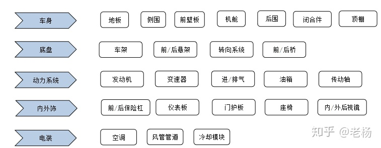
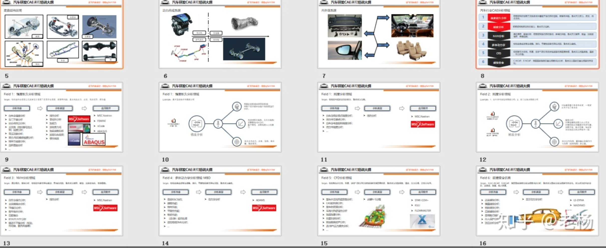

CAE用在汽车行业有哪些分析领域(系列分享01篇)

先来整体了解下汽车的整体构造：

汽车行业CAE分析领域

1强度耐久分析

校核结构在极限工况或者设计里程下是否存在屈服、断裂等风险，重点关注应力、应变、残余变形。

2刚度分析

校核结构抵抗变形的能力，重点关注位移。

3NVH分析

通过模态、频响分析，校核结构是否存在振动、异响的风险，重点关注频率、振型、加速度响应、传递函数。

4多体动力学

校核底盘或者整车操稳、转向、平顺性能是否存在风险，重点关注曲线.

5CFD

校核整车外流场、热害、进排气背压等流体性能是否满足目标值，重点关注风阻系数、温度、压力压强。

6碰撞安全

C-NCAP、E-NCAP，满足国家碰撞安全法规要求的分析，重点关注国家安全法规是否有变化。

**汽车CAE知识框架，十二年汽车CAE领域项目实战经验总结，价值巨大：**

限于篇幅，更多系统总结，私信老杨。

