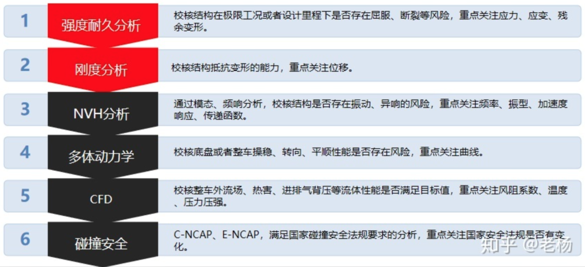
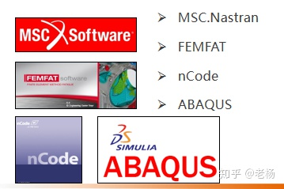
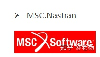
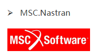
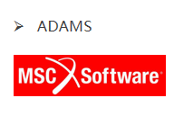
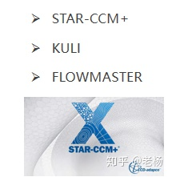
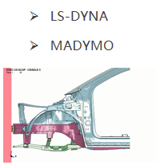

CAE-汽车行业CAE分析常用软件有哪些(系列分享02篇)

到很多朋友对CAE分析一大堆，看的大家云里雾里的，老杨结合汽车行业十多年项目实战经验做简单明了的分析，详细大家一看就明白。

所谓大道至简！直接上干货！

**第一个问题：汽车行业CAE分析领域**

1强度耐久分析

校核结构在极限工况或者设计里程下是否存在屈服、断裂等风险，重点关注应力、应变、残余变形。

2刚度分析

校核结构抵抗变形的能力，重点关注位移。

3NVH分析

通过模态、频响分析，校核结构是否存在振动、异响的风险，重点关注频率、振型、加速度响应、传递函数。

4多体动力学

校核底盘或者整车操稳、转向、平顺性能是否存在风险，重点关注曲线.

5CFD

校核整车外流场、热害、进排气背压等流体性能是否满足目标值，重点关注风阻系数、温度、压力压强。

6碰撞安全

C-NCAP、E-NCAP，满足国家碰撞安全法规要求的分析，重点关注国家安全法规是否有变化。

**第二个问题：不同场景领域使用的软件**

1.强度耐久分析领域应用软件：

2.刚度分析领域

3.NVH分析领域

4.多体动力学分析领域-MBD

5.CFD分析领域

6.碰撞安全仿真

更多CAE知识框架体系私信老杨给你解答。

看完两件事：

1.点赞，让更多的人也能看到这篇文章（收藏不点赞，都是耍流氓）

2.关注我和专栏，让我们成为长期关系，每天分享汽车行业专业技术干货、求职就业、职业发展等汽车行业经验！