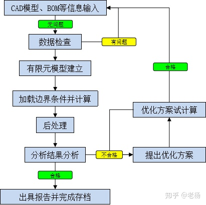
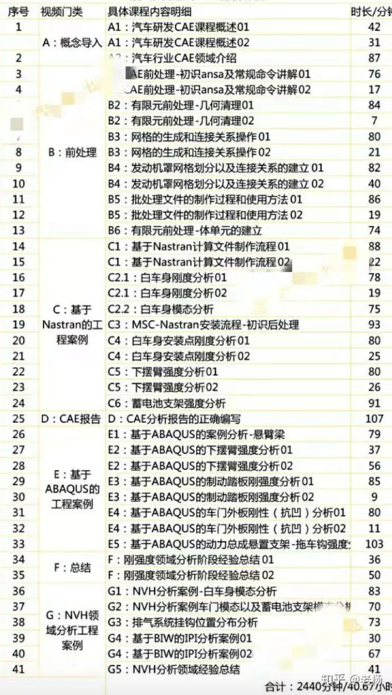

CAE-汽车行业CAE分析的完整流程图(系列分享03篇)

CAD模型、BOM的准确性直接影响后期的效率和分析效率，拿到输入后，检查无误才开始工作；

有限元建模过程是纯体力任务，所以现在是有一种职业叫做“CAE前处理工程师”；

边界条件加载目前各大公司基本上都基于二次开发或者Include文件固化下来了，为了避免失误；

优化方案的出具是整个分析流程中最具有技术性和挑战性的部分，也是最能够体现工程师能力的部分，这个部分的工作永远不可能被电脑替代掉；

CAE工程师提供的优化方案只是概念，付诸工程化后，会有何种各样的制约导致最终的工程数据与最初提出的方案有所差异。所以CAE工程师和CAD工程的沟通，以及对工程数据的验证计算过程，非常重要。

以下为老杨CAE知识体系总结，每一个知识点都对应案例讲解。

