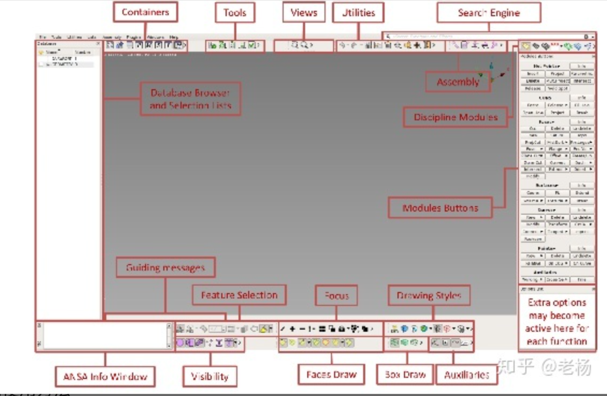
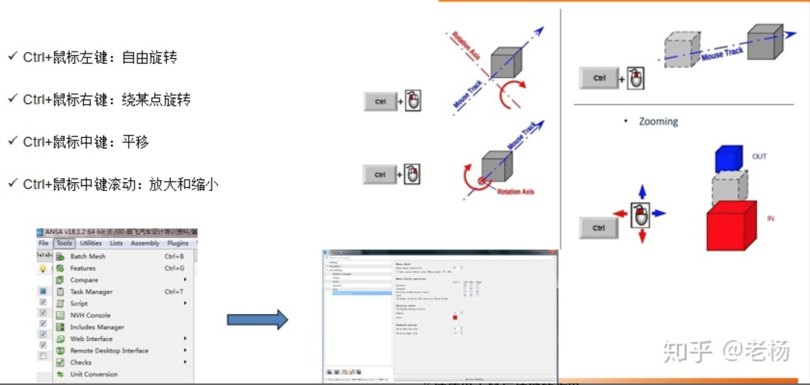
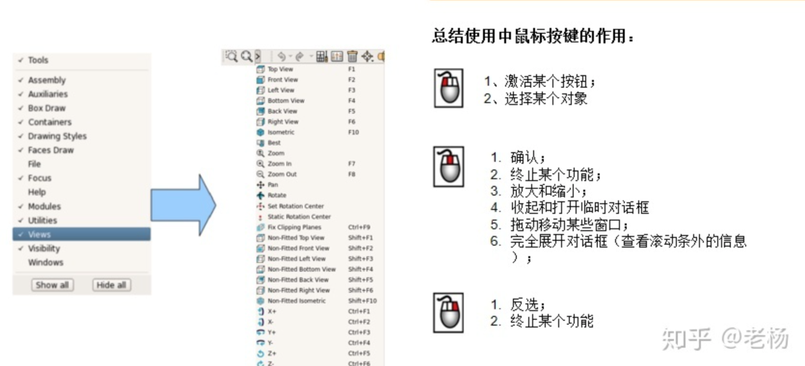
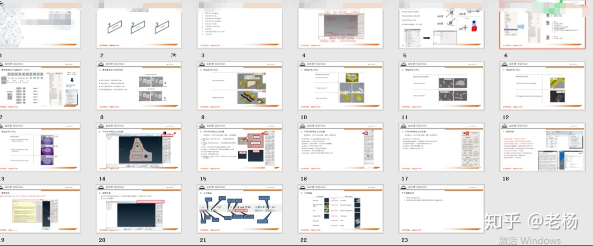

CAE-CAE前处理-初识ansa及常规命令讲解(系列分享07篇)

1、图形用户界面概述；

2、鼠标的使用方法；

3、使用键盘进行视图操作；

4、使用鼠标进行选择操作；

5、特征选择工具栏；

6、学科模块之间的转换；

7、获取帮助；

8、使用搜索引擎访问任何功能；

9、几何类型；

1、图形用户界面GUI(Graphical User Interface）

2、鼠标的使用方法

更多详细介绍私信老杨。

