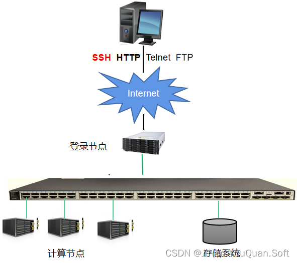
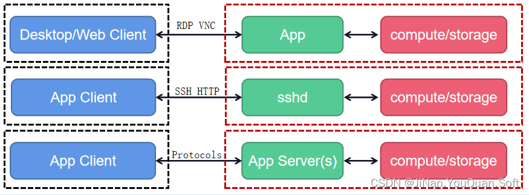

# CAE工业仿真软件调研学习

## 1.什么是工业仿真软件

> CAE(Computer Aided Engineering 工程设计中的计算机辅助工程)工业仿真软件，**主要指利用计算机对工程和产品的性能与安全可靠性进行分析，对其未来的工作状态和运行行为进行模拟，从而优化设计，并确保未来工程和产品功能、性能的可用可靠性。**

其以三维建模为基础，结合流体力学、结构、电磁等多学科，精细模拟流动、结构变形等物理现象，揭示动力学演化规律及其内在的物理机制，为工业研发设计提供决策支持，助力企业降低研发成本、优化研发方案、提升研发效率。工业仿真软件从本质上来看，即是**从底层的物理规则和数学公式出发，以现实世界的规则打造软件内核**；而后经过计算机语言编程和算法封装，沉淀为软件本身的求解器，再利用计算机图形学实现可视化和用户交互；最后，结合特定领域工程学的工作流程，提供相应领域的计算求解，从而帮助用户解决工程中的实际问题。

从核心工作流程来看，**工业仿真过程包括前处理、求解（有限元分析->用有限个的单元去结合不同力学算法分析可得出精确结果，如果是无线的单元，那是计算不出结果的，因为是无限个，而有限个也需要根据实际度量，越多个单元计算周期越长，当然分析越准确）、后处理、优化、报告。**前处理过程包括几何图形处理、网格划分等；求解过程主要包括模态、刚度、强度等分析方式；后处理过程包括展示位移、应力等动图；优化过程主要针对仿真结果设计进行修改，并再次回到前处理流程；最终获得满意的结果后，通过图形化方式向用户进行报告。

工业仿真软件是工业之魂，是智能制造的核心驱动力，是支撑工业企业生产运行的基础，广泛应用于工业生产的各个环节，伴随着产品从研发、生产，再到销售及售后服务的全生命周期。相比于传统的通过物理试验来验证产品的性能和可靠性，工业仿真软件在精度、时效和成本上都具有压倒性优势，将帮助极大的缩短由研发设计走向商业量产的最后一步距离。

工业仿真软件往往不是单个分散的技术，而是一个体系，是各学科知识的集合，需要在生产实践中与各种知识融合，进行不断的更新迭代。工业研发制造对软件的精度、稳定性、可靠性等要求极高，而这都需要在应用中进行优化和完善。

国际主流的工业仿真软件，均诞生于工业实际应用场景的需求，通过不断使用试错来进行迭代升级，经过数十年的沉淀后，达到了目前国际领先的水平。因此，在一定程度上可以说，“用”才是工业仿真软件之母。

因此，要发展工业仿真软件，需要更多的企业开放应用场景，鼓励企业更多的使用，才能在市场检验中打造出具有世界领先水平的工业仿真软件。

当然，因为工业仿真软件的开发涉及数学、力学、计算机等多学科的知识应用，能否培养出工业软件急缺的复合人才，也将决定这个行业的发展速度。

> **引入CAE后，可以在产品开模之前，透过相应软件对电子产品模拟自由落下试验（Free Drop Test）、模拟冲击试验（Shock Test）以及应力应变分析、振动仿真、温度分布分析等求得设计的最佳解，进而为一次试验甚至无试验可使产品通过测试规范提供了可能。**

## 2.比较流行的CAE仿真软件

> 大家常见的有限元分析软件就有ABAQUS、Solidworks Simulation 、ADINA、ALGOR、`ANSYS`和MSC等。其中ANSYS更是最经典的CAE，他在国内应用最广，客户成熟度最高，尤其是在高校科研领域。

当然不同软件的擅长领域各不相同，毕竟CAE涵盖的学科众多，各个侧重点都需要深耕才能有所突破。

- 强度分析方面有：ansys、abaqus、nastran、adina等算主流。
- 流体方面有：fluent、cfx、starcd等等。
- 多体动力学方面有：adams、simpack等等。
- 电磁：ansoft、magneforce
- 铸造：magma、anycasting、procast
- 注塑：mold flow、moldex3d

> 除以上商业软件还有如下开源软件：
>
> - SALOME：基于c++和python开发的一个CAE仿真软件平台，它内置了多个开源工具，包括前处理、求解器、后处理、统计学等工具，并且支持集成第三方求解器。
> - FreeCAD：基于c++开发的仿真工具，学习资料也较少。
> - Blender：未详细了解
> - MeshLab：基于c++开发

> 以上开源工具多半内置多个工具，下边我们从求解器，即有限元分析模块(工具)入口，看一下开源工具：注意他们都是可以独立运行的工具
>
> - code_aster：法国`EDF`集团研发中心开发的一款侧重于`结构与热动力学`计算的求解器。
> - code_saturen：法国`EDF`集团研发中心开发的一款侧重于`流体力学（CFD）`计算的求解器。
> - openfoam：基于c++编写的侧重于`流体力学（CFD）`计算的求解器。
> - Palobos：侧重于`流体力学（CFD）`计算的求解器。

**另外有一个特殊的系统：[CAELinux](https://www.caelinux.com/CMS3/) 是一个内置多种流行CAE工具的ubuntu系统，安装后内置的工具可以直接使用，初期学习不想研究各个工具的复杂安装问题的话可以使用该系统快速上手。**

> CAE大多数软件的核心代码采用C/C++编写。而接口扩展需要结合**行业习惯**、***\*应用场景\****、***\*软件技术栈\****等因素，选择合适的脚本语言。这样不仅可以**降低用户使用软件的门槛与成本**，而且可以通过**复用现有软件技术栈来提升软件开发的效率与应用范围**。目前比较流行的脚本编程语言有：**Python**、**JavaScript**、**Matlab**等。
>
> | **脚本语言** | **开发引擎**                 | **应用**                                                     |
> | ------------ | ---------------------------- | ------------------------------------------------------------ |
> | Python       | CPython, Boost.Python, PyCXX | [FreeCAD](https://github.com/FreeCAD/FreeCAD), [SALOME](https://www.salome-platform.org/), [QGIS](https://github.com/qgis/QGIS) |
> | JavaScript   |                              | QCAD                                                         |
> | Matlab       | Octave, Rlab                 | 光学, 电磁                                                   |
>
> 除此之外，大部分CAE软件的图形界面都是基于QT来实现的，并且一段时期之内QT仍然是主流方向。其中[CMakeQt](https://github.com/rjhansen/CMakeQt)是GitHub上一个开源Qt软件开发的CMake模板，已经被Blender等许多开源项目所采用，非常值得借鉴引用。

## 3.基于Web的CAE工业仿真协同系统

分布式计算(Distributed Computing，又称分散计算)是利用网络把大量计算资源连接起来以解决大型计算问题的一种计算科学。分布式计算研究主要集中在分布式操作系统与分布式计算环境等两个方面。主流的分布式计算技术包括中间件技术、网格技术、移动Agent技术、P2P技术、Web Service技术等。

近十年来，国家也建立了天津、济南、郑州、无锡、昆山、广州、深圳、长沙、成都等八大超算中心。随着高性能计算特别是超级计算平台的兴起，CAE软件(也可以统称为CAx软件，包括CAD/CAE/CAM)正逐渐由桌面系统逐渐向基于云计算平台的网络应用进行转变；另一方面，CAE所求解的问题规模与学科复杂性愈加复杂，传统的桌面CAx系统已经很难胜任。因此，将CAE技术与云计算技术结合起来形成CAE协同仿真系统必将是下一代CAx软件研发的一个重要方向。

鉴于目前的形势，CAE软件在设计之初就应当考虑云计算赋能的问题，因此，需要对目前云计算平台的软硬件情况做深入的研究，为前期软件系统设计、技术选型等提供依据。

关于HPC集群架设相关的技术，可以参看[部署HPC集群的实施方案](https://blog.csdn.net/qq_26221775/article/details/111708789)

超算中心大都基于Linux操作系统或者其衍生版本，其中又以CentOS系统居多，大都提供Web登录、VPN SSH登录等访问方式。济南超算中心山河计算平台提供了Web Services、SDK、CLI等三种开发接口。

单从CAE软件研发来看，基于云计算的CAE软件开发至少会涉及到远程登录、文件/数据传输、命令执行、作业管理等功能模块。

基于B/S架构的CAE软件研发，在实时性等方面还存在一些技术难点；基于C/S架构方案中，缺少专门的CAE软件通信协议。

近几年，以虚拟化、云计算等技术为基础的云桌面逐渐兴起，这或许为发展基于云计算的CAE软件提供了可行性。

|      | **编程技术**          | **开发框架**                |
| ---- | --------------------- | --------------------------- |
| 前端 | HTML, CSS, JavaScript | jQuery, Angular, React, Vue |
| 后端 | PHP, Java, Ptyhon     | Django                      |

考虑到目前的Web前后端开发技术栈的情况，**可将CAE C/C++代码进行Python封装，然后借助于Python Web应用开发框架完成Web版CAE软件的开发**。

现代CAD系统一般由数据交换、二维草图、曲面建模、三维建模、装配建模、工程制图等模块组成，而几何约束求解是二维草图与装配建模的核心技术，是整个参数化/变量化建模的两大关键技术之一（另一个关键技术是几何造型技术，也就是模型表示问题）。

FreeCAD目前使用PlanGCS进行二维草图约束求解；SALOME则同时提供了PlaneGCS、SolveSpace等两种约束求解器。

因此，欲要深入研究FreeCAD、SALOME等软件的全参数化建模功能，必须要掌握几何约束相关的基本理论与关键技术。因此，笔者罗列部分技术文献，作为深入研究的理论与技术基础。

## 4.关于超算和HPC高性能计算

工业仿真已被世界上很多企业应用到工业生产的各个环节，对提高企业的产品研发效率，减少决策失误，降低企业风险起到了重要作用，以设计与仿真模拟一体化的工业仿真，广泛地应用于航空航天、汽车工业、生物医学、桥梁、建筑、电子产品、重型机械、微机电系统、运动器械等领域。CAE(Computer Aided Engineering，计算机辅助工程)是工业仿真的主要手段，通过计算机求解复杂的工程和产品的仿真算例，求解过程中往往会涉及大规模的偏微分方程，普通的工作站或者是个人计算机，往往难以在满意的时间内完成仿真。HPC（High Performance Computing，高性能计算）通过高速互联的高性能集群以几十上百倍于单台工作站的能力，在较短的时间内并行完成仿真工作。因此，HPC成为各种工业仿真工作的首选。

## 4.关于salome的说明

1.支持CAD建模和计算软件(CAD-CAE链接)之间的互操作性

2.便于将新组件集成到异构系统中进行数值计算

3.优先考虑计算软件之间的多物理耦合

4.提供通用的、用户友好的、高效的用户界面

5.在此平台上，将培训时间缩短到学习软件解决方案的特定时间

6.通过集成Python控制台提供对所有功能的访问（指的是salome工具打开后有对应的python控制台，可直接通过脚本建模等操作）

7.创建，修改，导入和导出(IGES，STEP，BREP)，修复和清洁CAD模型

8.为CAD模型生成网格；编辑网格；检查网格质量；导入和导出网格数据(MED,UNV,DAT,STL)

9.处理与几何有关的属性

10.使用一个或多个外部求解器(耦合)执行计算

11.显示计算结果(标量、矢量数据)

## 5.

## 6.展望

随着工业产品的复杂程度越来越高以及工业仿真技术的不断成熟，现在大多数的仿真对象都是在各种物理场复杂条件情况下进行的，这决定了完成这些仿真工作需要大量的计算资源，以及可以快速访问仿真数据、并实现较高程度的自动化仿真流程。工业仿真技术在产品开发中扮演的角色越来越靠前，不再是产品设计完成后的验证。与此同时，仿真技术在产品生命周期的下游也发挥着越来越重要的作用，譬如分析来自工业物联网中连接机器的实时操作数据。这意味着，仿真工作所需计算资源、仿真人才培养、仿真环境建设的难度都在增加。但对于企业来讲，搭建一个仿真环境、并培养专职的仿真工程师并不容易，仅仅是购买软硬件的需求调研就可能花费几个月时间，之后还得投入大量的时间和精力进行仿真软件培训和应用部署。

如同其他的企业级IT应用一样，云技术正在给仿真应用带来巨大的改变。通过仿真云平台能够对产品进行设计、改进、创新，以及模型的快速认证和方案的快速对比，不但解决了大量零散复杂的仿真数据的可控性差的问题，还在安全性、耐久性、一致性方面得到保障。对于传统企业来说，应用云技术的价值归根结底是不用购买和管理计算集群，从而可以改变传统的仿真应用模式。基于云技术，企业将可以享受到更加灵活的软件使用价格，并可以随时随地解决复杂的仿真应用难题，借助同时模拟多个不同设计方案的能力，基于云技术的仿真可以支持企业更轻松地进行设计和工程仿真。通过云上仿真，通常在很短的时间就可以获益。不管是加快产品创新，还是满足企业日益增长的仿真需求，抑或是加强全球合作、提高IT投资回报率，都会收到立竿见影的效果。

## 7.salome_meca操作实例

Salome-Meca环境简介：Salome-Meca是EDF提供的一个集成环境，将CAD到CAE的整个流程所涉及步骤的软件集成到一个统一的环境下，code_aster作为核心的求解器部分，毫无疑问的被集成到其中。在此之外，在前处理部分，它提供了了包括Gmsh在内的几何建模工具，在后处理部分，将Paraview的功能集成到其中。针对code_aster所特有的命令文件comm文件，它还提供了一个便捷的编辑工具Eficas，为书写标准的comm文件提供了帮助。

以下说明适用于Salome-Meca 2016.0_LGPL 7.8.0 版本Salome-Meca环境分析问题基本流程：
\1. 调用Gmsh等工具建立几何模型，通过Gmsh划分网格，生成MED文件供求解使用
\2. 利用Eficas或者其他编辑器创建comm文件，供code_aster求解使用
\3. 打开Salome-Meca环境，新建一个study（file -》new -》create a new study）并保存
\4. 打开之前新建的study文件，将模块切换到mesh模块，导入med网格数据（file -》export-》export med file），检查网格是否正常
\5. 切换到Aster模块，然后在菜单栏里的aster选项下，新建一个study case，在弹出的菜单中选择之前已经创建的MED文件和comm文件并保存
\6. 在窗口左侧目录树里选中aster下新建的case，右键run，aster会自动调取comm文件与med文件完成运算，并在工作路径下面生成.export .mess .resu 和.rmed文件。其中export文件记录了文件调取，server设置的相关信息，mess是综合的信息包，是对整个求解过程的信息记录，是重要的参考文件，resu文件和rmed文件都是记录的结果
\7. 切换到Paravis模块，导入求解生成的rmed结果文件，在Paravis模式下，在切换模块的下拉框下有设置选择想要显示的结果场类型的选项。这里我们可以切换显示之前在comm文件中定义的各个结果场（位移场，应力场，应变场等等）

## 8.国内仿真公司

[安世亚太](http://www.peraglobal.com/)（始于1996，5000真实客户）

[云道智造](http://www.ibe.cn/)（国家队）

[舜云科技](http://www.geartoutiao.com/company/home/187)（核能）

[适创科技](https://www.supreium.com/)（粒子算法）

[上海数巧科技](https://www.simright.com/)（老板原Altair技术总）

[十沣科技](https://www.tenfong.cn/)（陈十一院士）

[南京天洑软件](http://www.njtf.cn/)（20年积累）

[英特仿真](http://www.intesim.cn/)（军工赛道，大连理工）

[蓝威数值](http://www.easycae.cn/)

[太泽透平](https://www.turbotides.com.cn/)（航天能源）

[大工仿真](https://gdivrcenter.dlut.edu.cn/)（大连理工40年）

[西安前沿动力](http://www.adicn.com/)

[同元软控](https://www.tongyuan.cc/)（奥兰托）

[颐励拓](http://www.litosim.com/)（20年+）

2.仿真云领域:

先看Onscale，再看Simscale

国内一定要看看上海数巧科技

真正的BS架构+前后处理线上一条龙。

Bs架构价值>Cs功能BS化价值>云桌面>[云超算](https://www.zhihu.com/search?q=云超算&search_source=Entity&hybrid_search_source=Entity&hybrid_search_extra={"sourceType"%3A"answer"%2C"sourceId"%3A2766508652})

目前民用99%以上的仿真一台万元机足够搞定。

最不值钱的就是云超算，华为云算力只要0.1元/核时。人一定要会比较，比较才懂价值大小，比较才懂前途光明和黑暗。

