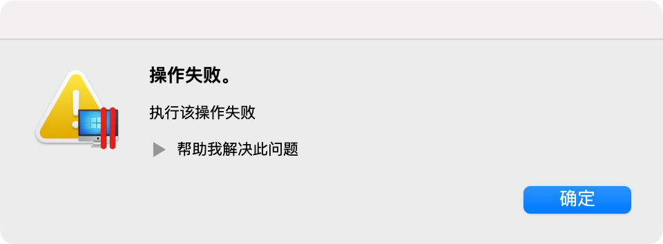
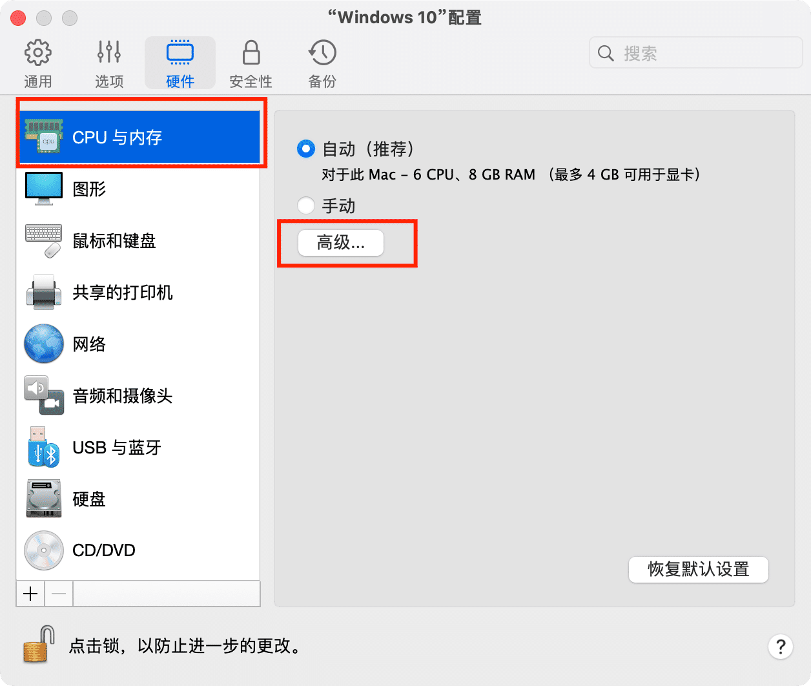
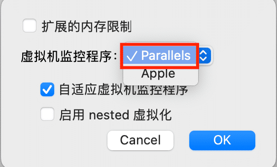

### 一.无法联网的问题

1.在终端中输入
sudo nano /Library/Preferences/Parallels/network.desktop.xml
2.找到`<UseKextless>1</UseKextless>`
（值或许是-1，通常是文件的第5行或第6行）
3.将此数字改为0，即`<UseKextless>0</UseKextless>`
如果找不到此行请手动添加
4.按Ctrl+O然后Enter然后ctrl+X 保存更改

### 二.USB错误

1.在终端中运行
sudo nano /Library/Preferences/Parallels/dispatcher.desktop.xml
2.找到
`<Usb>0</Usb>`
并将之变为
`<Usb>1</Usb>`
3.按 Ctrl+O 然后 Enter 然后 ctrl+X 保存更改

### 三.如果出现如下图问题

需要修改虚拟机的设置，这里以win10为例，点击这里

然后到CPU与内存，找到高级

将这里修改为parallels即可
