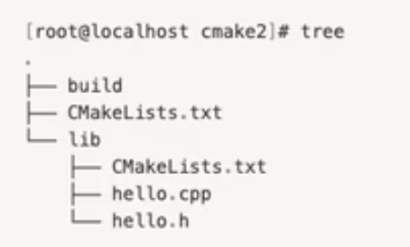

1.c++的编译器，一般使用gnu套件(GNU Compiler Collection，简称gcc)，他不止能编译c++文件，GNU编译器套件包括C、C++、 [Objective-C](https://baike.baidu.com/item/Objective-C/8374012?fromModule=lemma_inlink)、 [Fortran](https://baike.baidu.com/item/Fortran/674319?fromModule=lemma_inlink)、[Java](https://baike.baidu.com/item/Java/85979?fromModule=lemma_inlink)、[Ada](https://baike.baidu.com/item/Ada/5606819?fromModule=lemma_inlink)和[Go](https://baike.baidu.com/item/Go/953521?fromModule=lemma_inlink)语言，也包括了这些语言的库（如libstdc++，libgcj等。）


2.mac上安装gcc编译器套件，需要先安装xcode工具xcode-select --install，直接命令行执行即可。


3.还需要通过homebrew来安装gcc，brew install gcc，期间可能会443错误，只需要ping 超时url，将ip地址配置到/etc/hosts文件，然后再重新安装即可


​	hosts映射方式：ip  超时域名


4.然后执行brew install gcc


5.安装CLION开发工具，使用2021.3版本可以直接破解


6.当然了我们可以通过使用gcc来编译c++原文件，如g++ 文件名.cpp，但这样的话文件多起来编译就会很麻烦，所以可以借助一些编译工具，如cmake，他底层当然还是使用gcc，只不过他可以像maven一样可以更加的方便使用，cmake命令在安装gcc的同时会自动也安装上。而对于windows系统可以到cmake官方，自行安装exe程序，建议安装3.24.1或之后的版本。


> 注意：关于安装的gcc编译器，默认mac自带了gcc，但是该gcc是Command Line Tools工具携带的，Command Line Tools是XCode工具的子工具包，而Command Line Tools的gcc是基于clang的，而我们看的gcc -v也是内置的clang的命令，所以我们安装的gcc并没有生效。 所以要在clion生效使用安装的gcc可以找到安装的命令目录，单独配置，查找方法brew list gcc，可以先通过brew list看看安装的gcc叫什么名字，然后通过brew list gcc名字查看命令目录。

## CMake：

简单点描述就是指定各种参数：

- 工程名称

- 编译的源文件是什么语言：如c、c++、java等，cmake支持很多语言的编译

- 要被编译的源文件目录path和文件名name

- 编译后编译的二进制或可执行文件的输出目录

- INSTALL：安装一些相关文件到指定的目录，其实可以认为就是拷贝指定文件到指定目录。虽然源文件编译器编译后会进入指定目录，但是有些时候我们的工程不一定都是源代码，

  比如可能会有版权COPYRIGHT文件、README文件、启动脚本sh或bat文件(可以用来启动我们编译完后的二进制或可执行文件，避免我们命令行中手动敲脚本，比如我们把sh脚本安装到/usr/local/bin目录，这样整个cmake结束后就可以执行执行sh命令来启动我们编译后的程序了)等，而这些文件编译器是不会处理的，所以可以通过cmake的INSTALL指令来完成拷贝安装到指定目录。--> 注意cmake执行完后还需要到编译后的目标目录执行make才算真正编译完成。而在CMakelists.txt中如果有INSTALL指令的话，单单通过cmake和make两个命令时得不到执行的，还需要执行以下make install这样INSTALL指令才会被执行，即完成一些后续的文件的安装(拷贝)。


cmake分为内部构建和外部构建：

区别就是内部构建就是在源文件目录执行构建cmake命令，但是构建完后当前目录会生成很多cmake编译相关的无用文件，所以我们一般选择外部编译，

比如建一个build目录，然后我们cd到build目录，然后再build目录执行cmake命令，生成的cmake相关文件就是在cmake目录执行的所在目录，

当然cmake命令需要执行CMakeLists.txt文件的位置，一般每个目录都要有CMakeLists.txt配置文件，并且要把他们建立关系(就是在父文件中指定还有子文件并指定位置)，

执行cmake命令时执行总的父文件即可，其实和maven的用法很类似，毕竟都是构建工具。


## CMake构建静态库和动态库（动态库也叫共享库）

静态库和动态库的区别

- 静态库扩展名一般是“.a”或“.lib”；动态库扩展名一般是“.so”或“.dll”。
- 静态库在编译时会直接整合到目标程序中，编译成功的可执行文件可独立运行。
- 动态库在编译时不会放到连接的目标程序中，即可执行文件无法单独运行（必须要有关联的动态库的环境下运行，即有依赖关系）。


看一下怎么构建(创建)静态库和动态库：

- 准备一个HelloFunc函数，它会向终端输出HelloWorld字符串，以此我们来创建一个静态库和动态库
- 安装头文件与共享库 


目录结构：



其中build用来执行cmake命令的目录，即保存cmake相关的无用文件的目录；

lib就是用来保存我们要生成共享库的源文件

```c++
# 先来创建一个头文件，就是调用HelloFunc函数
vi hello.h

#ifndef HELLO_H
#define Hello_H

void HelloFunc();

#endif
```

```
vi hello.cpp

#include "hello.h"  // 引入头文件
#include <iostream>
void HelloFunc(){
  std::cout << "Hello World" << std::endl;
}
```

```
# 编辑最外层的CMakeLists.txt

# 指定编译工程的名字，这个随意取名即可
PROJECT(HELLO)
# 指定子目录还有个CMakelists.txt，目录为lib，后边的bin是指定子目录lib中的内容都编译到bin目录
ADD_SUBDIRECTORY(lib bin)
```

```
# 编辑lib中的CMakeLists.txt

# 定义一个变量叫LIBHELLO_SRC，值为hello.cpp
SET(LIBHELLO_SRC hello.cpp)
# hello表示生成的库名，SHARED表示生成动态库(共享库)，如果生成静态库要用STATIC，后边的就是要把谁生成动态库${LIBHELLO_SRC}，引用变量，值为hello.cpp
# 注意这里动态库名字为hello，但编译器会默认在前边加上lib串，且扩展名为.so，即最终生成的名字为libhello.so
ADD_LIBRARY(hello SHARED ${LIBHELLO_SRC})
```

进入build目录，我们执行编译

```
# 进入build目录
cmake ..  # 执行主目录的CMakeLists.txt配置文件
# 直接在build目录执行make，来真正生成共享库，共享库libhello.so会生成到bin目录
make
```


### 同时构建同名的动态库和静态库

当然我们会想如下方式不就可以吗

```
ADD_LIBRARY(hello SHARED ${LIBHELLO_SRC})
ADD_LIBRARY(hello STATIC ${LIBHELLO_SRC})
```

但实际上，这样是不会生成静态库的，虽然静态库后缀是.a，当然如果把hell变成不同名，这样写就没问题了，但实际开发中我们期望是同名

此时我们要借助`SET_TARGET_PROPERTIES`，他可以设置输出的名字，以及指定动态库版本和API版本。

```
# 修改lib目录中的CMakeLists.txt

SET(LIBHELLO_SRC hello.cpp)

ADD_LIBRARY(hello_static STATIC ${LIBHELLO_SRC})
# 对hello_static重命名为hello
SET_TARGET_PROPERTIES(hello_static PROPERTIES OUTPUT_NAME "hello")
# cmake在构建一个新的target时，会尝试清理掉其他使用这个名字的库，所以在构建 libhello.so 时，就会清理掉 libhello.a
SET_TARGET_PROPERTIES(hello_static PROPERTIES CLEAN_DIRECT_OUTPUT 1)

ADD_LIBRARY(hello SHARED ${LIBHELLO_SRC})
SET_TARGET_PROPERTIES(hello PROPERTIES OUTPUT_NAME "hello")
SET_TARGET_PROPERTIES(hello PROPERTIES CLEAN_DIRECT_OUTPUT 1)
```

这样执行完就会生成同名为hello的动态库和静态库，分别为libhello.so和libhello.a


### 动态库的版本


所以，以上的动态库其实就是一个libhello.so，但因为指定了版本和api版本，所以在系统中会出现3个，知道一下。


### 安装共享库和头文件

上边讲完，我们只是编译生成了动态库libhelo.so，但是我们总归是要在代码中引用并使用他的，所以还需要将编译好的动态库拷贝到指定的目录才能方便我们使用，那么怎么拷贝呢？

当然就是INSTALL指令了。


我们这里把动态库安装到/usr/local/lib目录，将hello.h头文件安装到/usr/local/include/hello目录

```c++
// 默认目录就是/usr/local，此处使用的是相对路径，所以最终目录是/usr/local/include/hello
INSTALL(FILES hello.h DESTINATION include/hello)

// 二进制、静态库、动态库都是用TARGETS
// ARCHIVE 特指静态库； LIBRARY 特指动态库； RUNTIME 特指可执行目标二进制
INSTALL(TARGETS hello hello_static LIBRARY DESTINATION lib ARCHIVE DESTINATION lib)
```


> 注意：默认是安装到/usr/local目录，但是放在这个目录，我们代码中不能直接引用到，当然可以指定动态库的目录，但此处我们直接安装到/usr目录，这样就可以直接应用了，
>
> 所以我们需要修改默认的安装目录，要通过`cmake -D CMAKE_INSTALL_PREFIX=/usr`来修改默认目录。


### 使用动态库

安装好了，我们就要开始使用了，新建一个目录来使用外部共享库和头文件

```
[root@MiWiFi-R4CM-srv cmake3]# tree
.
├── build
├── CMakeLists.txt
└── src
    ├── CMakeLists.txt
    └── main.cpp
```

```
vi main.cpp

#include <hello.h>

int main(){
	HelloFunc();
}
```

```
# CMakeLists.txt 内容

INCLUDE_DIRECTORIES(/usr/include/hello)
ADD_EXECUTABLE(aaa main.cpp)
# 链接共享库
TARGET_LINK_LIBRARIES(aaa libhello.so)
```

> 注意：这样执行完后会提示找不到libhello.so库文件，这是因为我们之前把他放在了/usr/lib目录，而我的系统是64位mac，所以需要把libhello.so放到/usr/lib64目录。

#### 解决：make后头文件找不到的问题

include <hello/hello.h> 这样include是可以解决，但这么做的话不太优雅；

关键字：INCLUDE_DIRECTORIES 这条指令可以用来向工程添加多个特定的头文件搜索路径，路径之间用空格分割

在CMakeLists.txt中加入头文件搜索路径

INCLUDE_DIRECTORIES(/usr/include/hello)


#### 解决：找到引用的函数问题

报错信息：undefined reference to `HelloFunc()'

关键字：LINK_DIRECTORIES 添加非标准的共享库搜索路径

指定第三方库所在路径，LINK_DIRECTORIES(/home/myproject/libs)

关键字：TARGET_LINK_LIBRARIES 添加需要链接的共享库

TARGET_LINK_LIBRARIES的时候，只需要给出动态链接库的名字就行了。

在CMakeLists.txt中插入链接共享库，主要要插在add_executable指令的的后面

查看main的链接情况


链接静态库

```
TARGET_LINK_LIBRARIES(aaa libhello.a)
```


#### 特殊的环境变量 CMAKE_INCLUDE_PATH 和 CMAKE_LIBRARY_PATH

注意：这两个是环境变量而不是 cmake 变量，可以在linux的bash中进行设置

我们上面例子中使用了绝对路径INCLUDE_DIRECTORIES(/usr/include/hello)来指明include路径的位置

我们还可以使用另外一种方式，使用环境变量export CMAKE_INCLUDE_PATH=/usr/include/hello


补充：默认使用cmake编译的为release版本，如果想要debug版本可以如下操作：

cmake .. -D CMAKE_BUILD_TYPE=debug

这样我们就可以通过`GDB调试工具`进行调试了。