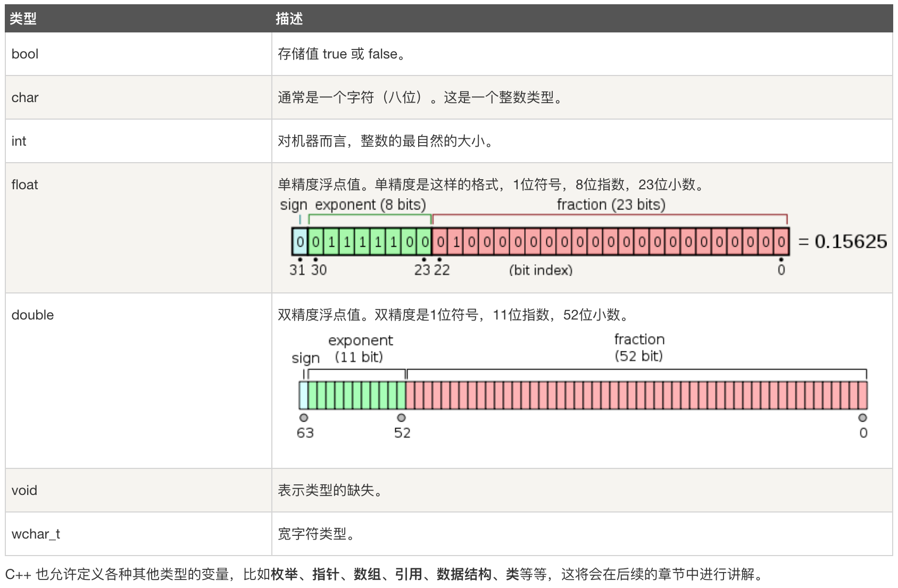

## 1.输出/换行


cout << "Hello World" << endl;


其中<<表述输出到终端，endl表示输出一个换行符，cout就是输出关键字；

## 2.typedef

可以改变类型的名称，比如int类型，可以更名为abc，如typedef int abc，那么就可以通过abc来创建int类型的变量了，如abc a = 5;

## 3.枚举

```
enum 枚举名{ 
     标识符[=整型常数], 
     标识符[=整型常数], 
... 
    标识符[=整型常数]
} 枚举变量;
```

其中标识符可以赋值可以不赋值，不赋值的话那么默认他们的值是从0开始自增，如果有指定值的，那么就从指定值变量之后开始以赋值后的值自增。

```
// 创建变量c，因为red、green、blue没有赋值，所以他们的值分别为0、1、2
enum color { red, green, blue } c;
# 表示c赋值了枚举值blue，值为2
c = blue;

// red=0，green=5，blue=6
enum color { red, green=5, blue } c;
```


## 4.变量类型




5.


