# DevOps系统环境搭建


## 1.DevOps是什么？


DevOps（Development和Operations的组合词）是一种重视“软件开发人员（Dev）”和“IT运维技术人员（Ops）”之间沟通合作的文化、运动或惯例。

透过自动化“软件交付”和“架构变更”的流程，来使得构建、测试、发布软件能够更加地快捷、频繁和可靠。


## 2.运行环境：OMV


本文采用omv nas服务器作为运行环境，当然有条件或根据自己喜好可以选择Proxmox、OpenStack等环境均可。

omv的安装很简单，官网下载iso镜像写入到U盘，引导安装即可。


## 3.Docker环境


因为omv是一个底层linux系统，而他可以直接安装docker服务（通过插件的方式安装）并同时安装portainer图形界面来管理docker容器。具体插件安装就不细说了。

当然如果使用proxmox等虚拟服务器的，可以单台虚拟机安装或组建k8s安装devops的各个组件，这是都可以的，而我这里使用的是omv，所以都在docker中以容器的方式安装各个组件。

后续我会单独讲一下升级成proxmox虚拟化和k8s的过程。此处如果大家没有omv环境，只是一台单物理linux或一台虚拟机linux，只需要安装一个docker服务就行了，

安装方法比较简单，网上也有很多教程，避免浪费时间且不是我要讲的重点就不说了。


> 注意：docker安装完后，避免拉取镜像较慢，需要更换成国内镜像源，或使用阿里云镜像加速，本人使用的是阿里云镜像加速。
>
> - Docker中国区官方镜像 https://registry.docker-cn.com
> - 网易 http://hub-mirror.c.163.com
> - 中国科技大学 https://docker.mirrors.ustc.edu.cn
> - 阿里云容器 https://cr.console.aliyun.com/cn-beijing/instances/mirrors
>
> 我的加速地址是：https://mtu7rhzd.mirror.aliyuncs.com
>
> 将地址给docker的配置即可：/etc/docker/daemon.json
>
> ```shell
> sudo mkdir -p /etc/docker
> sudo tee /etc/docker/daemon.json <<-'EOF'
> {
> "registry-mirrors": ["https://mtu7rhzd.mirror.aliyuncs.com"]
> }
> EOF
> sudo systemctl daemon-reload
> sudo systemctl restart docker
> ```

> 补充[docker 安装]：避免有些小伙伴对安装docker不熟悉，这里补充下安装脚本：基于centos7安装
>
> 官网参考：https://docs.docker.com/engine/install/centos/
>
> ```
> # 安装必要依赖
> yum install -y yum-utils device-mapper-persistent-data lvm2
> # 添加阿里云的 docker-ce yum源，避免连接到国外无法现在成功
> yum-config-manager --add-repo http://mirrors.aliyun.com/docker-ce/linux/centos/docker-ce.repo 
> # 重建 yum 缓存 
> yum makecache fast
> # 查看可用 docker 版本
> yum list docker-ce.x86_64 --showduplicates | sort -r
> # 根据以上列出的支持版本，此处选择docker-ce-20.10.8-3.el7版本【注意版本号不包含“:”与之前的数字】
> yum install -y docker-ce-20.10.8-3.el7
> # 验证
> docker version
> ```
>
> 补充[docker compose安装]：
>
> 官方地址：https://docs.docker.com/compose/install/other/
>
> 离线地址：https://github.com/docker/compose/releases/tag/v2.12.2
>
> ```
> # 在线从github拉取并安装到/usr/local/bin目录
> curl -SL https://github.com/docker/compose/releases/download/v2.12.2/docker-compose-linux-x86_64 -o /usr/local/bin/docker-compose
> # 添加执行权限
> sudo chmod +x /usr/local/bin/docker-compose
> # 验证
> docker-compose version
> ```

> Portainer安装：https://docs.portainer.io/start/install
>
> ```
> docker run -d \
> -p 8000:8000 \
> -p 9443:9443 \
> --name portainer \
> --restart=always 
> -v /var/run/docker.sock:/var/run/docker.sock 
> -v /docker/portainer/data:/data 
> portainer/portainer-ce:latest
> ```


## 4.OMV的docker目录规划


因为我的机器是1块128G固态+1块1T机械硬盘，而通过df -h命令可以知道磁盘挂载情况

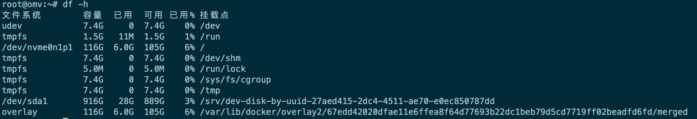

如图可知，1T硬盘挂载在”“目录，为了方便我本想将docker的根据目录设置到/srv/dev-disk-by-uuid-27aed415-2dc4-4511-ae70-e0ec850787dd/下的docker目录，在把这个docker通过软连接的方式链接到/docker目录，但是实际操作在omv安装docker指定根目录时，如果用/srv/dev-disk-by-uuid-27aed415-2dc4-4511-ae70-e0ec850787dd/docker会报错，无奈只能使用原始目录作为docker的根目录，即/var/lib/docker，所以只能将这个docker映射到/docker目录，后续有时间可以研究下将docker服务的跟目录改到1T硬盘上。

> 以上都是前期准备知道就行。 


## 5.Gitlab搭建

> gitlab就不多说了，这个东西现在大多数公司内部都在使用，它分为社区和企业版本，社区版本ce是免费的，当然也可以选择gitee或github，但由于一些情况gitlab还是最受欢迎的。
>
> 首先在docker服务器根目录创建gitlab目录，表示将所有gitlab容器的数据都会映射到/docker/gitlab目录


> 创建网络：通用同一个网段
>
> ```
> docker network create --subnet=172.2.1.0/24 devops
> ```
>
> 

### 5.1 拉取gitlab最新镜像

https://docs.gitlab.com/ee/install/docker.html

```sh
docker pull gitlab/gitlab-ce:latest
```

### 5.2 运行gitlab容器

映射目录规划：/docker/gitlab


> #### 通过docker-compose.yml运行
>
> `优势：该方式一步到位，省去了《方式一》运行后还需要单独配置对外开放的host和port。`

我们知道docker-compose是可以编排复杂容器关系的工具，该文件中可以通过设置docker容器的多维属性并能同时创建运行多个容器，可以和kubernetes的yaml类比。

```shell
# 创建vi docker-compose.yml文件，保存到宿主机的/docker/gitlab目录。

version: '3'  # docker-compose可以使用1、2、3版本，1版本已经基本弃用了，2、3分别会支持更多的指令，我们使用3即可，具体可参考官网对照表查看指令支持
services:
  gitlab:
    image: 'gitlab/gitlab-ce:latest'  # 使用的gitlab镜像版本[其他参数见方案一解释]
    restart: always
    container_name: 'gitlab'
    hostname: 'gitlab'
    environment:
      GITLAB_OMNIBUS_CONFIG: |
        # Add any other gitlab.rb configuration here, each on its own line
        external_url 'http://10.10.1.199:8929'
        gitlab_rails['gitlab_shell_ssh_port'] = 2224
    ports:
      - '8929:80'
      - '2224:22'
      # - '9443:443' # 如果需要https访问则需要映射443端口
    networks:
      - 'exist-net-bloom' # 当前创建的容器加入到外部的bloom网络
    volumes:
      - '/docker/gitlab/config:/etc/gitlab'
      - '/docker/gitlab/logs:/var/log/gitlab'
      - '/docker/gitlab/data:/var/opt/gitlab'
      - '/etc/timezone:/etc/timezone:ro'
      - '/etc/localtime:/etc/localtime:ro'
    shm_size: '256m'
networks:
  exist-net-bloom: # 改名字为当前docker-compose中要引用的名字
    external: # 指定已经存在的网络名字
      name: devops
```

```shell
# 命令行执行，运行docker编排内容
docker-compose up -d
# 观察docker运行日志
docker logs -f gitlab
```


> #### 统一配置部分：

<font size='2px'>`-> 修改docker容器内的gitlab配置，完成gitlab容器的高级映射[避免修改宿主机映射的目录文件]`</font>

```shell
1.修改容器中vi /etc/gitlab/gitlab.rb配置，增加对外映射的ip，可以认为指定对外开放哪个ip可以访问

# 进容器内部
docker exec -it gitlab /bin/bash
 
# 修改gitlab.rb
vi /etc/gitlab/gitlab.rb
 
# 加入如下配置内容
# gitlab访问地址，可以写域名。如果端口不写的话默认为80端口，10.10.1.199是我omv(宿主机)的ip地址，大家可以根据自己的情况设置
external_url 'http://10.10.1.199'

#ssh主机ip
gitlab_rails['gitlab_ssh_host'] = '10.10.1.199'
#ssh连接端口
gitlab_rails['gitlab_shell_ssh_port'] = 2224
 
# 让配置生效
gitlab-ctl reconfigure
```

```shell
2.修改容器中vi /opt/gitlab/embedded/service/gitlab-rails/config/gitlab.yml
 
  gitlab:
    host: 10.10.1.199 # 因为上面的修改生效后会自动更新到改文件，所以host不用改
    port: 8929 # 这里需要改成外部映射的8929端口
    https: false # 如果想通过https访问，此处设置成true
    
# 让配置生效
gitlab-ctl restart

3.安装完后进入容器查看默认gitlab密码，用户名: root
sudo docker exec -it gitlab grep 'Password:' /etc/gitlab/initial_root_password
```

> `注意：`安装完后查看容器日志，可能会发现如下错误
>
> ```java
> err="create memberlist: Failed to get final advertise address: No private IP address found, and explicit IP not provided"
> ```
>
> 错误原因是因为alertmanager配置的监听地址是localhost，此处需要指定127.0.0.1，修改vi /etc/gitlab/gitlab.rb如下：
>
> ```json
> alertmanager['flags'] = {
>   'cluster.advertise-address' => "127.0.0.1:9093"
> }
> 
> # 指定后使配置生效即可
> gitlab-ctl reconfigure
> ```


### 5.3 其他配置

> `邮箱配置：`用于用户操作时推送关键性信息
>
> ```
> # 1.修改容器中配置文件vi /etc/gitlab/gitlab.rb
> ### GitLab email server settings                                                          
> ###! Docs: https://docs.gitlab.com/omnibus/settings/smtp.html                      
> ###! **Use smtp instead of sendmail/postfix.**                                     
>                                                                                               
> gitlab_rails['smtp_enable'] = true                                                 
> gitlab_rails['smtp_address'] = "smtp.126.com"                                      
> gitlab_rails['smtp_port'] = 465                                                                
> gitlab_rails['smtp_user_name'] = "xxx@126.com"                             
> gitlab_rails['smtp_password'] = "xxx"                                         
> gitlab_rails['smtp_domain'] = "smtp.126.com"                                                             
> gitlab_rails['smtp_authentication'] = "login"                                                                 
> gitlab_rails['smtp_enable_starttls_auto'] = true                                           
> gitlab_rails['smtp_tls'] = true               
> 
> gitlab_rails['gitlab_email_from'] = 'xxx@126.com'                          
> gitlab_rails['gitlab_email_display_name'] = 'gitlab'
> 
> user['git_user_email'] = "xxx@126.com"  
> 
> # 2.重启配置
> gitlab-ctl reconfigure
> gitlab-ctl restart 
> 
> # 3.测试：首先进入控制台
> gitlab-rails console
> # 执行测试命令
> Notify.test_email("接收邮箱","标题","内容").deliver_now
> 
> # 4.输出如下内容就是成功了
> root@gitlab:/# gitlab-rails console
> --------------------------------------------------------------------------------
>  Ruby:         ruby 2.7.5p203 (2021-11-24 revision f69aeb8314) [x86_64-linux]
>  GitLab:       14.6.1 (661d663ab2b) FOSS
>  GitLab Shell: 13.22.1
>  PostgreSQL:   12.7
> --------------------------------------------------------------------------------
> Loading production environment (Rails 6.1.4.1)
> irb(main):001:0> Notify.test_email("xxx@126.com","ceshi","内容").deliver_now
> Delivered mail 636286d3cea5d_35a95adc58939@gitlab.mail (1436.8ms)
> => #<Mail::Message:154820, Multipart: false, Headers: <Date: Wed, 02 Nov 2022 23:03:47 +0800>, <From: gitlab <xxx@126.com>>, <Reply-To: gitlab <noreply@10.10.1.199>>, <To: xxx@126.com>, <Message-ID: <636286d3cea5d_35a95adc58939@gitlab.mail>>, <Subject: ceshi>, <Mime-Version: 1.0>, <Content-Type: text/html; charset=UTF-8>, <Content-Transfer-Encoding: 7bit>, <Auto-Submitted: auto-generated>, <X-Auto-Response-Suppress: All>>
> ```

> `【坑】`按照以上方式启动docker会遇到一个坑，就是注册用户后，给新用户发邮件需要新用户点击邮件中的链接去重置密码，而链接点击后却是空白页？
>
> ==> 这是因为邮件的链接是指向了10.10.1.199:80，并没有使用我们映射到宿主机的8929端口，这是因为我们在配置external_url 'http://10.10.1.199'时用的是默认的80，
>
> 那就简单了，直接指定external_url 'http://10.10.1.199:8929'不就行了吗？
>
> 这样改问题更大，直接通过http://10.10.1.199:8929都不能访问gitlab了，那怎么办？
>
> 
>
> 其实问题出在docker创建时的端口映射，我们把容器的80->映射到了宿主的8929，而宿主内部使用的是80，而external_url 'http://10.10.1.199'对外的地址也是80，
>
> 所以改起来也很简单，就是让宿主机内部也是用8929，这样在external_url这里就可以使用external_url 'http://10.10.1.199:8929'了。
>
> `更正后的docker-compose.yml如下：`
>
> ```shell
> version: '3'
> services:
>  gitlab:
>    image: 'gitlab/gitlab-ce:latest'  # 使用的gitlab镜像版本[其他参数见方案一解释]
>    restart: always
>    container_name: 'gitlab'
>    hostname: 'gitlab'
>    environment:
>      GITLAB_OMNIBUS_CONFIG: |
>        external_url 'http://10.10.1.199:8929'
>        gitlab_rails['gitlab_shell_ssh_port'] = 2224
>        alertmanager['flags'] = {'cluster.advertise-address' => "127.0.0.1:9093"}
>    ports:
>      - '8929:8929'
>      - '2224:22'
>      # - '9443:443' # 如果需要https访问则需要映射443端口
>    networks:
>      - 'exist-net-bloom' # 当前创建的容器加入到外部的bloom网络
>    volumes:
>      - '/docker/gitlab/config:/etc/gitlab'
>      - '/docker/gitlab/logs:/var/log/gitlab'
>      - '/docker/gitlab/data:/var/opt/gitlab'
>      - '/etc/timezone:/etc/timezone:ro'
>      - '/etc/localtime:/etc/localtime:ro'
>    shm_size: '256m'
> networks:
>   exist-net-bloom: # 改名字为当前docker-compose中要引用的名字
>     external: # 指定已经存在的网络名字
>       name: devops
> ```
>
> `疑惑：`有的小伙伴可能注意了，你的GITLAB_OMNIBUS_CONFIG环境变量中不是指定了external_url 'http://10.10.1.199:8929'吗？怎么实际设置vi /etc/gitlab/gitlab.rb的时候却使用了external_url 'http://10.10.1.199'不带端口的？
>
> --> 根据官方的解释，GITLAB_OMNIBUS_CONFIG这个变量可以指定所有gitlab.rb配置文件中的属性，但这个不会写入到容器的gitlab.rb配置文件，所以他只是一个临时的配置，实际运行是还是使用的gitlab.rb中的配置。
>
> `疑惑：`既然不生效，为什么要在docker-compose.yml中指定呢？
>
> --> 其实直接说不生效并不准确，通过GITLAB_OMNIBUS_CONFIG指定的参数，在我不重新读gitlab.rb配置时确实是生效的，但是当重新执行gitlab-ctl reconfigure后就会以gitlab.rb中的配置为准了。而我们以上操作确实在启动docker容器后又改了gitlab.rb并重启加载，这样就导致GITLAB_OMNIBUS_CONFIG是失效的。
>
> `细节：`其实不知道大家有没有注意，如果按照我上边的操作，执行完docker-compose.yml启动容器后，直接访问http://10.10.1.199:8926是无响应的，就是因为这个时候GITLAB_OMNIBUS_CONFIG的设置生效了，因为这里我指定的external_url 'http://10.10.1.199:8929'是带端口的，而宿主和容器的映射却是8929->80。
>
> `最后一步：`所以按照正确的修正，修改了docker-compose.yml中的端口映射后，还需要修改一下vi /etc/gitlab/gitlab.rb才算完整：
>
> ```
> external_url 'http://10.10.1.199:8929'
> ```
>
> `重新部署gitlab：`因为修改了docker-compose.yml，所以需要更新一下配置并构建
>
> ```shell
> # 关闭并移除现有gitlab容器
> docker-compose down
> # 重构并启动：【之前的配置并不会丢失】
> docker-compose up -d --build
> ```


### 5.4 常用命令

| 命令                    | 描述                                                         |
| ----------------------- | ------------------------------------------------------------ |
| gitlab-ctl reconfigure  | 重载配置                                                     |
| gitlab-ctl check-config | 检查配置并启动                                               |
| gitlab-ctl diff-config  | 将用户配置与包可用配置进行比较                               |
| gitlab-ctl status       | 查看所有启动组件的进程和状态                                 |
| gitlab-ctl service-list | 查看所有服务                                                 |
| gitlab-ctl stop         | 停止GitLab服务                                               |
| gitlab-ctl start        | 启动GitLab服务                                               |
| gitlab-ctl restart      | 重启GitLab服务                                               |
| gitlab-ctl once         | 如果GitLab服务已停止则启动服务，如果GitLab服务已启动则重启GitLab服务 |

### 5.5 常用修改

> gitlab默认的主分支是main。
>
> 修改路径：Menu->Admin->Settings->Repository->Default initial branch name自行设置，比如master是我们常用的主分支。

> gitlab默认开启了分支保护，不是owner用户需要mergerequest，测试期间可以暂时关闭，线上一般是开启的，为了安全，夜方便codereview。
>
> 关闭路径：Menu->Admin->Settings->General->Visibility and access controls->选中”Not protected“


> 以上参考官方文档：https://docs.gitlab.cn/jh/install/docker.html


## 6.Maven私服搭建：Nexus3


Maven私有仓库，就不多说了，我们这里选用最新的Nexus3的3.17版本，平时公司使用的都是Nexus 2.x,新的3.x版本做了很多的升级，包括存储方式等，

这里选用新版本的一个原因就是也想了解下新版本的变化。

> 参考官网：https://help.sonatype.com/repomanager3/installation-and-upgrades/installation-methods

### 6.1 拉取镜像

```
# 此处我们选择3.17版本，因为3.18版本采用的是red hat，3.18之前是centos
docker pull sonatype/nexus3:3.17.0
```

### 6.2 运行容器

> 注意：宿主机需提前创建/docker/nexus3/data目录，用于和容器的数据目录进行映射，
>
> 值得注意的是nexus3容器内会使用200这个用户去执行操作，所以/docker/nexus3/data需要给200授权，为了方便我使用的是777权限。
>
> ```
> chmod -R 777 /docker/nexus3/data
> ```

```shell
# 在/docker/nexus3目录创建vi docker-compose.yml

version: '3'
services:
  nexus3:
    image: 'sonatype/nexus3:3.17.0'
    restart: always
    container_name: 'nexus3'
    hostname: 'nexus3'
    environment:
      - NEXUS_CONTEXT=nexus # 默认不指定上下文为根/，这是和nexus2不同的地方
    ports:
      - '9081:8081'
    networks:
      - 'exist-net-bloom'
    volumes:
      - '/docker/nexus3/data:/nexus-data'
      - '/etc/timezone:/etc/timezone:ro'
      - '/etc/localtime:/etc/localtime:ro'
networks:
  exist-net-bloom:
    external:
      name: devops
```

> 查看密码：进入容器的cat /nexus-data/admin.password文件中查看。
>
> 入口：http://10.10.1.199:9081/nexus/  # 注意如果去掉NEXUS_CONTEXT=nexus的设置，入口就是http://10.10.1.199:9081/
>
> 用户名：admin

- hosted：maven-releases、maven-snapshots，接收客户端提交过来的依赖包(jar包，mvn deploy)，也可从中心库下载依赖包。

  在2.x老版本中还会有一个**3th party**库，用来从第三方获取jar包然后上传到该库中管理。

- proxy：maven-central，正常客户端下载依赖包顺序，优先查找hosted库是否存在，不存在则通过proxy库到中心库查找并下载保存到本地仓库。

- group：maven-public，这个仓库就是前两个的汇总，它包含所有仓库的依赖包。

### 6.3 本地全局settings.xml配置

```xml
<settings>
  <localRepository>/mvnrepo/repo</localRepository>
  <servers>  
    <! -- 设置私服登录需要的用户名/密码(注意：一般会单独给研发创建账号避免权限过大)
    注意此处id需要和项目pom->distributionManagement->repository->id相匹配 -- >
    <server>
        <id>nexus3</id>
        <username>admin</username>
        <password>123456</password>
    </server>
    <! -- 以下两个会在下边再次讲到 -- >
    <server>
        <id>omv-releases</id>
        <username>admin</username>
        <password>123456</password>
    </server>
    <server>
        <id>omv-snapshots</id>
        <username>admin</username>
        <password>123456</password>
    </server>
  </servers>
  <profiles>
    <profile>
      <id>omv-profile</id>
      <! -- 指定使用group库，即汇总有hosted和proxy为一体的库，这样只需配置一个即可 -- >
      <repositories>
        <repository>
          <id>omv-central</id>
          <url>http://10.10.1.199:9081/nexus/repository/maven-public/</url>
          <releases><enabled>true</enabled></releases>
          <snapshots><enabled>true</enabled></snapshots>
        </repository>
        <! -- 错误配置：阿里云提供的远程中心仓库【后边解释】 -- > 
        <! -- 疑问：这里如果配置2个或多个repository会以什么顺序拉取依赖？ -- >
        <! -- 解答：因为maven的配置是按顺序来的，并且这多个repository对于maven来说都是私服，
        他会先从最上边的repository查，查不到再到第二个，最后到central中心库 -- >
        <repository>
          <! -- 阿里云这个只为演示错误 -- >
          <id>aliyun</id>
          <name>aliyun Repository</name>
          <url>https://maven.aliyun.com/repository/public</url>
          <! -- 不使用snapshot库，默认是true，所以release库是可用的 -- >
          <snapshots>
            <enabled>false</enabled>
          </snapshots>
        </repository>
      </repositories>
      <! -- 如果有私服中有插件也要单独指定下插件库 -- >
      <pluginRepositories>
        <pluginRepository>
          <id>omv-central-plugin</id>
          <url>http://10.10.1.199:9081/nexus/repository/maven-public/</url>
          <releases><enabled>true</enabled></releases>
          <snapshots><enabled>true</enabled></snapshots>
        </pluginRepository>
      </pluginRepositories>
    </profile>
  </profiles>
  <activeProfiles>
    <! -- 激活omv-profile这个配置：只配置不激活不生效 -- >
    <activeProfile>omv-profile</activeProfile>
  </activeProfiles>
  
  <! -- 注意：以上配置后，客户端去下载依赖的流程是：①先在自己本地库查找 ②再到私服nexus的库查找 ③再由私服到远程中心库查找 -- >
  <! -- 问题：阿里云怎么用的？不应该去阿里云拉取吗？-- >
  <! -- 目的：我们本意是想让私服拉取不到后，不要去默认的远程中心库拉取而是去阿里云拉取，而上边配置后是达不到目的的，只能让拉取变得混乱，需要使用mirror镜像 -- >
  <mirrors>
    <mirror>
      <! -- 目的：就是要屏蔽掉<mirrorOf>指定的<repository>的id对应的仓库，就是如果要访问屏蔽的仓库，会被重定向到url指向的仓库 -- >
      <! -- 默认的中心仓库id=central，所以指定屏蔽掉它，用阿里云作为他的镜像就可以了 -- >
      <id>omv-mirror</id>
      <mirrorOf>central</mirrorOf>
      <url>https://maven.aliyun.com/repository/public</url>
    </mirror>
  </mirrors>
</settings>
```

> `关于中心仓库`：通过镜像方式重定向中心仓库只是其中是一种方式，也可以在nexus的web页面，直接将maven-central这个代理仓库代理的中心仓库改成我们期望的仓库。
>
> 比如还可以在nexus中增加一个proxy的maven-cental，让他直接代理阿里云仓库，这样上边的镜像到的url就可以直接使用自己的私服nexus地址了。

### 6.4 Maven工程的总pom.xml文件设置：所有模块都生效

> settings.xml中定义了拉取依赖的库(私服和阿里云)，那下边我们来定义通过maven打包后部署jar包到哪个库的配置，即怎么向nexus上传分发。

```xml
<project>
  <! -- 分发管理：就是打包后上传到哪里，因为客户端主动上传只能用nexus的hosted库，只有release和snapshot -- >
  <distributionManagement>
    <! -- 遇到<version>xxx-RELEASE</version>的包都会上传到release库 -- >
    <repository>
      <id>omv-releases</id>
      <name>Releases</name>
      <url>http://10.10.1.199:9081/nexus/repository/maven-releases/</url>
    </repository>
		<! -- SNAPSHOT,原理同上 -- >
    <snapshotRepository>
      <id>omv-snapshots</id>
      <name>Snapshot</name>
      <url>http://10.10.1.199:9081/nexus/repository/maven-snapshots/</url>
    </snapshotRepository>
  </distributionManagement>
</project>

<! -- 
问题：当我们打包deploy时会报权限问题
-> 因为nexus设置了鉴权，所以需要授权，授权需要settings.xml中配置<service>，id要和这里的id一致 
-- >
```

> 关于loger error：通过nexus的日志，我们发现有一个ssl的请求超时，他是去访问国外网站了，鉴于这个功能我们不使用，所以直接屏蔽掉
>
> 路径：admin登录->System->Capabilities->Outreach: Management->Disable
>
> 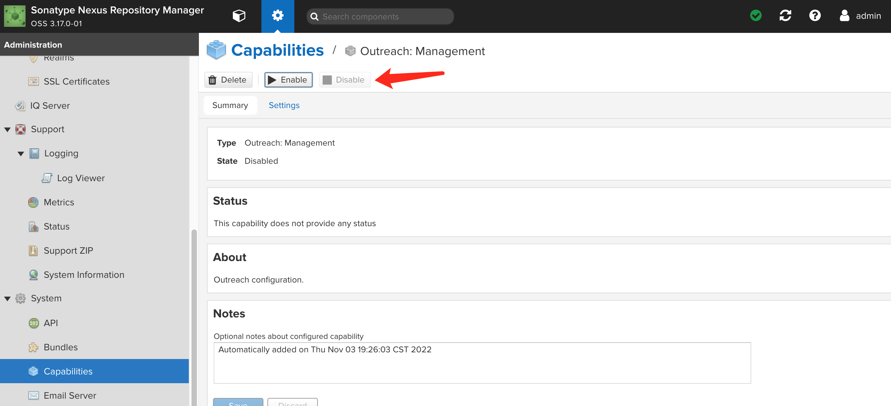
>
> 根据官方文档描述这是一个从仓库对外提供数据的插件，因为nexus3升级后不只是maven仓库还可以做其他仓库，比如docker，而这个功能看上去和maven没什么关系。


## 7.Jenkins搭建


根据jenkins官网对自己的描述，他是一个可集成有1800+插件的自动化服务(https://plugins.jenkins.io/)，

提供构建、部署和自动化的工程，可以说是opsdev的大总管，将开发的代码工程与环境紧密结合起来。以实现CI持续集成、CD持续发布的能力。

中文地址：https://www.jenkins.io/zh/doc/book/installing/


### 7.1 拉取jenkins lts长期稳定版本(jdk8)

```
# 从dockerhub上能找到的支持jdk8的长期稳定版是2.346.3-2，所以这里就选的这个版本
# 可参看官网的jdk支持对照表：https://www.jenkins.io/doc/administration/requirements/java/
docker pull jenkins/jenkins:2.346.3-2-lts-centos7
```

### 7.2 构建自定义jenkins镜像Dockerfile

由于jenkins环境需要jdk、maven和git的支持，而jenkins现有镜像是没有全部集成这三个工具的，所以我们采用自己编写镜像文件，基于jenkins/jenkins:2.361.2-lts

> 注意：Dockerfile中我们使用了些实现要准备的文件，如下：都需要拷贝到宿主机/docker/jenkins中(和Dockerfile和docker-compose.yml同目录)
>
> 1. jdk-8u181-linux-x64.tar.gz
>
> 2. apache-maven-3.8.6-bin.tar.gz
>
> 3. git-2.38.1.tar.gz
>
> 4. mvnrepo/settings.xml 
>
>    #因为jenkins作为使用maven的客户端，需要一个settings.xml，这个文件就是用《Maven私服搭建》章节的即可(注意localRespository要修改)。
>
> 5. Dockerfile
>
> 6. docker-compose.yml
>
> 7. home：目录
>
> 8. mvnrepo/repo：目录

```
# 在vi /docker/jenkins中创建Dockerfile文件[避免下载jdk等，实现需准备考，并和Dockerfile一起拷贝到宿主机的/docker/jenkins目录]

FROM jenkins/jenkins:2.375.1-lts-centos7
LABEL maintainer="xxx@126.com"
USER root
COPY * /docker/
WORKDIR	/usr/local
RUN set -e \
    && cp /usr/share/zoneinfo/Asia/Shanghai /etc/localtime \
    && echo 'Asia/Shanghai' > /etc/timezone \
    && chmod 755 /docker/* \
    && mv -f /docker/jdk-8u181-linux-x64.tar.gz ./ \
    && tar -zxf jdk-8u181-linux-x64.tar.gz \
    && rm -f jdk-8u181-linux-x64.tar.gz \
    && echo "jdk install is complete!" \
    && echo "try to install maven ..." \
    && mv -f /docker/apache-maven-3.8.6-bin.tar.gz ./ \
    && tar -zxf apache-maven-3.8.6-bin.tar.gz \
    && rm -f apache-maven-3.8.6-bin.tar.gz \
    && echo "maven install is complete!" \
    && echo "try to install git ..." \
    && mv -f /docker/git-2.38.1.tar.gz ./ \
    && tar -zxf git-2.38.1.tar.gz \
    && rm -f git-2.38.1.tar.gz \
    && yum remove -y git \
    && yum install -y curl-devel expat-devel gettext-devel openssl-devel zlib-devel \
    && yum install -y gcc-c++ make \
    && cd git-2.38.1 && ./configure && make && make install \
    && echo "git install is complete!" \
    && yum clean all

ENV JAVA_HOME /usr/local/jdk1.8.0_181
ENV CLASSPATH .:$JAVA_HOME/lib
ENV MAVAN_HOME /usr/local/apache-maven-3.8.6
ENV GIT_HOME /usr/local/git-2.38.1
ENV PATH $JAVA_HOME/bin:$MAVAN_HOME/bin:$GIT_HOME:$PATH
ENV JAVA_OPTS "-Dfile.encoding=UTF8 -Dsun.jnu.encoding=UTF8 -Djava.security.egd=file:/dev/./urandom"

EXPOSE 8080
EXPOSE 50000
USER jenkins
```

### 7.3 运行jenkins容器

为了方便维护，后续统一使用docker-compose.yml

```shell
# 1.首先在宿主机创建jenkins的容器目录/docker/jenkins
mkdir /docker/jenkins

# 2.因为jenkins容器启动后会自动使用jenkins用户(所属组为1000)来进行操作，所以需要给宿主机的/docker/jenkins目录授权，此处为简单我们直接使用777授权
chmod -R 777 /docker/jenkins

# 3.编写docker-compose.yml文件：vi docker-compose.yml

version: '3'
services:
  jenkins:
    build: 
      context: .
      dockerfile: Dockerfile
    image: 'lij/jenkins:2.346.3-2-lts-centos7'
    restart: always
    container_name: 'jenkins'
    hostname: 'jenkins'
    environment:
      # 该参数为避免插件安装失败，不校验
      - JAVA_OPTS="-Dhudson.model.DownloadService.noSignatureCheck=true"
    ports:
      - '9078:8080'
      # 50000 端口是jenkins内部通过JNLP(java提供的一个通过浏览器可以访问java应用的机制)
      - '50000:50000'
    networks:
      - 'exist-net-bloom'
    volumes:
      - '/docker/jenkins/home:/var/jenkins_home'
      # maven仓库的映射，容器中的目录会自动创建
      - '/docker/jenkins/mvnrepo:/mvnrepo'   
      - '/etc/timezone:/etc/timezone:ro'
      - '/etc/localtime:/etc/localtime:ro'
networks:
  exist-net-bloom:
    external:
      name: devops
```

### 7.4 初始化/更新源

> 查看web页面入口密码：/var/jenkins_home/secrets/initialAdminPassword
>
> 入口：10.10.1.199:9078
>
> 选择推荐安装即可：避免手动安装麻烦，如果这里安装失败也没关系，进入jenkins后可以更改为国内源后重新安装。
>
> 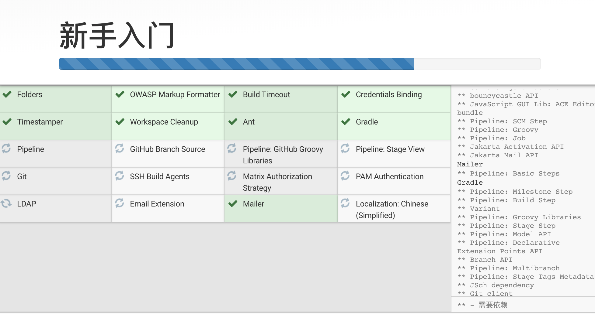
>
> 更新国内镜像源：ManageJenkins -> ManagePlugins -> Advance -> 升级站点
>
> 输入：http://mirror.esuni.jp/jenkins/updates/update-center.json
>
> 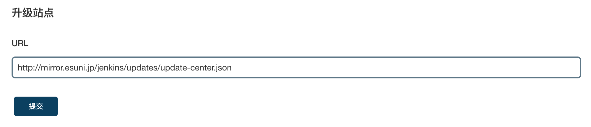
>
> 重启：http://10.10.1.199:9078/restart
>
> 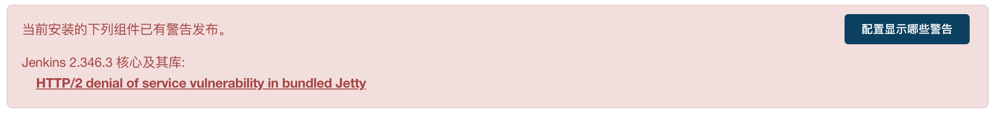
>
> 我这里安装后有一个警告：这个是jenkins内置的jetty存在一个漏洞，具体大家可以点过去看一下，因为jenkins一般都在内网使用，忽略这个问题就行。

### 7.5 全局配置jdk/maven/git

> maven的settings.xml我们已经通过宿主机的目录将其映射到容器内部，直接选择即可。
>
> 其他参照容器的环境变量设置好即可。
>
> `路径：系统管理->全局工具配置[如果路径不对，页面会直接报错，放心配置即可]`

### 7.6 插件安装

> 1.集成maven插件：【Maven Integration】、【Pipeline Maven Integration】
>
> 2.集成gitlab插件：【GitLab】、【Generic Webhook Trigger】、【Git Parameter（允许选择分支、tag构建）】
>
> 3.集成ssh插件：【Publish Over SSH】，让jenkins具备通过ssh远程发布的能力，通俗讲就是通过ssh将build后的包发布到目标服务器(如微服务服务器等)
>
> 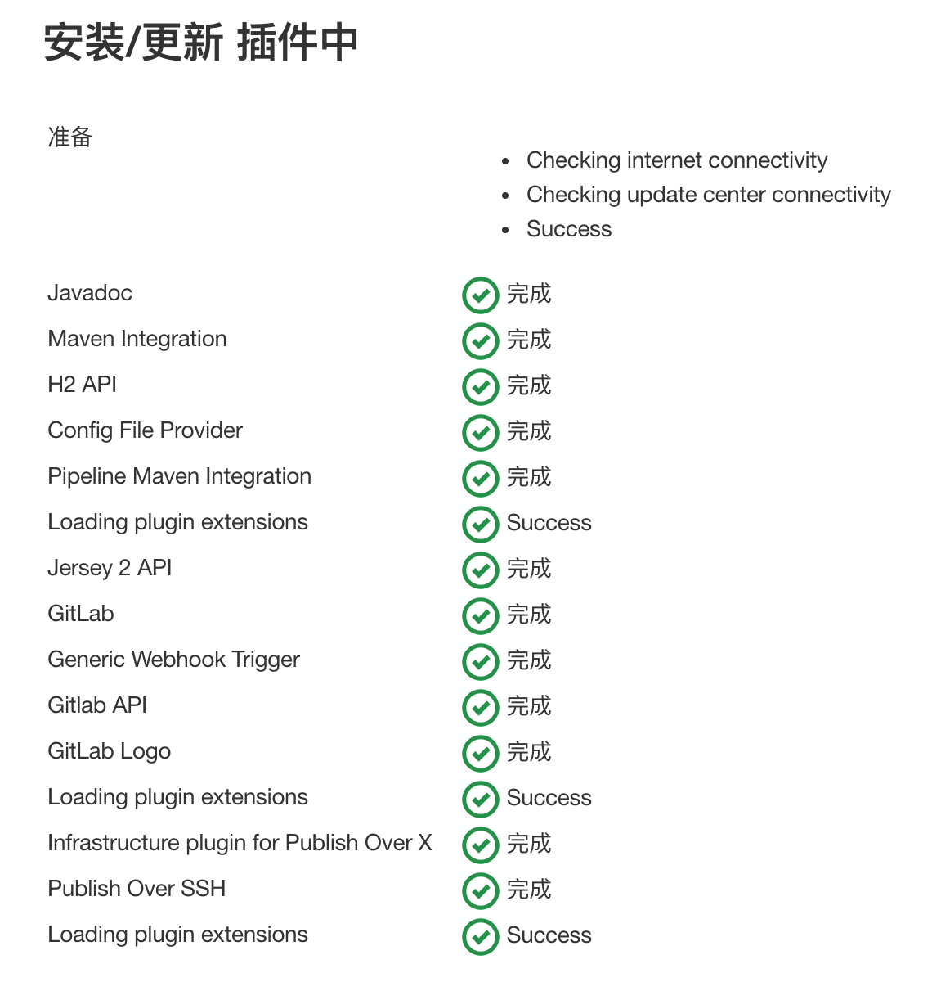
>
> `-> 安装完后重启Jenkins服务`

### 7.7 插件配置

> 1.【Publish Over SSH】配置：系统配置->Publish over SSH，主要功能就是可以让jenkins容器能够通过ssh命令远程到其他目标机器。
>
> jenkins构建后的工程会在自身的/var/jenkins_home/workspace目录，而我们的前、后端服务一般都是单独，比如都是用docker，那么jendins构建的包就需要发送给可以构建docker镜像的服务器(如宿主机、kubernetes等)，交由他们去将构建包打入镜像，然后部署镜像运行容器。【我们这里目标机器就是宿主机】
>
> - 用户名密码方式：通过输入用户名和密码来完成ssh的鉴权，会存在中间人攻击的风险。
>
>   - 原理：首次客户端要连接ssh服务时，如果客户端未携带公钥参数访问ssh服务，则ssh服务将本地的公钥下发给客户端，客户端使用收到的公钥将密码加密后发送，ssh服务收到密文后使用私钥解密，得到密码然后进行鉴权。
>
>   - 风险：中间人攻击，如果客户端连接的是中间人的ssh服务，那么中间人很容易就得到了客户端的密码。
>
>   - 配置方法：用户名密码方式比较简单，重点是RemoteDirectory，就是目标机器的目录，该目录在目标机器需要事先创建好，否则在配置页面test时会报错。
>
>     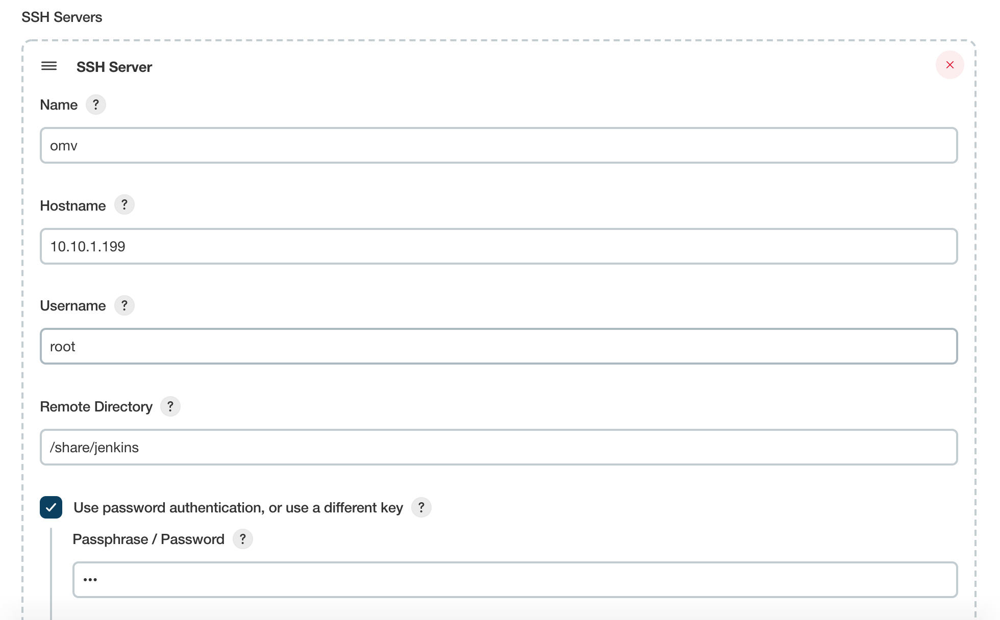
>
> - 公私钥免密方式：客户端不需要输入密码直接连接ssh进行操作。
>
>   - 原理：客户端需要自己生成一套公私钥，并提前将公钥发送给ssh服务，由ssh服务存储在自己的密钥配置文件(~/.ssh/authorized_keys)中.这样当客户端与ssh建立连接时，将会把自己的公钥传递给ssh服务，而ssh收到请求后发现客户端传递了公钥，所以将使用RSA认证，同时他也不会给客户端发送自己的公钥，而是将收到的公钥与自己保存的公钥列表比对，如果成功比对则通过在ssh服务创建一个随机数，并用收到的公钥加密发给客户端，客户端收到密文使用自己的私钥解密再讲解密后的随机数发回ssh服务，ssh服务收到后与创建时的随机数比对，成功则完成连接握手。
>   
>   - 优点：不存在中间人攻击，安全性高，但效率不如前者。
>   
>   - 配置方法：①服务端开启RSA验证 ②客户端生成RSA密钥对 ③客户端公钥提交至服务端 ④客户端配置使用RSA进行ssh连接 ⑤修改jenkins的配置
>   
>     - 修改服务端ssh服务，开启RSA验证：vi /etc/ssh/sshd_config
>   
>       ```shell
>       RSAAuthentication yes  #开启rsa验证
>       PubkeyAuthentication yes  #通过公钥进行验证
>       AuthorizedKeysFile .ssh/authorized_keys  #保存公钥的的服务端文件，该目录为~/.ssh/authorized_keys
>       ```
>   
>     - 客户端生成RSA密钥：进入jenkins容器，执行如下命令生成密钥对
>   
>       > ```shell
>       > # 生成密钥对，因为我们jenkins容器使用的是jenkins用户，而jenkins容器的默认用户是我们指定的/var/jenkins_home
>       > # 所以此处我们直接回车，使用默认的保存密钥对目录：/var/jenkins_home/.ssh/
>       > # 继续回车会让输入私钥的加密密码，我们此处不输入直接回车，即不设置私钥密码(如果设置的话，打开私钥文件都需要输入密码)
>       > ssh-keygen -t rsa
>       > ```
>       >
>       > -> 此时进入/var/jenkins_home/.ssh/目录会发现已经生成了id_rsa(私钥)和id_rsa.pub(公钥)文件，其内容都是经过Base64编码后的内容。
>   
>     - 客户端公钥拷贝到ssh服务器端：此处我们使用远程公钥发送命令(在jenkins容器中执行如下命令)
>   
>       > ```shell
>       > ssh-copy-id -i ~/.ssh/id_rsa.pub root@10.10.1.199  
>       > ```
>       >
>       > 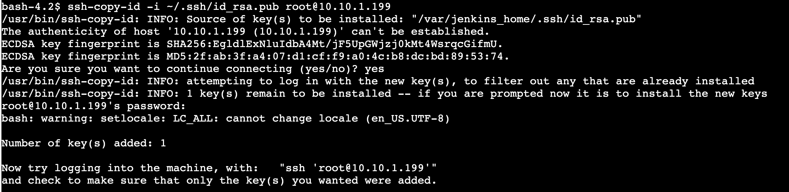
>       >
>       > 期间会要求输入宿主机root账号密码(此处多以演示为主，线上我们一般会专号专用，根据需求设置账号权限，不会使用root账号操作)
>       >
>       > 完成后，会在宿主机root账号的home目录的.ssh/authorized_keys中增加公钥内容，如果没有该文件会新建，如果有则会追加。
>   
>     - 客户端配置开启RSA登录ssh：vi /etc/ssh/ssh_config 【注意作为客户端是ssh_config起作用，作为服务端是sshd_config起作用，注意区分】
>   
>       ```
>       # 注意该文件为root权限修改，需要以root用户登录jenkins容器进行操作
>       docker exec -it -u root jenkins bash
>       vi /etc/ssh/ssh_config
>       
>       # 将以下注释释放即可
>       IdentityFile ~/.ssh/id_rsa
>       ```
>   
>       > 至此：配置完毕，可以直接在jenkins容器内部，通过ssh连接宿主机测试是否成功，如果不需要密码直接登录则表示成功，如下图：
>       >
>       > 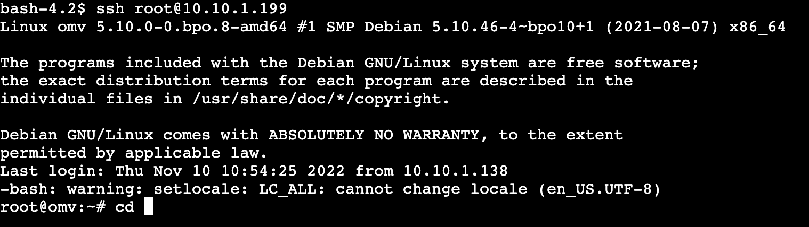
>       >
>       > 
>       >
>       > `-> 问题： 此处我们使用的是宿主机的root账号登录，权限最大；如果是自建的普通账号，那么账号的home目录(保存authorized_keys的目录)需要设置成不允许其他用户和组操作，即755权限，而文件authorized_keys需要指定为700权限。而客户端jenkins生成的公私钥的目录也要做同样的权限修改。`
>   
>     - jenkins配置："系统管理"->"系统配置"->"Publish over SSH"
>   
>       > 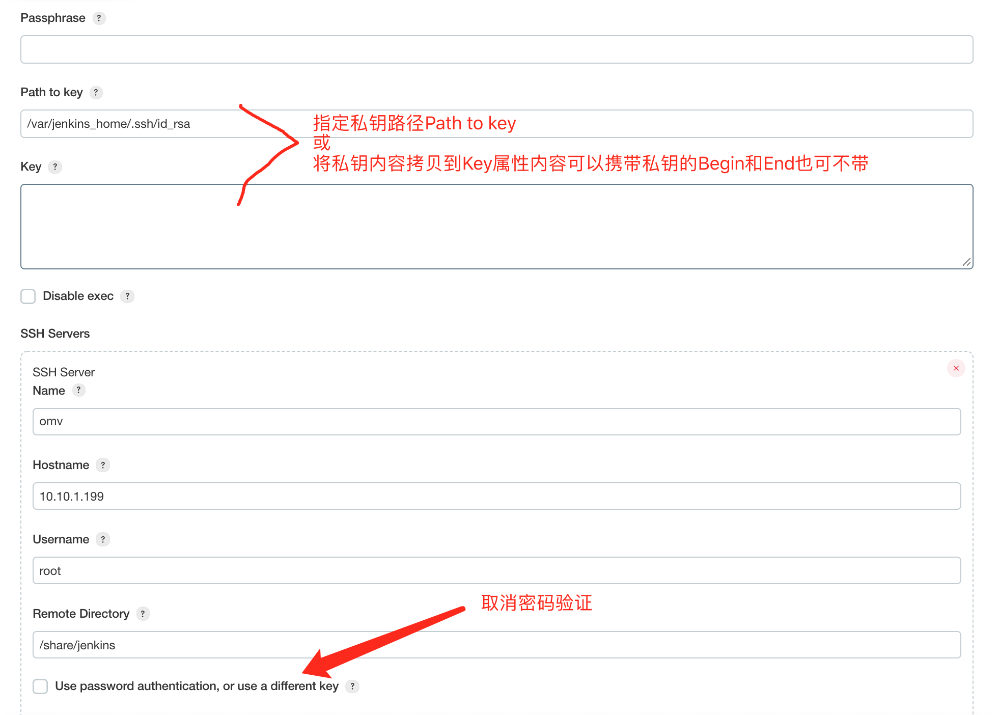
>       >
>       > 配置完成后，点击测试提示Success即可。
>       >
>       > 
>       >
>       > `问题：`有些同学点击测试后可能会提示【`privatekey(Failed to add SSH key)`】错误。
>       >
>       > -> 这是因为生成的私钥文件内容的格式有些问题，打开内容应该会发现开头是"`BEGIN OPENSSH...`"，而这不是标准的RSA私钥格式，
>       >
>       > 我们需要使用工具将内容转换成RSA格式，比如使用puttygen工具，有可视化界面，将私钥文件导入生成新的私钥再替换到jenkins容器的id_rsa即可。
>       >
>       > 当然也有命令行工具可以转换，这个交给大家自己去拓展吧，在此就不多说了。
>       >
>       > 标准RSA私钥文件内容开头应该是"`BEGIN RSA...`"。
>       >
>       > -> 原因：之所以通过ssh-keygen -t rsa会生成"BEGIN OPENSSH..."样的私钥，是因为openssh生成秘钥格式有两种，而老版本是"BEGIN RSA..."开头，新版本是"BEGIN OPENSSH..."开头，生成的是哪个版本看openssh的版本，当然也可以强制生成老版本格式，比如通过指定参数：
>       >
>       > ssh-keygen -m PEM -t rsa，其中-m PEM就是生成RSA格式的密钥，这个大家知道下就行了，具体可以查看ssh-keygen的使用。
>   
>     - `关于sftp的简单了解：`其实ssh服务除了包括sshd服务还包含sftp服务，即我们设置了以上的免密登录，那么sftp也自动变成了免密登录，而sftp授权的根目录是一般是登录用户的home目录，如果需要调整则要到sshd_config中进行配置，而我用的是root免密，所以共享目录是/root，如果通过jenkins需要拷贝文件(Transfer Set)到远程目录，需要留意一下这个目录，jenkins设置的目录都是基于宿主机的共享目录之上进行设置的。
>   
>       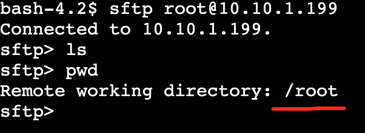

> 2.jenkins拉取gitlab代码通过sshkey：其实和ssh免密登录几乎一样，只不过生成密钥对时需要指定使用哪个gitlab账号
>
> ```
> # 在jenkins容器中生成密钥对，并指定gitlag账号
> ssh-keygen -t rsa -C “登录gitlab的邮箱”
> ```
>
> 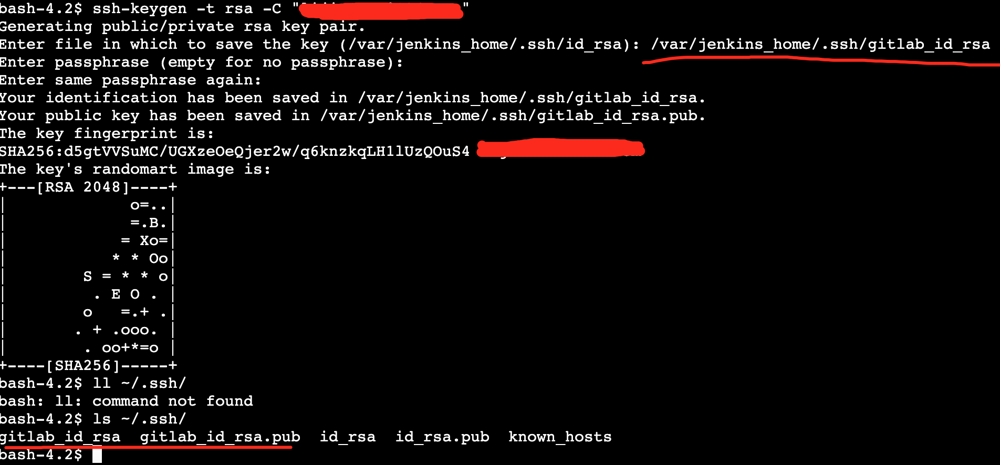
>
> 生成密钥对后，只需要2步：
>
> - 将公钥内容配置到gitlab对应账号的sshkey
>
>   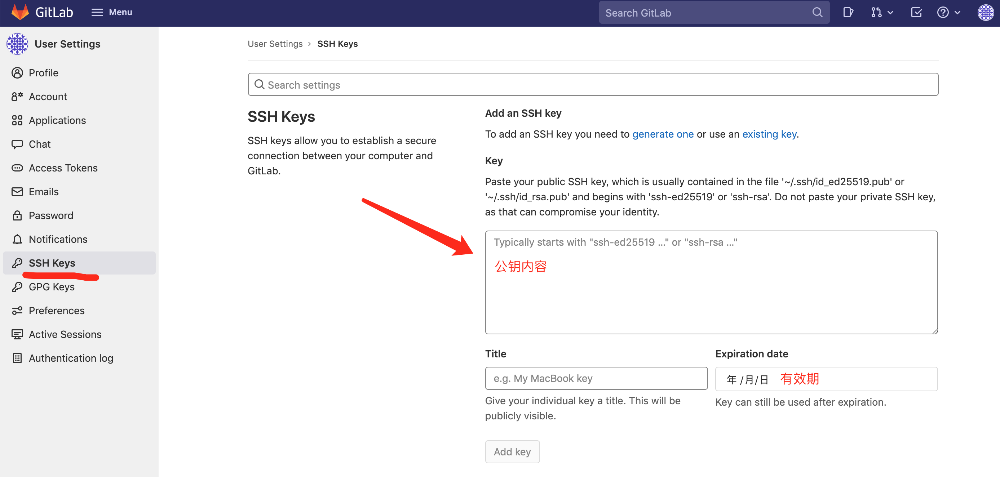
>
> - 将私钥配置到jenkins的凭证中
>
>   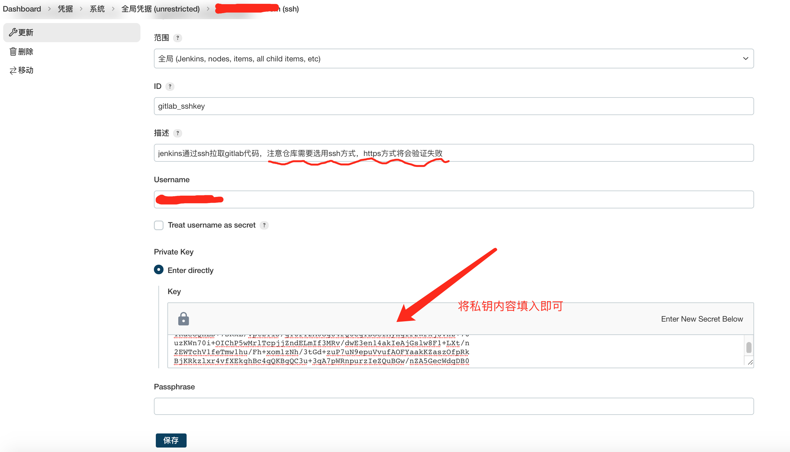
>
> - `注意：`这样配置将会是失败的，因为我们已经生成了2套公私钥，并且默认使用的是/etc/.ssh/ssh_config中指定的~/.ssh/id_rsa，
>
>   而gitlab使用的是gitlab的账号，所以需要单独配置一下gitlab的认证使用哪个私钥，否则都去用默认的了，肯定会验证失败。
>
>   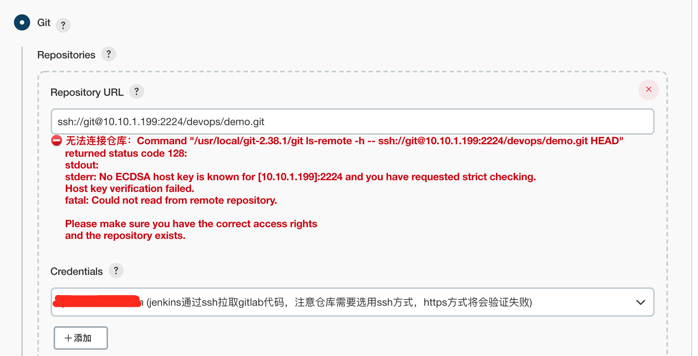
>
>   ```
>   # 修改jenkins容器ssh_config配置文件:vi /etc/ssh/ssh_config
>   # ssh命令读取配置文件顺序：命令行参数 -> ~/.ssh/config -> /etc/ssh/ssh_config
>   Host 10.10.1.199 # 随意定义的一个名字【但因为我这里gitlab是将22端口映射到宿主机2224上，所以Host要指定为10.10.1.199，否则匹配补上】
>       HostName 10.10.1.199 # gitlab的ip地址【指定宿主机ip】
>       Port 2224 # 端口号，我们的gitlab映射ssh端口时指定的为2224
>       PreferredAuthentications publickey # 指定认证方式
>       User xxx@126.com # 指定登录gitlab的账号
>       IdentityFile ~/.ssh/gitlab_id_rsa # 指定为gitlab生成的证书的私钥绝对路径
>                                                                                       
>   # 操作完后可以在jenkins容器中先做测试，直接拉取gitlab代码看是否正常，注意要使用ssh方式拉取
>   git clone ssh://git@10.10.1.199:2224/devops/demo.git
>   ```
>   
>   如果是如下结果，说明配置成功：
>   
>   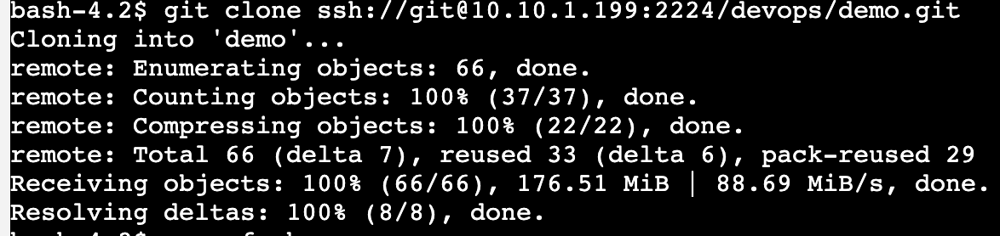
>   
>   
>   
>   `更正一个网上错误概念：`如上操作，其实openssh的配置文件都是以一个Host节点为单位，可以配置多个Host，而默认的一般是"Host *"，表示所有的都生效
>   
>   但是网上有多数资料，在解决ssh客户端存在多个证书密钥时都需要配置一个ssh-add ~/.ssh/gitlab_id_rsa的命令，
>   
>   其实这是不对的，一个很大的误导，ssh-add是向ssh-agent代理认证服务中添加私钥证书，如果添加了即便~/.ssh/config配置的不对也是生效的，
>   
>   其实这是两种方式，前者是ssh自身读配置去建立连接，而ssh-agent是ssh将认证功能交给代理完成，而代理不会使用默认的配置，而是优先使用提交给代理高速缓存的证书进行验证，而ssh-add就是向高速缓存中存入证书信息，所以指定了ssh-add后，即便不配置~/.ssh/config也是可行的，但ssh-agent是一个临时存储，重启后缓存会清空。
>   
>   -> 如果要用这种方式，则按如下操作即可：
>   
>   ```shell
>   # 加入代理，如果执行报错【Could not open a connection to your authentication agent】
>   # 可以先执行命令：[ssh-agent bash]，然后执行如下命令
>   ssh-add ~/.ssh/gitlab_id_rsa
>   # 查看是否成功
>   ssh-add -l
>   ```
>   
> - 最后我们在jenkins的仓库页面可以看到不会提示报错了
>
>   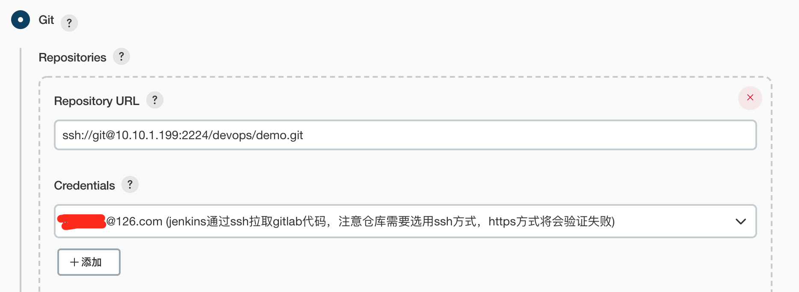
>

> 详细命令可参考OpenSSH官网：https://www.openssh.com/manual.html

### 7.8 一个简单的实操：

`-> 从创建jenkins的job开始`

> 1.gitlab设置：我们从新建一个jenkins任务开始，建一个自由风格项目，我们暂时只让他能拉取git的代码。
>
> -> 从gitlab上新建一个工程demo -> Idea创建Springboot项目demo，并提交至gitlab -> jenkins中指定拉取的仓库和鉴权信息。
>
> 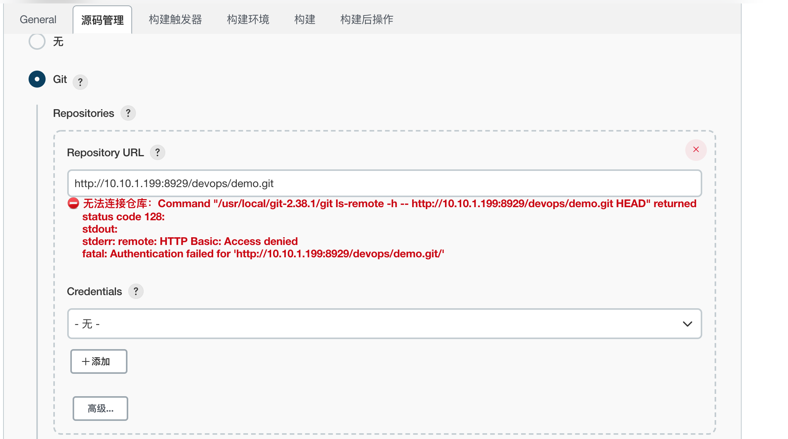
>
> -> 因为我的仓库是private，所以需要输入用户名、密码才可以，从Credentials选项添加即可（也可通过”凭证“功能单独添加）。
>
> -> 点击构建进行测试，如果输出如下内容表示git配置成功。
>
> 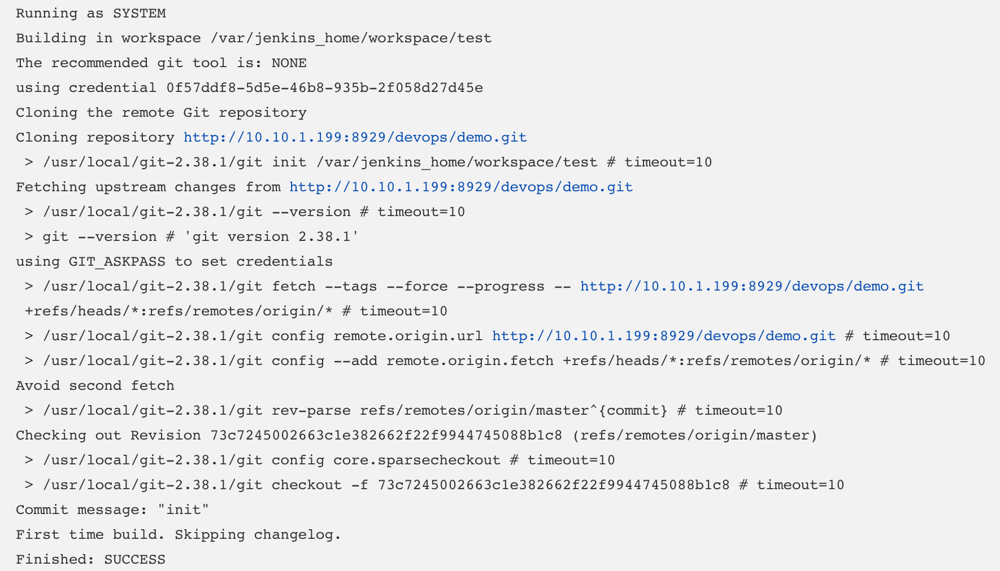

> 2.maven设置：其实之前讲的”全局“配置中已经对maven做了配置，在jenkins的job中只需引用即可，并添加自己的构建命令。
>
> 路径：找到job的”构建“节点，然后选择之前配置的maven，在”目标“中指定构建命令，如：-DskipTests=true clean install
>
> 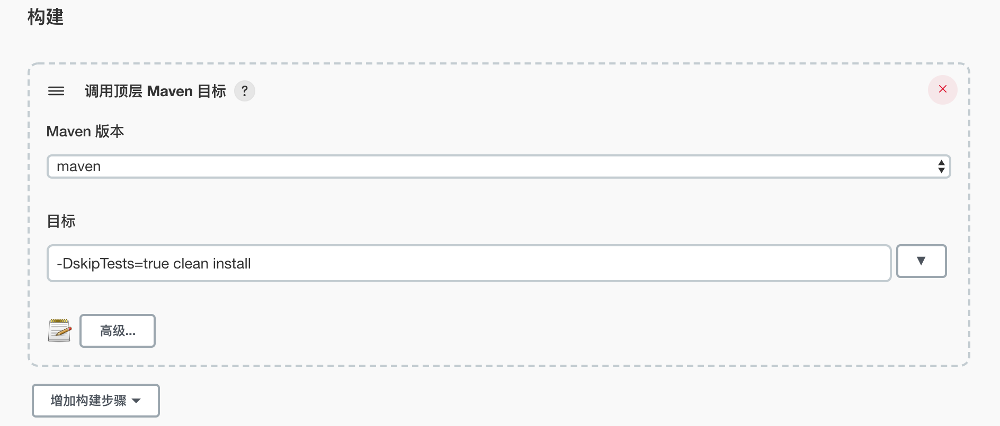
>
> -> 再次点击构建，我们发现log中是成功的，并在构建到目录：/var/jenkins_home/workspace/test/target/demo-0.0.1-SNAPSHOT.jar
>
> 
>
> `注意：`第一次构建时会比较慢，因为会去中心仓库下载大量的依赖到本地私服(可以到nexus中查看)并且下载到jenkins本地(maven客户端)，
>
> 之后再次构建将会直接使用jenkins本地的依赖，就会很快了。
>
> 
>
> `优化：`我们发现打包后的jar包名字不太好记，这个是maven的设置，只需在springboot工程的pom.xml中增加<build>：通过fileName指定即可
>
> ```
> <build>
> 	<! -- 打包后的jar包为：demo.jar -- >
> 	<finalName>demo</finalName>
> 	<plugins>
> 	  <! -- springboot专用构建插件，如果不配置，打出来的jar包，通过java -jar不能找到main方法 -- >
> 		<plugin>
> 			<groupId>org.springframework.boot</groupId>
> 			<artifactId>spring-boot-maven-plugin</artifactId>
> 		</plugin>
> 	</plugins>
> </build>
> ```

> 3.ssh发布：这里我们先使用【最简单的ssh命令方法来】发布服务，后边会讲解pipeline流水线的发布方法。
>
> 根据流程我们已经完成了git项目的拉取、maven的构建打包，最后就是将打包后的springboot部署到docker容器并运行。
>
> 我们知道运行docker之前要先有镜像，而因为我们需要的是包含springboot jar包的镜像，所以我们只能先构建这么一个镜像，然后再运行镜像。
>
> ->此处我们暂时不介入docker仓库，而是直接在docker本地构建镜像后启动运行容器
>
> ->需要做的事情：
>
> - 将构建的jar包拷贝到宿主机指定目录(如：/share/jenkins/demo)
> - 在springboot工程创建Dockerfile文件，用于构建镜像(放到宿主机存放jar包所在目录)
> - 在springboot工程创建docker-compose.yml文件，用于启动容器(放到宿主机存放jar包所在目录)
> - 在jenkins构建后执行的脚本(可以写入脚本文件)，执行内容主要目的就是运行docker-compose up -d来启动容器。
>
> `-> 操作路径：`”构建后操作“ -> ”Send build artifacts over SSH“
>
> 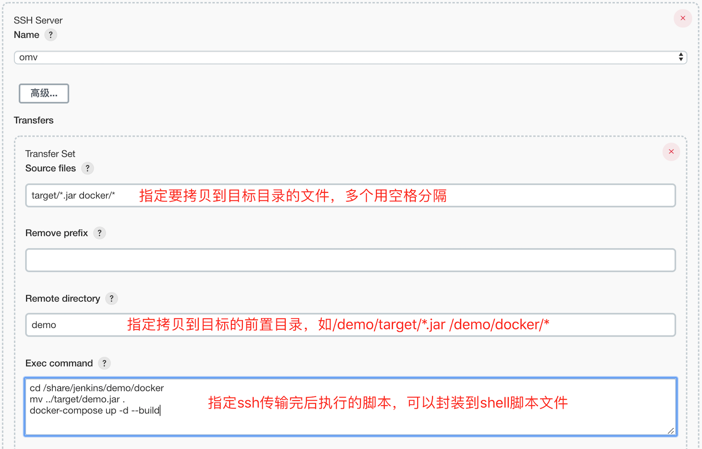
>
> -> 如上配置，打包后会将jar包通过ssh发布到宿主机的/share/jenkins/demo/target/demo.jar目录，/share/jenkins是我们在系统设置中设置ssh时指定的目录，
>
> /demo则是"Remote directory"属性的含义，target/demo.jar则是匹配"Source files"属性。
>
> -> 虽然不会将springboot的docker目录打包，但已经通过git拉取到了jenkins的目录，所以此处可以将docker目录一起发布到ssh远程目录,
>
> 这样我们就可以通过ssh脚本来执行构建并运行容器了。

> `问题：`如上配置，经过多次对demo构建后，虽然镜像和容器都是最新构建和部署的，但是会产生多个镜像名为none的镜像，这是因为我们每次都会构建新镜像，而原有镜像没有删除，此时docker会更名他们为none，所以我们对脚本进行优化，就是构建前先把老镜像删除，因为我们每次都是重新打jar包，所以镜像也不会相同，所以老镜像直接删除即可。
>
> 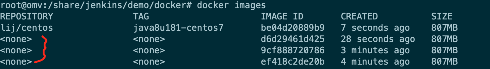
>
> ```
> # docker-compose down 停止容器并删除镜像，这个也不太合适，因为构建起见容器不可用，虽然k8s可以热部署，但这里我们也不希望让服务不可用时间过长
> set -e \
> && cd /share/jenkins/demo/docker \
> && mv ../target/demo.jar . \
> && docker-compose up -d --build \
> && docker image prune -f
> 
> # 好处：这样操作容器的不可服务时间会很短，因为没有停掉原有容器的操作，这样在构建期间将会临时创建新容器，构建完成后替换掉原有容器。
> ```
>
> `-> 悬空镜像：`就是新构建的镜像替换了原有镜像的标签，而原有镜像的标签将会变成none，这些镜像docker并不会自动删除，我们可以通过命令查出这样的镜像手动删除，
>
> 查找悬空镜像命令：docker images -f "dangling=true" -q
>
> 删除悬空镜像命令：docker image prune  也可以  docker rmi $(docker images -f "dangling=true" -q)  ，其中-f是不需要确认
>
> 官网参考：https://docs.docker.com/engine/reference/commandline/image_prune/

> Springboot工程内容资料：工程名为demo
>
> 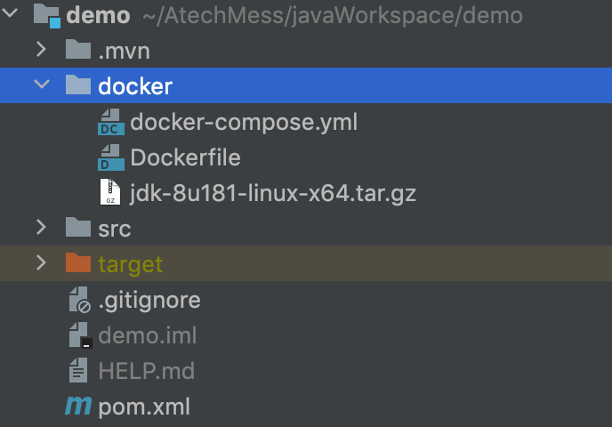
>
> - Dockerfile文件：我没找到合适的java 1.8版本的镜像，所以这里选择基于centos7构建了带有jdk8和jar包的镜像，如果大家自己能找到合适的镜像自行替换就行，
>
>   只要保障有java环境即可，我这个构建完后有800M+，如果希望轻量级也可以基于alpine内核来构建。
>
>   ```dockerfile
>   FROM centos:centos7
>   LABEL maintainer="xxx@126.com"
>   USER root
>   COPY * /docker/
>   WORKDIR	/usr/local
>   RUN set -e \
>       && cp /usr/share/zoneinfo/Asia/Shanghai /etc/localtime \
>       && echo 'Asia/Shanghai' > /etc/timezone \
>       && chmod 755 /docker/* \
>       && mv -f /docker/jdk-8u181-linux-x64.tar.gz ./ \
>       && tar -zxf jdk-8u181-linux-x64.tar.gz \
>       && rm -f jdk-8u181-linux-x64.tar.gz \
>       && echo "jdk install is complete!" \
>       && echo "try to run server ..." \
>       && mkdir packages \
>       && mv -f /docker/*.jar ./packages
>   ENV JAVA_HOME /usr/local/jdk1.8.0_181
>   ENV CLASSPATH .:$JAVA_HOME/lib
>   ENV PATH $JAVA_HOME/bin:$PATH
>   # 暴露端口
>   EXPOSE 8080
>   # 执行脚本
>   ENTRYPOINT ["java","-jar","/usr/local/packages/demo.jar"]
>   ```
>
>   ==> 当然也可以基于openjdk来构建：【更简单】
>
>   ```
>   FROM openjdk:8u181-jdk
>   LABEL maintainer="xxx@126.com"
>   COPY * /usr/local/packages
>   # 暴露端口
>   EXPOSE 8080
>   # 执行脚本
>   ENTRYPOINT ["java","-jar","/usr/local/packages/demo.jar"]
>   ```
>
>   
>
> - docker-compose.yml文件：
>
>   ```shell
>   version: '3'
>   services:
>     demo:
>       build:
>         context: .
>         dockerfile: Dockerfile
>       image: 'lij/centos:java8u181-centos7'
>       restart: always
>       container_name: 'demo'
>       hostname: 'demo'
>       ports:
>         - '9099:8080'
>       networks:
>         - 'exist-net-bloom'
>       volumes:
>         # - '/data/logs:/data/logs' # 用来映射微服务日志
>         - '/etc/timezone:/etc/timezone:ro'
>         - '/etc/localtime:/etc/localtime:ro'
>   networks:
>     exist-net-bloom:
>       external:
>         name: devops
>   ```

### `7.9 增加git parameter构建`

通过指定git的分支、标签等进行构建，该方式为jenkins的一个插件，通过插件管理安装git-parameter即可，也可手动离线安装：

源码地址：https://github.com/jenkinsci/git-parameter-plugin，可自行构建后离线安装，直接将jpi文件放入Jenkins的home目录的plugins文件夹下

官方插件地址：http://mirror.xmission.com/jenkins/plugins/git-parameter，可直接下载hpi文件离线安装

> 配置方式：General -> "参数化构建过程" -> "Git参数"
>
> 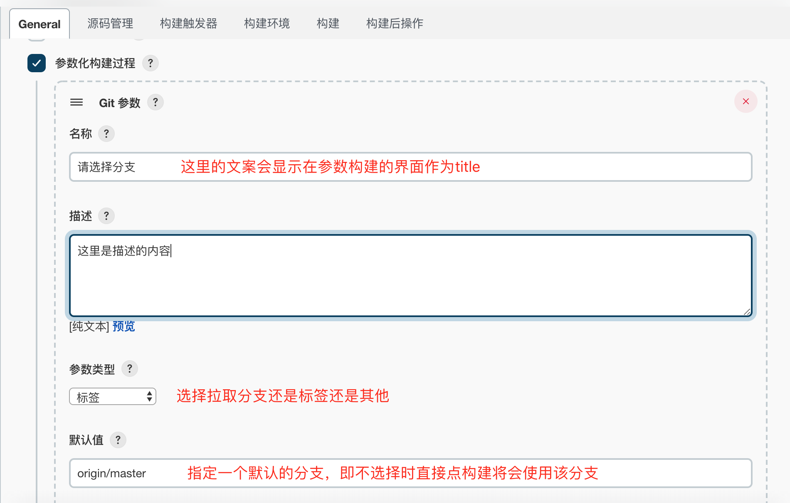
>
> -> 配置完后保存，在job面板会多出一个"Build With Parameters",点击进入即可选择对应的标签或分支。
>
> 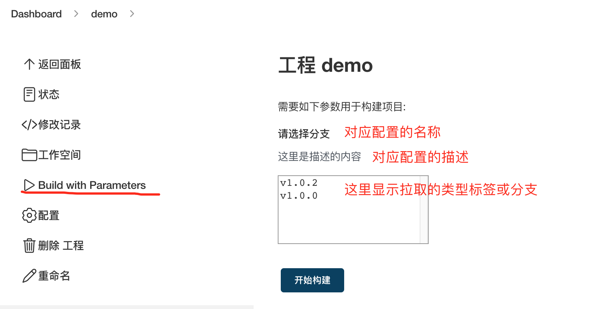

> `遇到的第一个坑：`我是通过jenkins的插件管理，自动安装的最新版git-parameter插件，为0.9.18，而这个版本配置完“参数化构建”后出现无法拉取tag和branch的现象。
>
> 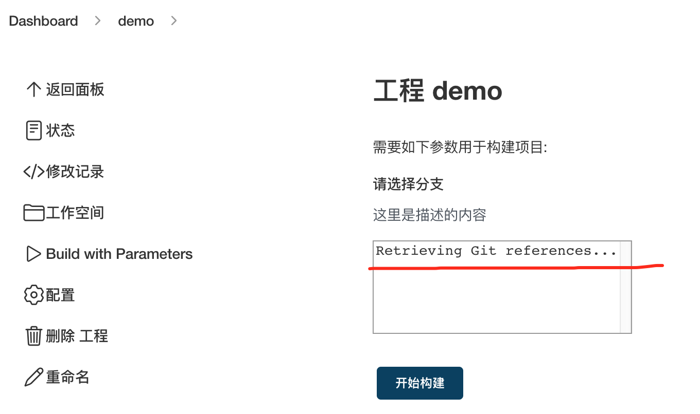
>
> -> 解决方法：以上问题并未发现明显的报错日志，因为毕竟最新版插件可能存在兼容问题，于是逐个更换旧版本插件，知道更换到0.9.15版本才正常。
>
> 插件下载地址：http://mirror.xmission.com/jenkins/plugins/git-parameter/0.9.15/git-parameter.hpi
>
> 离线安装：将插件下载后采用上传离线安装即可，"系统管理"->"插件管理"->"高级"->"Deploy Plugin"
>
> 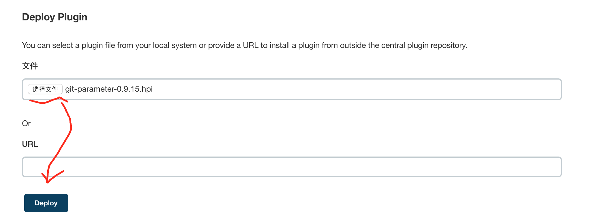
>
> 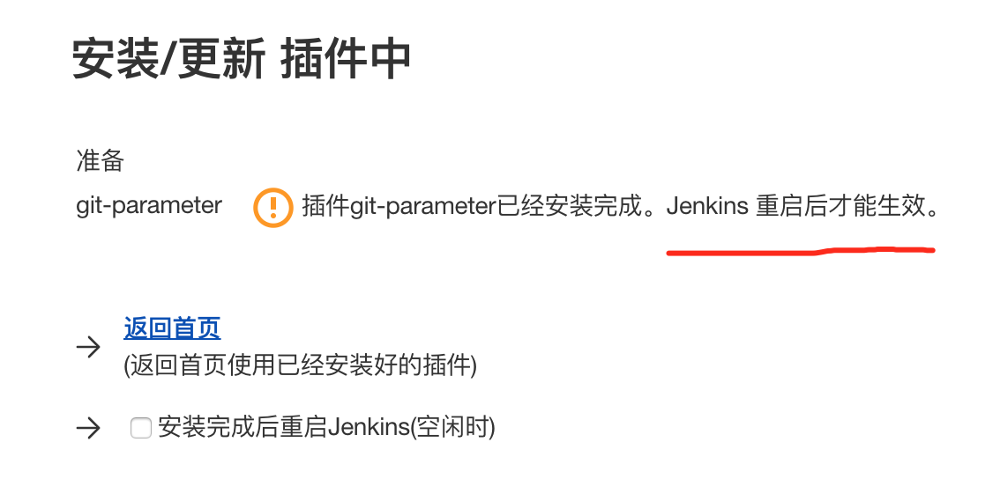
>
> -> 安装完成后记得重启，在进入就没问题了。

> `第二个坑：`按照上边配置完后，选择合适的参数构建，但发现拉取的git代码并不是指定的分支，而是仍然为默认分支的代码？
>
> -> 我们需要在jenkins拉取代码构建之前先"手动切换"到选中的分支或标签。
>
> 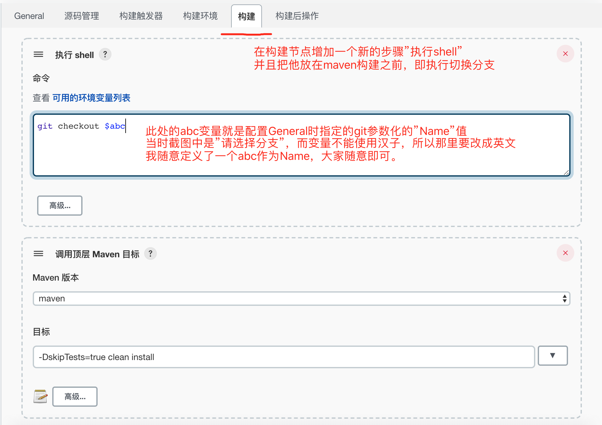
>
> -> 配置完后再进行构建，结果是成功的，并且通过log日志可以看出，在Maven构建之前执行了切换分支的操作。
>
> 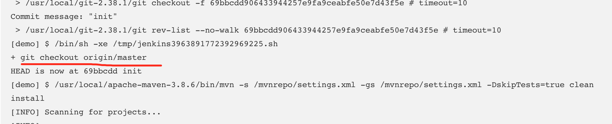
>
> ->`问题：`从日志中看出，其实拉取的还是master分支，只是后来切换到我们选择的$branch分支，所以其实我们应该直接在git拉取时直接使用$branch,
>
> 而无需通过ssh切换到$branch分支。以上配置的问题在于，如果master无更新，则不会拉取内容，则即便选择的$branch分支有更新，也不会拉到本地。
>
> 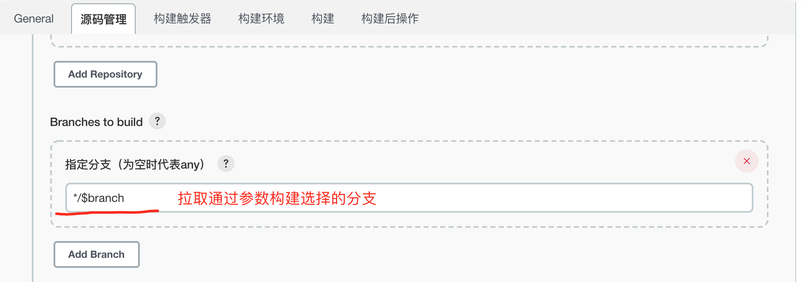
>
> => 配置完删除执行git checkout $branch的脚本节点即可。


## 8.Docker私服搭建：Harbor/Nexus3

私服我们很熟悉了，比如docker hub就是官方私服，而有些情况比如我们自建的镜像，不想往外传，就需要考虑内部搭建一个私有服务器来存放私有的镜像。

Harbor是一个比较成熟且图形界面功能比较完善，而nexus从2升级到3后，做了很大的更改，其中就包括可以作为docker镜像的私服。在这里我们两种私服都讲一下。

> 目标：搭建docker私服将应用在jenkins构建完docker镜像后，优先上传到私服，而后部署容器时从私服拉取，这样我们搭建微服务集群的效率就会很高。
>
> 在实际生产中，我们一般采用k8s(docker集群化)，这样的话如果没有私服，那么假设有3台k8s集群，那么构建镜像的主机可能是任意一个或者是都参与，那么每个主机本地都存一份镜像就会显得过于冗余，而如果由首次构建镜像的主机上传到私服，而其他主机直接拉取就会很快并且不会占用共用带宽，并且镜像都在私服也方便管理，更加安全和方便治理。
>
> 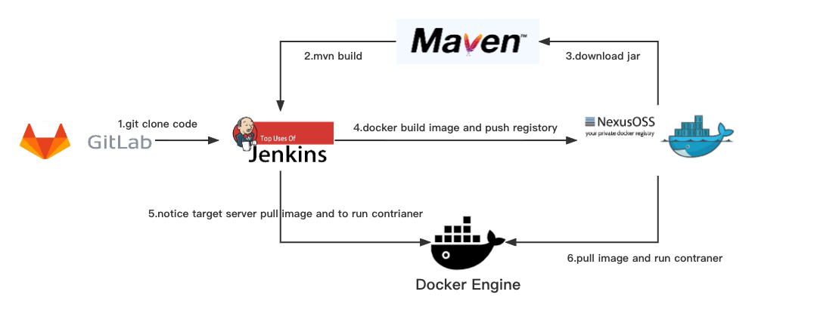

> `Docker的概念：`在docker的概念中，如果要登录私服，私服必须是https协议服务才能进行正常鉴权，当然docker没那么傻，并没有规定那么死，
>
> 只不过出于安全考虑他期望是https，当然如果你有从CA认证机构购买的证书，当然一定要使用https，这样直接配置证书，证书是可以正常验证的；
>
> 而如果你使用的是自签发证书或者只有http的仓库服务，那么docker允许你将仓库加入到信任列表，即需要将仓库配置到要连接仓库的docker服务对应的daemon.json
>
> ```
> "insecure-registries":[
>   "10.10.1.199:9082", # 提交时的hosted仓库
>   "10.10.1.199:9083", # 拉取时用的group仓库
> ]
> ```
>
> 这样配置好后，即便是http仓库或是自签发证书的https都可以正常登录。
>
> 
>
> `允许docker使用Nexus账号登录私服`：说到这里顺便也讲一下docker登录私服的账号，既然docker login到私服，那肯定是需要账号，
>
> 默认Nexus是不允许docker使用Nexus的管理账号登录的
>
> 需要管理员开启该功能：`"设置"->"Security"->"Realms"->"Docker Bearer Token Realm"`，激活该选项即可。

> --> 我们先拿Nexus3来搭建一个提供http服务的私服，再用Harbor搭建一个自签发证书的https私服，显然我是没有花钱买过证书的，
>
> 当然免费证书现在也是很多中小型公司比较青睐的，使用率比较高的比如：[Let's Encrypt](https://letsencrypt.org/zh-cn/),大家可以自行申请，但前提是要有一个可以绑定的域名才行。

### 8.1 Nexus3私服搭建

`第6章节`我们已经搭建好了Nexus3服务器，这里我们就直接复用了，其实他和maven的概念基于相同，区分group、hosted、proxy这几种类型的仓库，只不过Nexus3默认安装后并没有自动给我们创建这些仓库，而是需要我们手动自己创建。

> 官方地址：https://help.sonatype.com/repomanager3/nexus-repository-administration/formats/docker-registry

#### 8.1.1 Docker容器部署

> 准备工作：我们在安装Nexus容器时，只映射了一个端口9081->8081
>
> 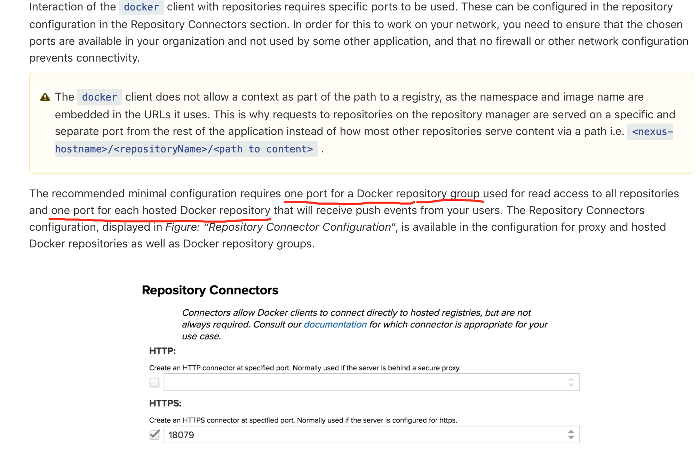
>
> 而根据官网描述，docker仓库不能在上下文路径基础上提供服务，也就意味着我们需要单独提供一个端口为docker仓库服务使用，
>
> 根据官网描述，每个hosted仓库都建议有一个独占的端口用于接收客户端镜像的提交，而使用一个端口给group的仓库用于客户端从私服拉取镜像，
>
> 所以我们这里至少要指定2个端口，一个给hosted一个给group使用(即一个提交一个拉取)，比如9082->8082，9083->8083
>
> -> 其实换到docker的角度就很好理解，docker拉取私服需要先登录到私服，而登录的关键信息就是ip+port，而类比Nexus提供的maven的仓库地址形如：
>
> http://10.10.1.199:9081/nexus/repository/maven-public/，显然docker是无法登录到这样的仓库的，而Nexus针对docker仓库是提供了http或https的服务端口，这样就可以通过【docker login ip+port】来登录到对应的docker仓库，进而进行docker pull或docker push操作。
>
> -> 
>
> ```
> version: '3'
> services:
>   nexus3:
>     image: 'sonatype/nexus3:3.17.0'
>     restart: always
>     container_name: 'nexus3'
>     hostname: 'nexus3'
>     environment:
>       - NEXUS_CONTEXT=nexus # 默认不指定上下文为根/，这是和nexus2不同的地方
>     ports:
>       - '9081:8081'
>       - '9082:8082'
>       - '9083:8083'
>     networks:
>       - 'exist-net-bloom'
>     volumes:
>       - '/docker/nexus3/data:/nexus-data'
>       - '/etc/timezone:/etc/timezone:ro'
>       - '/etc/localtime:/etc/localtime:ro'
> networks:
>   exist-net-bloom:
>     external:
>       name: devops
> ```
>
> -> 只需命令行执行: docker-compose up -d 即可更新容器配置

#### 8.1.2 仓库创建与配置

> 1.创建proxy类型的docker仓库：用来作为中心仓库，本地没有的通过代理到中心仓库下载到私服仓库。
>
> 操作路径：设置->Repository->**Repositories**->create repository->docker(proxy)
>
> 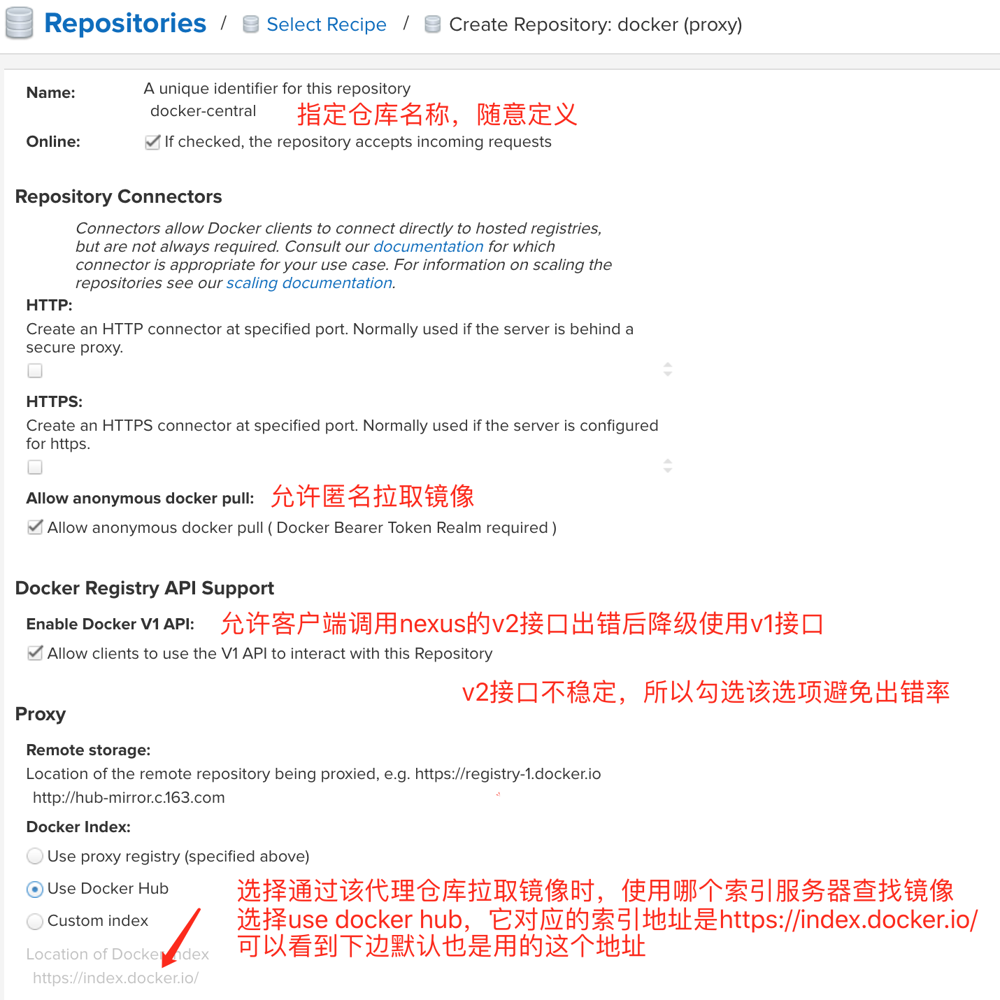
>
> 除以上配置我有些是偷工减料了，比如Storage，正常为了与其他库隔离，docker可以单独创建一个存储目录，可以到Blob Storage中创建，这里为了方便我们省略了。
>
> `[重要属性：Docker Index]`：注意这里我指定的是"Use Docker Hub"，他的作用是当我们通过docker pull或docker search的时候，仓库会先到Docker Index指定的服务器去查找镜像的关键信息，找到后再去用完整的镜像标签去镜像源拉取镜像，我们平时使用的标签只不过是一个简化的索引，所以这个Docker Index不能随意指定，否则会找不到镜像，而一般的Docker Index都会和镜像源的地址一起发布，而Docker Hub的索引服务是https://index.docker.io/，所以此处我是用它，当然也可以手动指定地址https://index.docker.io/；如果大家知道其他索引服务器也可以选择手动指定，可以尝试下。
>
> 官网出处：https://help.sonatype.com/repomanager3/nexus-repository-administration/formats/docker-registry/proxy-repository-for-docker
>
> > 一些常用的镜像源列举：
> >
> > - docker hub：https://registry-1.docker.io
> > - docker中国：https://registry.docker-cn.com
> > - 网易：http://hub-mirror.c.163.com
> > - 腾讯云：https://cloud.tencent.com
> > - 中科大：http://mirrors.ustc.edu.cn/
>
> `[注意]`: 这里的proxy仓库并没有指定http或https端口，其实是可以指定的，如果指定了当然可以单独连接该仓库通过docker pull拉取代理的源中的镜像，
>
> 但是这里我们主要是要用到group类型的仓库的拉取，他的特点就是可以汇集hosted和proxy多个仓库的镜像，具体可以看后边的测试部分。
>
> 
>
> 2.创建hosted类型的docker仓库：用来保存自己构建的镜像
>
> 操作路径：同上，只不过需要指定http的端口，我们这里设置8082，proxy代理仓库因为是代理，并不直接提供服务，所以无需指定端口，而他一般是交给group，由客户端连接group然后拉取所有在group下的仓库的内容，优先拉取本地私服镜像，如果没有的，则由私服拉取proxy代理仓库的镜像。
>
> 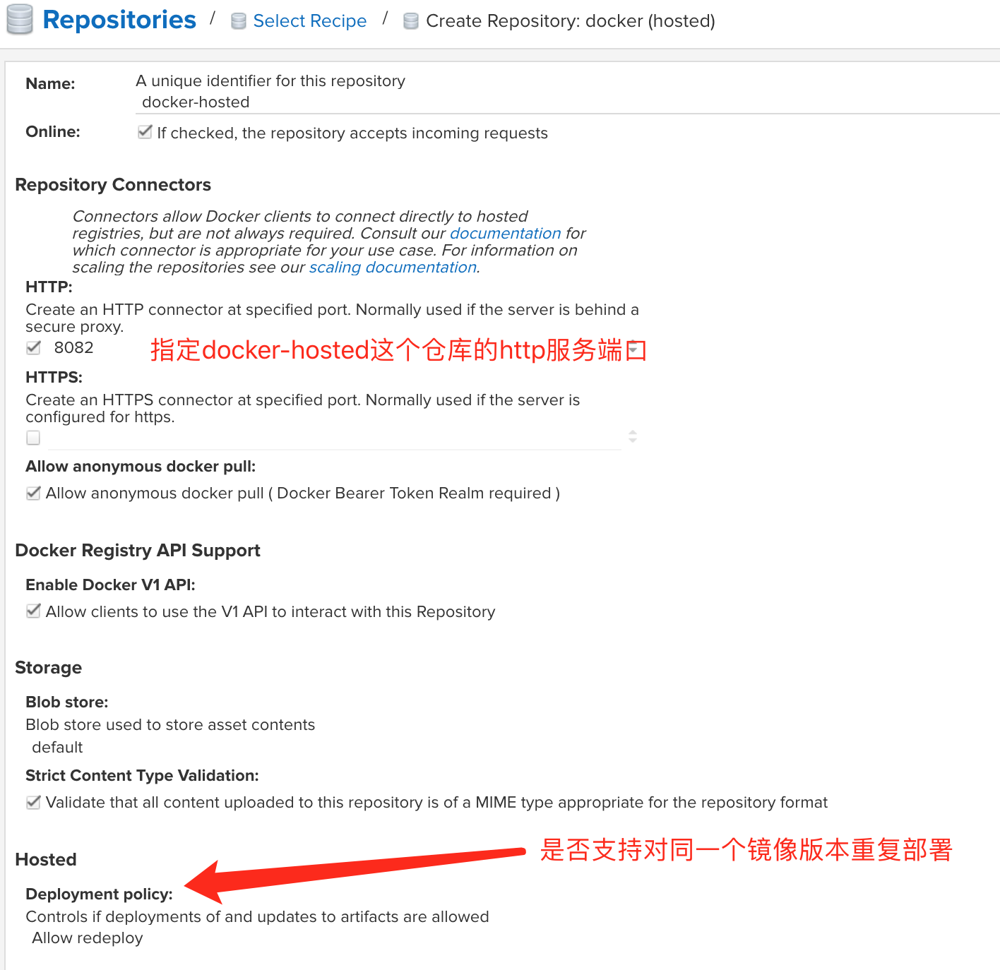
>
> 3.创建group类型的docker仓库：同maven的group一个意思，是一个虚构的仓库，里边包含了所有仓库镜像的集合（需要创建时手动选择汇总哪些仓库）。
>
> 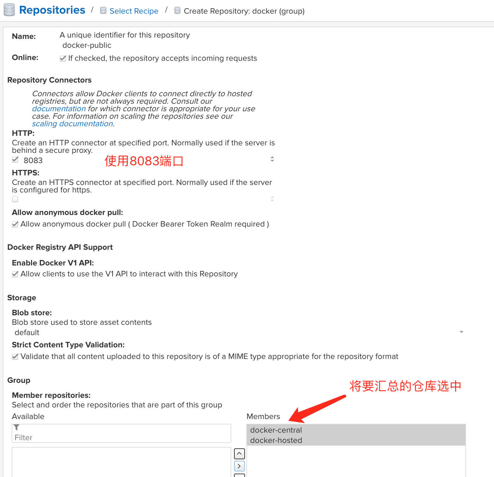
>
> 
>

#### 8.1.3 实践

> 4.试错阶段：
>
> -> 假设此时没有将仓库地址加入docker信任列表、也没有开启允许docker使用nexus账号登录
>
> 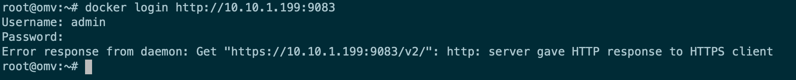
>
> 错误意思就是请使用https协议，所以我们进行优化，将仓库加入信任列表：
>
> ```
># 进入宿主机操作
> vi /etc/docker/daemon.json
>
> # 注意这里因为是通过映射到宿主机的端口访问，所以不是Nexus中设置的8082和8083，而是宿主机的端口
> "insecure-registries": [
>   "10.10.1.199:9082", # 提交时的hosted仓库
>   "10.10.1.199:9083", # 拉取时用的group仓库
> ]
> 
> # 重启docker使之生效
>systemctl restart docker
> # 查看配置是否生效
>docker info
> ```
>
> 再次执行 docker login http://10.10.1.199:9083
>
> 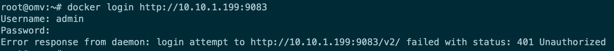
>
> 从错误得知，不再要求https了，而是401认证错误，所以此时我们在没有输错账号密码的情况，就需要开启支持nexus账号登录的功能：
>
> 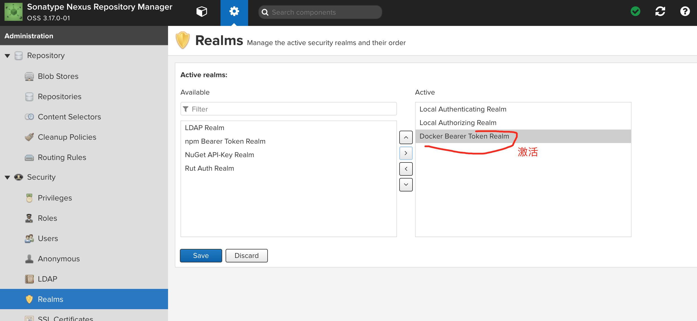
>
> -> 再试
>
> 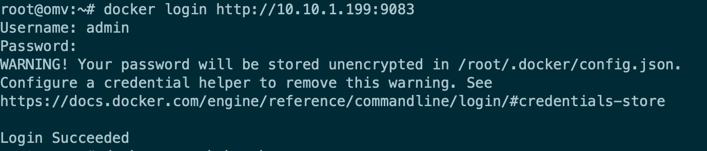
>
> 这次没问题，成功连接到group仓库
>
> ->`问题：`但是仔细看日志，可以发现登陆成功后，docker会将密码存入到当前用户home目录的.docker/config.json中，并且是未加密不安全的，打开后我们发现内容如下：
>
> ```
>{
>   "auths": {
>    "10.10.1.199:9083": {
>       "auth": "YWRtaW46MTIzNDU2" # 该内容为base64编码
>    }
>   }
> }
> # 我们可以使用base64解码，可以发现很容易拿到明文的密码，所以这样是不安全的，这主要看我们实际环境的网络架构，
> # 如果有风险docker提供了其他保存密码的方式，大家感兴趣可以自行研究下，这里不是我们的重点就不多说了。
> echo 'YWRtaW46MTIzNDU2' | base64 --decode
> ```

> `镜像拉取/推送环节`
>
> - 从互联网拉取(不使用私服)
>
>   ```
>   docker pull busybox
>   # 拉取后我们到私服上查看并没有保存该镜像，而是只有宿主机本地有此镜像，说明没有走私服
>   ```
>
> 
>
> - 从group仓库拉取镜像：以busybox镜像为例
>
>   ```
>   # 拉取之前我们先把本地的busybox镜像删除，避免干扰测试
>   docker rmi busybox:latest
>   # 登录group仓库
>   docker login 10.10.1.199:9083
>   # 通过group仓库拉取镜像
>   docker pull 10.10.1.199:9083/busybox:latest
>   ```
>
>   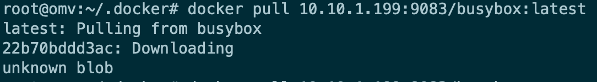
>
>   我们看结果是报错了，本地并没有拉到镜像，看私服的proxy仓库确实有内容了，这个其实是我们配置的代理仓库的镜像源有问题，
>
>   我把163的镜像源换成了我的阿里云镜像源就没有问题了：阿里云镜像源大家到阿里云的容器管理中自己生成一个地址就行了，前边有案例就不多说了。
>
>   再次执行结果如下：
>
>   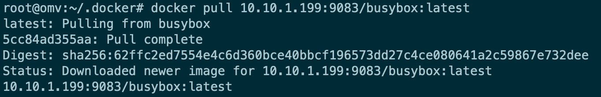
>
>   再看下私服的proxy仓库：也是拉取到了
>
>   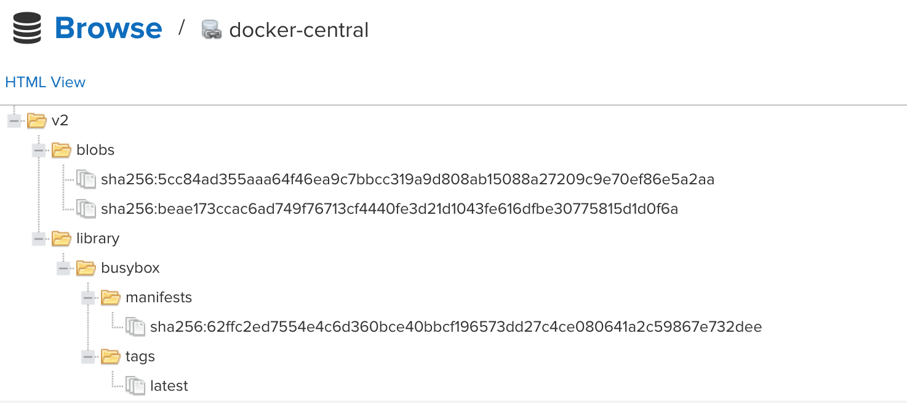
>
> - 从hosted仓库拉取/推送镜像
>
>   ```
>   # 接下来我们把刚拉下来的镜像重新打个标签(标签中指定要上传到的私服仓库地址)，上传到私服，即上传到hosted仓库
>   docker tag 10.10.1.199:9083/busybox:latest 10.10.1.199:9082/busybox:hosted-1.0
>   ```
>
>   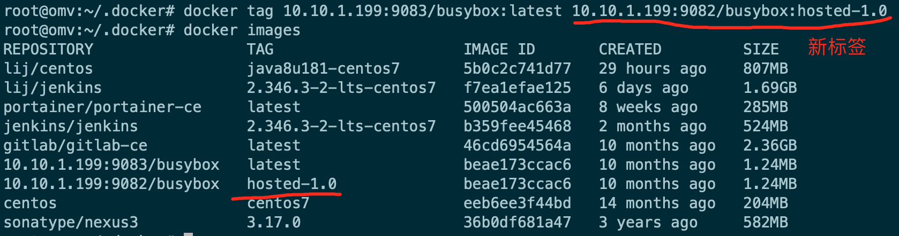
>
>   ```
>   # 将打好标签的新镜像，推送到hosted仓库
>   docker push 10.10.1.199:9082/busybox:hosted-1.0
>   ```
>
>   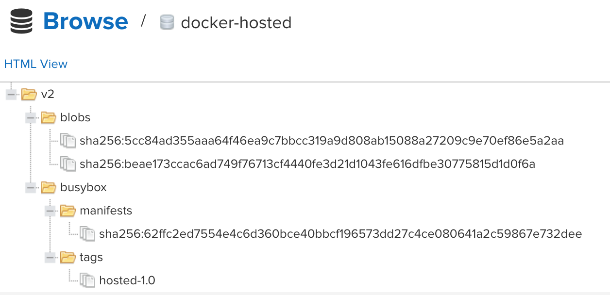
>
> - 再从group仓库拉取本地推送到hosted中的镜像
>
>   ```
>   # 这里我们演示下从group仓库拉取hosted仓库的镜像
>   
>   # 先删除本地的所有busybox镜像，避免干扰测试
>   docker rmi 10.10.1.199:9083/busybox:latest	
>   docker pull 10.10.1.199:9083/busybox:hosted-1.0
>   ```
>
>   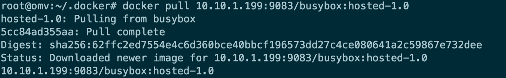
>   
> - `匿名拉取：`根据我们的配置，是已经开启了允许匿名拉取，下边我们测一下
>
>   ```
>   # 首先我们退出group仓库，退出成功后会将~/.docker/config.json中的密码删除
>   docker logout 10.10.1.199:9083
>   # 拉取一个nginx镜像 --> 结果是没问题的。
>   docker pull 10.10.1.199:9083/alpine
>   ```


### 8.2 Harbor私服搭建

讲完Nexus3再来看下harbor，其实大同小异，只不过harbor的管理要比Nexus3更专业、功能更完善，大家按需选择即可，Nexus的优势是他能和Maven仓库复用同一个服务器。

> 根据官网指导：https://goharbor.io/docs/2.6.0/install-config/installation-prereqs/
>
> 其实Harbor更适合拿一台虚拟机或物理机来安装，当然也可以集成到k8s，但如果是单台docker服务下安装，就有些不太合适了，
>
> 不合适的原因是Harbor需要docker-engine、docker-compose、openssl的支持，即要在装有这些工具包机器上安装Harbor。
>
> 有3种安装方案：
>
> - `直接安装在宿主机[复用docker环境]`<font color="green">【演示https方式】</font>
> - `将harbor安装到容器：手动构建镜像，镜像中安装harbor需要的环境(docker环境等)`<font color="green">【演示http方式】</font>
> - 将harbor安装到容器：类似jenkins那样，将需要的环境从宿主机映射到容器(该方式我们不再演示)
>
> -> 下边我们先来演示容器中单独部署Harbor仓库

#### 8.2.1 Docker容器部署[http]

下载安装包：从官方(https://github.com/goharbor/harbor/releases)下载harbor稳定版，

离线安装包：[harbor-offline-installer-v2.6.2.tgz](https://github.com/goharbor/harbor/releases/download/v2.6.2/harbor-offline-installer-v2.6.2.tgz)，大约有769M，如果大家无法访问可以找我索取。

目录：我们依然按照老规矩，将文件拷贝到/docker/harbor目录，目录结构如下，所有资料下文都有。

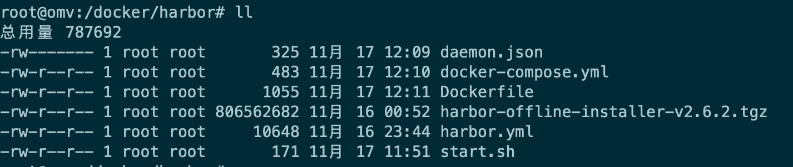

> 1.将离线安装包拷贝到 /docker/harbor/harbor-offline-installer-v2.6.2.tgz
>
> 2.事先准备一个harbor的配置文件：harbor.yml ，值得关注的属性如下，其他忽略【此处只需要修改hostname和注释掉https，其他默认即可】
>
> ```
> # 因为我要宿主机映射访问，所以此处使用宿主机ip，即访问harbor时使用10.10.1.199
> hostname: 10.10.1.199
> http:
> port: 9090
> 
> # 我们优先演示http协议，所以注释掉https(注释掉)
> #https:
> #port: 9443
> #certificate: /cert/certificate/path # 生成的证书目录
> #private_key: /cert/private/key/path
> 
> # harbor管理员admin的密码(保持默认)
> harbor_admin_password: Harbor12345 
> # 默认存储数据目录
> data_volume: /data 
> 
> # 日志配置：日志级别、输出目录(保持默认)
> log:
> level: info 
> local:
> location: /var/log/harbor 
> ```
>
> 3.准备一个docker的配置文件：/etc/docker/daemon.json，主要是把镜像加速和信任列表创建好，否则最好映射到宿主，因为毕竟是容器，删除后容易丢失。
>
> ```
> {
>     "registry-mirrors": [
>       "https://mtu7rhzd.mirror.aliyuncs.com"
>     ],
>     "insecure-registries": [
>     "10.10.1.199:9090"
>   ]
>   }
>   ```
>   
> 4.创建Dockerfile镜像文件：/docker/harbor/Dockerfile
> 
>此处使用阿里云的yum源安装docker，也可以用官方：https://download.docker.com/linux/centos/docker-ce.repo
> 
>```
> FROM centos:centos7
>LABEL maintainer="xxx@126.com"
> USER root
> COPY * /docker/
> WORKDIR	/usr/local
> RUN set -e \
> && cp /usr/share/zoneinfo/Asia/Shanghai /etc/localtime \
> && echo 'Asia/Shanghai' > /etc/timezone \
> && mv -f /docker/harbor-offline-installer-v2.6.2.tgz . \
> && tar -zxf harbor-offline-installer-v2.6.2.tgz \
> && mv -f /docker/harbor.yml harbor \
> && rm -f harbor-offline-installer-v2.6.2.tgz \
> && yum install -y yum-utils \
> && yum-config-manager --add-repo http://mirrors.aliyun.com/docker-ce/linux/centos/docker-ce.repo \
> && yum install -y docker-ce docker-ce-cli docker-compose-plugin \
> && mkdir -p /etc/docker/ \
> && mv -f /docker/daemon.json /etc/docker \
> && mv -f /docker/start.sh harbor \
> && chmod 777 harbor/start.sh \
> && chmod 777 /etc/rc.d/rc.local \
> && echo "echo '准备脚本执行...！'" >> /etc/rc.local \
> && echo "sh /usr/local/harbor/start.sh" >> /etc/rc.local \
> && echo "echo '脚本执行完毕！'" >> /etc/rc.local
> 
> EXPOSE 9090
> EXPOSE 9443
> 
> # 这里设置的会被docker-compose.yml中设置的替换掉
> CMD ["/usr/sbin/init"]
> ```
> 
> `大坑：`注意我们是基于centos7的镜像构建的，而我们容器内安装有docker-engine，那么肯定要通过systemctl启动服务，而systemctl是需要root权限的，虽然我们Dockerfile指定了USER root，但这只是容器的root，他对于宿主机来说仍然是普通用户，而我们需要启动容器时指定`privileged: true`,这样容器内的root才真正具备root权限，但是正式因为当前基于centos7，而centos7的privileged: true设置是不起作用的，这在官方也提供了解决方法，但是太麻烦，我们采用另一种方式，就是容器启动前先执行`/usr/sbin/init`脚本，即可解决。具体大家可以到官网查询，我这里就不多说了。
> 
>=> 官方安装：https://hub.docker.com/_/centos -> 正文部分在解决Systemd的位置，可以自行选择。
> 
>`第二个坑：`容器中我们安装了docker服务，那么肯定是要通过systemctl start docker来启动，但是要想让systemctl能执行就需要开启init进程，init进程必须在系统启动的时候开启，作为第一个进程，init无法在脚本中启动，因此只能是将容器的启动命令设置成/usr/sbin/init，然后将启动服务的命令写成脚本，再把执行脚本的命令写入/etc/rc.local中，这样就可以在centos7容器中使用systemctl启动服务了。
> 
>`第三个坑：`：按照上述操作其实还有个坑，就是发现放到rc.local的代码并没有执行，这是因为centos7开始/etc/rc.d/rc.local的权限变成了644，并没有执行权限，而我们修改的是/etc/rc.local，他是软连接到/etc/rc.d/rc.local，所以我们还需要给/etc/rc.d/rc.local授权 `chmod +x /etc/rc.d/rc.local`，并且我们要先检查一下rc.local服务是否启动，如果没启动还需要让他也向docker一样随机启动(systemctl status rc-local.service/systemctl enable rc-local.service)
> 
>5.容器启动脚本vi /docker/harbor/start.sh
> 
>```shell
> #!/bin/bash
>logfile=/var/log/harbor/harbor-run.log
> set -e && systemctl start docker >> $logfile && /usr/local/harbor/prepare >> $logfile && /usr/local/harbor/install.sh >> $logfile
> ```
> 
> 6.创建docker-compose.yml编排脚本：vi /docker/harbor/docker-compose.yml
> 
>```
> version: '3'
>services:
>  harbor:
>     build: 
>       context: .
>          dockerfile: Dockerfile
>        image: 'lij/harbor:2.6.2-centos7'
>        restart: always
>        container_name: 'harbor'
>        hostname: 'harbor'
>        user: root
>        ports:
>          - '9090:9090'
>          - '9443:9443'
>        networks:
>       - 'exist-net-bloom'
>     volumes:
>       - '/docker/harbor/log:/var/log/harbor'
>       - '/docker/harbor/data:/data'
>     privileged: true
> networks:
>   exist-net-bloom:
>     external:
>       name: 
> ```
> 
> `-> 注意：`harbor的配置文件端口我们从80改成了9090，保持了和宿主机映射的端口一致，为什么呢？
> 
>经过我的实践，如果容器中使用80，宿主机使用9090，这样映射访问harbor的web页面是没问题的，但是通过docker login 10.10.1.199:9090时就会访问不到。
> 
>
> 
>7.构建部署镜像：宿主机执行部署 ./docker/harbor/docker-compose up -d --build
> 
>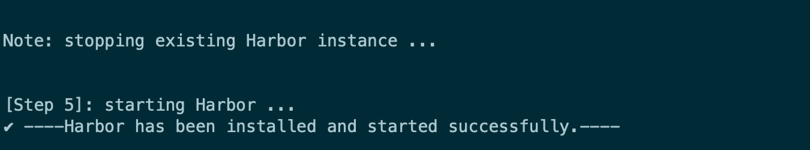
> 
>看到这样的日志表示启动完成，而容器内部其实是启动了多个容器：
> 
>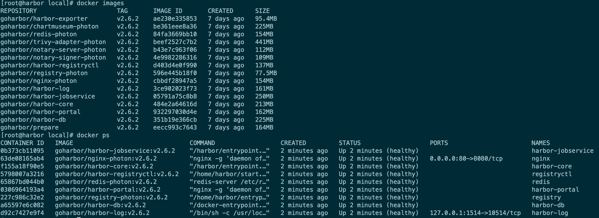
> 
>8.验证：浏览器中输入10.10.1.199:9090，输入默认用户admin，密码Harbor12345
> 
>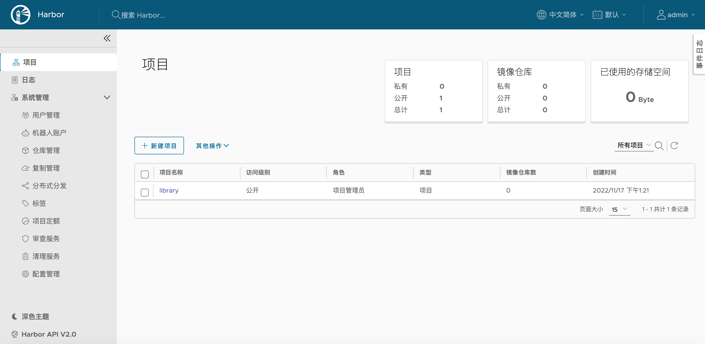
> 
>9.客户端登录试试：宿主机中执行docker login 10.10.1.199:9090，结果却报错了
> 
>```
> Error response from daemon: Get "https://10.10.1.199:9090/v2/": http: server gave HTTP response to HTTPS client
>```
> 
> 我们不是已经加入到信任列表了吗？==>注意我们是把harbor服务地址加入到了自身容器中，而没有加入到宿主机，而此时是使用宿主机访问，所以要加入到宿主机
> 
>加入后重启宿主机docker服务再试，就没问题了。

#### 8.2.2 宿主机部署Harbor[https]

> 1.数字证书

这里我们使用openssl工具来生成证书，其实我们会经常遇到ssh-keygen、openssl、keytool，甚至有时候会用到puttygen，这里简单说明下他们的关系：

- ssh-keygen：是openssh提供的管理密钥证书的工具，即通过他生成的一般是符合ssh使用的证书格式；

  http://www.openssh.com/

- openssl：我们知道ssl/tls协议，那openssl顾名思义，是一个开源的用于加密和安全通讯的工具包，包括生成证书等功能；

  https://github.com/openssl/openssl

  中文网站：

- keytool：他是JDK提供的一个密钥管理工具，也可以生成证书等；

  https://docs.oracle.com/javase/8/docs/technotes/tools/windows/keytool.html

- puttygen：他是putty这个软件提供的密钥管理工具

  https://puttygen.tech/index.php

-> 完全参考官方文档安装：https://goharbor.io/docs/2.6.0/install-config/configure-https/

> 2.生成CA根证书：生产中我们需要到CA机构申请证书，而此时我们自己生成CA证书，自己给自己签发证书

```
# 生成RSA私钥：当前目录生成密钥长度为4096的RSA私钥，输出文件名为ca.key
openssl genrsa -out ca.key 4096

# 生成证书：根据RSA私钥生成证书文件，通过key指定RSA私钥文件，out指定生成的证书文件名，其中subj中要指定申请证书的组织信息，
# 主要将CN指定成harbor所在机器的域名即可，我们这里就是宿主机了，我们将宿主机域名定义成【omv.local】
openssl req -x509 -new -nodes -sha512 -days 3650 \
 -subj "/C=CN/ST=Beijing/L=Beijing/O=example/OU=Personal/CN=omv.local" \
 -key ca.key \
 -out ca.crt
```

> 3.生成自签名证书：即服务端(harbor)要使用的证书

```
# 生成私钥：使用域名定义私钥文件名
openssl genrsa -out omv.local.key 4096

# 生成服务端证书签名请求：证书请求是向CA发起申请证书的数据格式
openssl req -sha512 -new \
    -subj "/C=CN/ST=Beijing/L=Beijing/O=example/OU=Personal/CN=omv.local" \
    -key omv.local.key \
    -out omv.local.csr

# 生成x509 v3扩展文件：根据官网要求执行
cat > v3.ext <<-EOF
authorityKeyIdentifier=keyid,issuer
basicConstraints=CA:FALSE
keyUsage = digitalSignature, nonRepudiation, keyEncipherment, dataEncipherment
extendedKeyUsage = serverAuth
subjectAltName = @alt_names

[alt_names]
DNS.1=omv.local
DNS.2=omv
EOF

# 使用该v3.ext文件为你的Harbor主机生成证书，即将自己的证书申请，提交给CA，然后由CA生成证书，只不过此处CA是自己
openssl x509 -req -sha512 -days 3650 \
    -extfile v3.ext \
    -CA ca.crt -CAkey ca.key -CAcreateserial \
    -in omv.local.csr \
    -out omv.local.crt
```

> 4.将证书配置给Harbor和Docker(harbor所在机器的Docker服务)
>
> ```
> # 将自签名证书配置给harbor，即拷贝对应的文件到harbor.yml中配置指定的路径
> certificate: /docker/harbor2/harbor/cert/omv.local.crt   
> private_key: /docker/harbor2/harbor/cert/omv.local.key
> 
> # 将omv.local.crt转换成omv.local.cert，因为docker-engine将crt认为是CA证书，而cert认为是客户端证书，我们要使用客户端连接harbor
> openssl x509 -inform PEM -in omv.local.crt -out omv.local.cert
> # 将对应的证书拷贝到docker服务的证书目录(需要手动创建 mkdir -p /etc/docker/certs.d/omv.local/)
> # 注意创建的omv.local目录，只能通过https://ommv.local访问,如果端口不是443，则目录需要带上端口，如/etc/docker/certs.d/omv.local:7443/
> cp omv.local.cert /etc/docker/certs.d/omv.local:7443/  
> cp omv.local.key /etc/docker/certs.d/omv.local:7443/
> cp ca.crt /etc/docker/certs.d/omv.local:7443/
> # 重启docker服务
> systemctl restart docker
> ```

> 5.启动harbor：将harbor.yml的https节点打开，把端口修改成7443即可。
>
> ```
> ./prepare
> ```
>
> -> 出错了：
>
> 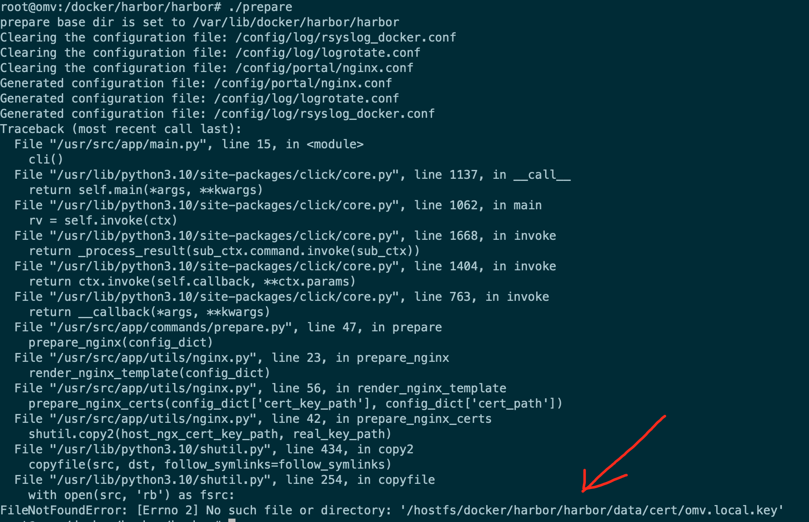
>
> 提示我们目录或文件不存在：No such file or directory: '/hostfs/docker/harbor/harbor/data/cert/omv.local.key'
>
> `但是这个目录/hostfs哪来的？`
>
> => 我们知道了harbor是在docker容器中运行，那么prepare脚本应该也是去创建容器了，打开这个脚本，我们发现以下代码：
>
> ```
> # 显然是在发布容器，而hostfs正式容器内部的目录，要映射到外部目录/下
> docker run --rm -v $input_dir:/input \
> -v $data_path:/data \
> -v $harbor_prepare_path:/compose_location \
> -v $config_dir:/config \
> -v /:/hostfs \
> --privileged \
> goharbor/prepare:v2.6.2 prepare $@
> 
> # 我们做一下改造：将我的证书目录映射过去
> docker run --rm -v $input_dir:/input \
> -v $data_path:/data \
> -v $harbor_prepare_path:/compose_location \
> -v $config_dir:/config \
> -v /docker/harbor/harbor/data/cert:/hostfs/docker/harbor/harbor/data/cert \
> --privileged \
> goharbor/prepare:v2.6.2 prepare $@
> ```
>
> 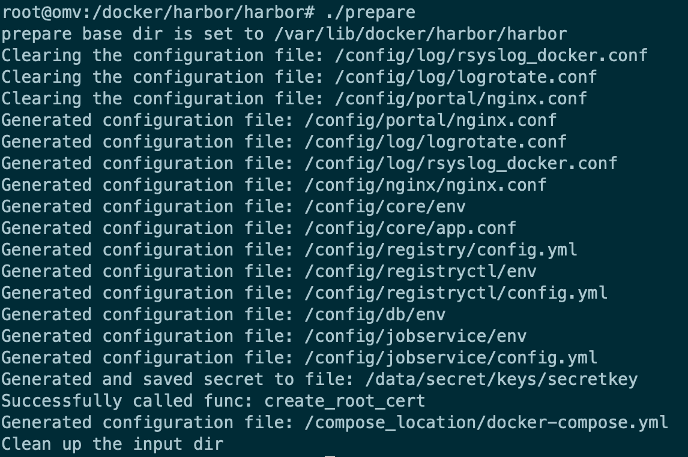
>
> 再次执行ok！
>
> ```
> # 进行启动
> ./install.sh
> ```
>
> 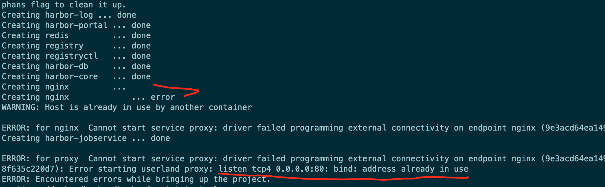
>
> -> 问题：该问题是启动harbor相关的nginx容器时遇到宿主机80端口被占用的情况，我是因为omv主机服务的端口用了80，
>
> 有两种修改方法：
>
> - 修改omv更换成其他端口
>
> - 修改harbor的nginx容器成其他端口：很简单，打开harbor目录，此时因为运行了install.sh，已经生成了docker-compose.yml，我们打开找到位置修改端口即可
>
>   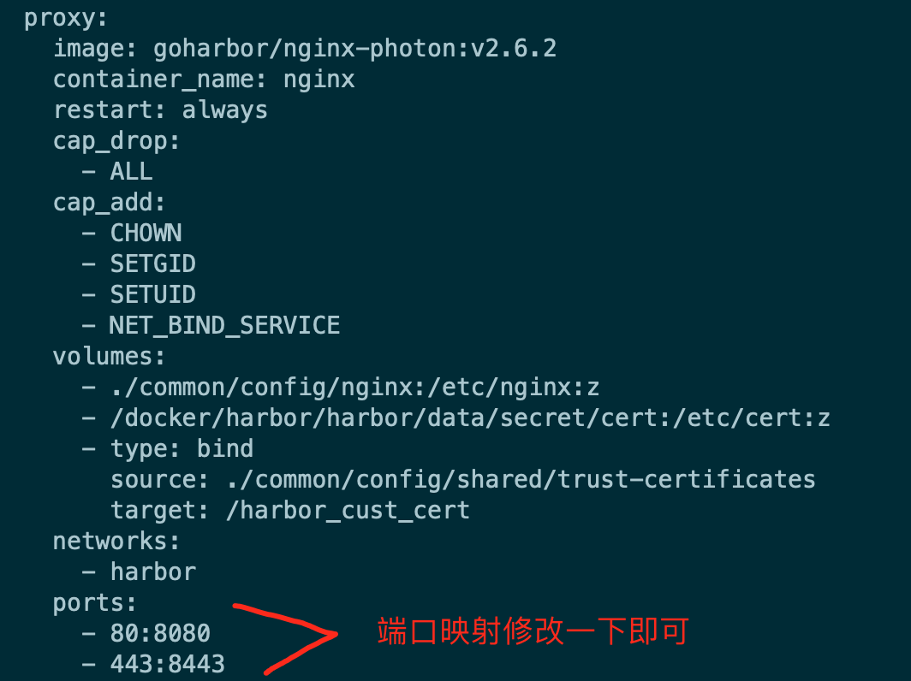
>
> -> 再启动
>
> 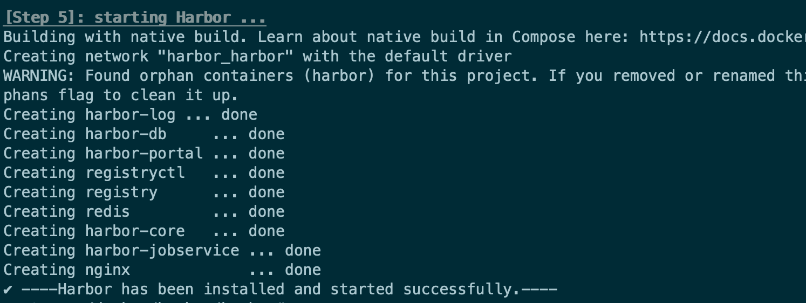

> 6.验证浏览器使用：输入https://10.10.1.199:7443，注意此时使用的是https，所以默认不输入端口默认使用443，而上边我们看到80和443都已放开，只不过没使用80端口，
>
> 那没使用上边为什么报错呢？因为即便没使用但是我们做了映射啊，
>
> 所以上边还有第3种方法，就是不映射80端口，只映射443端口即可，
>
> `但是默认harbor各容器内部通信是使用http协议的,并且各容器并未配置link连接(由docker-compose.yml可知)`，
>
> 所以关闭80映射是影响内部通信大家可以测试一下。如果想把内部通信方式改为https其实和harbor对外https修改方式大同小异，可参看官方文档，这里就不演示了。
>
> 内部通信https配置官方文档：https://goharbor.io/docs/2.6.0/install-config/configure-internal-tls/
>
> 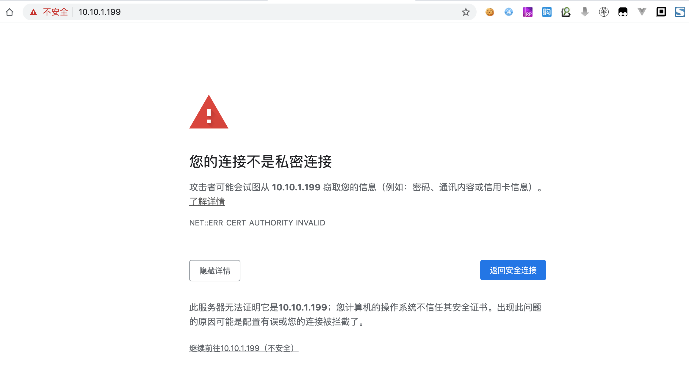
>
> 因为我们使用的自签名证书，所以浏览器从服务端拿到证书后是无法通过已知的CA认证机构校验的，所以需要我们自己将证书加入到浏览器的信任列表，我们此处选择继续访问即可。
>
> -> 和docker容器方式一样可以正常访问，此处不截图了，避免重复。

> 7.验证Docker推送和拉取：
>
> docker的使用，这里和Nexus有些区别，harbor同nexus一样，都是需要我们自己创建仓库的，只不过nexus每个仓库我们可以单独指定端口，而harbor则不可以，
>
> 所以为了区分拉取/推送哪个仓库，我们需要打标签时加上namespace(即仓库名)，而nexus则可以通过端口来区分。
>
> 我们先来创建一个仓库：从页面可知也可以创建代理仓库，此处我们选择公开，即允许匿名拉取。
>
> 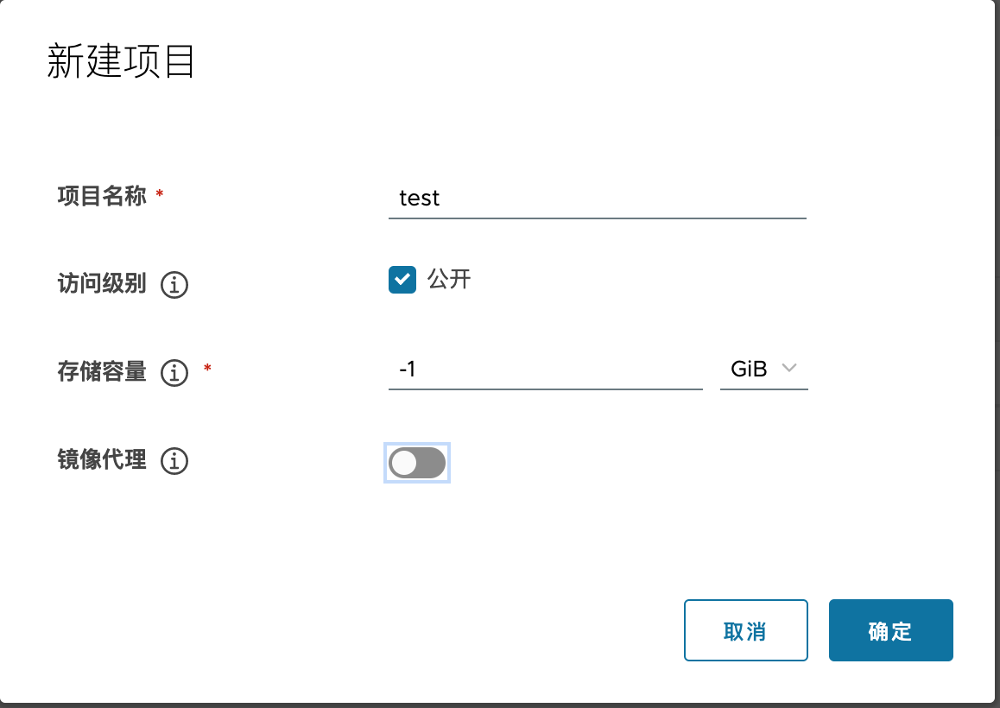
>
> 进入仓库，可以看到有很多配置功能，这也是他比nexus强大的地方之一，比如webhooks可以对接harbor仓库的10几个事件通知，方便我们做监控。
>
> 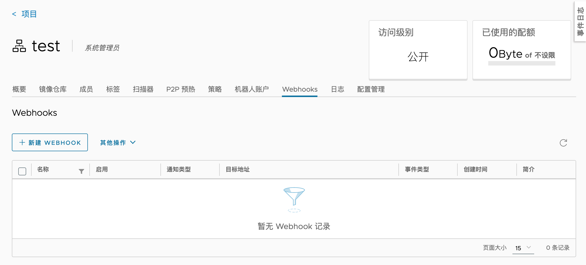
>
> 进入"镜像仓库"选项卡，我们可以看到镜像列表，右侧有推送命令，大家可以自行查看
>
> 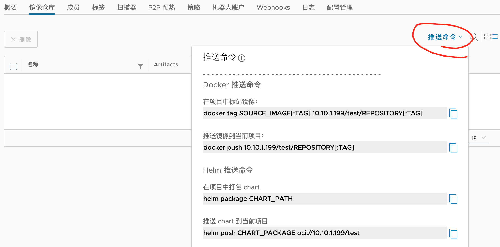
>
> ```
> # 先来拉取一下busybox：注意我们使用https，所以要使用域名访问
> # 如果大家域名不能访问需要将harbor服务器的hosts进行映射，即10.10.1.199 omv.local配上
> docker pull omv.local:7443/test/busybox:latest
> ```
>
> 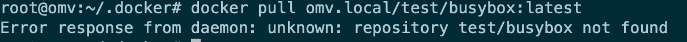
>
> 显然我们并不存在这样的镜像。
>
> ```
> # 从公网拉取镜像busybox
> docker pull busybox
> # 打私服标签
> docker tag busybox:latest omv.local:7443/test/busybox:v1.0
> # 登录私服
> docker login -u admin -p Harbor12345 omv.local:7443
> # 推送镜像
> docker push omv.local:7443/test/busybox:v1.0
> # 删除本地busybox镜像
> docker rmi -f omv.local:7443/test/busybox:v1.0 
> # 拉取镜像
> docker pull omv.local:7443/test/busybox:v1.0
> ```
>
> 疑惑1：其实通过界面对比Nexus我们会有些疑惑，Nexus有group仓库，可以汇总所有仓库内容，方便拉取，那么harbor有吗？
>
> -> 为此harbor提供了机器人账号，可以通过创建机器人账号关联多个仓库，这样我们使用机器人账号就可以使用多个仓库的镜像。
>
> 疑惑2：Nexus有proxy仓库，可以作为镜像代理仓库，harbor有吗？
>
> -> harbor是从v2.1.1版本开始增加了这个功能，通过新建"目标"指定外网仓库，然后新建工程指定为代理，以此实现
>
> 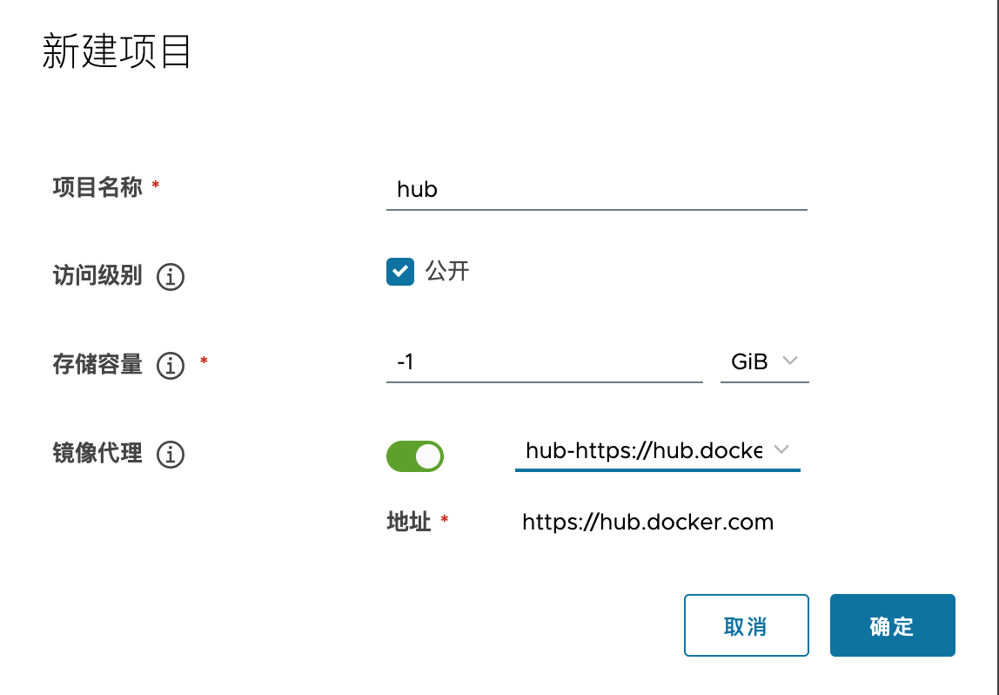
>
> `注意：`拉取时我们除了要加项目名到url中还需要增加一个library名称空间，来表名使用代理仓库
>
> 如：docker pull omv.local:7443/hub/`library`/busybox ，这样才可以
>
> 具体可见官方文档：https://goharbor.io/docs/2.6.0/administration/configure-proxy-cache/

> 8.Nexus和Harbor对比：各有长处，大家自行选择即可，下边演示我使用的nexus。
>
> - Nexus使用更加方便
> - Harbor对镜像的管理更加强大

### 8.3 Jenkins集成Docker镜像仓库

docker私服已经搭建完毕，下边我们期望jenkins做的事是：

①通过git拉取代码 -> ②通过maven构建生成jar包 -> ③构建含有jar包的镜像 -> `④推送到docker仓库` - `⑤通知宿主从仓库拉取镜像并启动容器`

> 有什么好处？避免将jar包拷贝到宿主机，而是直接将jar包打入镜像上传到私服。
>
> 为什么不是jenkins直接拉取并启动容器？从角色上看jenkins并不是docker服务，生产中多数是部署docker集群，所以拉取镜像并部署容器更应该由docker自身操作。
>
> 非要用jenkins拉取和部署可以吗？当然可以，但jenkins容器中一直只映射单个docker宿主机的docker.sock，如果是docker集群就不好解决了，比较麻烦。

#### 8.3.1 Jenkins容器编排文件修改

> 注意：之前我们讲的都是jenkins构建完jar包后，传输到宿主机，由宿主机通过docker命令完成构建和启动容器，
>
> => 此处我们期望jenkins能完成这些事，有几种方法：
>
> - 在jenkins中安装docker服务或安装docker cli并连接到宿主
>
> - 直接将宿主机的docker内核映射给jenkins容器，让jenkins能操作宿主机的docker<font color="green">【推荐】</font>
>
>   ```
>   # 很简单只需要将jenkins的docker-compose.yml修改一下即可
>   version: '3'
>   services:
>     jenkins:
>       build: 
>         context: .
>         dockerfile: Dockerfile
>       image: 'lij/jenkins:2.346.3-2-lts-centos7'
>       restart: always
>       container_name: 'jenkins'
>       hostname: 'jenkins'
>       environment:
>         - JAVA_OPTS="-Dhudson.model.DownloadService.noSignatureCheck=true"
>       ports:
>         - '9078:8080'
>         - '50000:50000'
>       networks:
>         - 'exist-net-bloom'
>       volumes:
>         - '/docker/jenkins/home:/var/jenkins_home'
>         - '/docker/jenkins/mvnrepo:/mvnrepo'   
>         - '/etc/timezone:/etc/timezone:ro'
>         - '/etc/localtime:/etc/localtime:ro'
>         # 新增加内容
>         - '/var/run/docker.sock:/var/run/docker.sock'
>         - '/usr/bin/docker:/usr/bin/docker'
>         - '/etc/docker/daemon.json:/etc/docker/daemon.json'
>   networks:
>     exist-net-bloom:
>       external:
>         name: devops
>   ```
>
>   解释：/var/run/docker.sock 是docker服务器后台进程执行docker客户端命令的服务，
>
>   不论是docker cli还是对外开放的api最终都是与/var/run/docker.sock进行交互，所以把他映射到jenkins内部，jenkins就可以内部操作宿主机了。
>
>   另外还需映射docker命令(即客户端命令)和已经配置好的配置文件。

> 问题：更新配置后执行docker info报权限问题
>
> 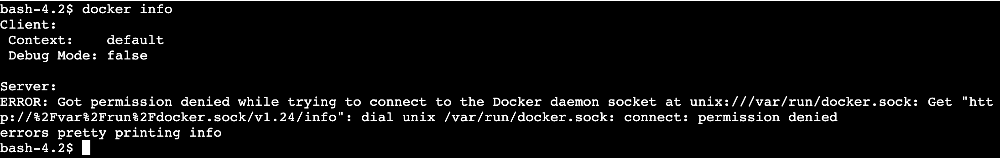
>
> 分析：这应该是执行docker.sock的权限问题，我们进入宿主机查看docker.sock的权限
>
> 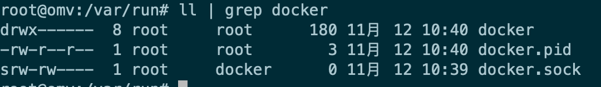
>
> 解决：这里有几种方式
>
> - 以root用户登录jenkins，我实际我们用的是jenkins用户，这样容器导致用户权限过大，不推荐
>
>   ```
>   # 修改方法只需在docker-compose.yml中增加以root登录即可
>   user: root
>   ```
>
>   
>
> - 将宿主机的docker.sock文件的权限改为可以让jenkins的账号ID=1000的用户使用即可<font color="green">【推荐】</font>
>
> - 这里我们粗暴些，直接777权限
>
>   ```
>   # 第一种：授权777权限
>   chmod 777 /var/run/docker.sock
>                                                                           
>   # 第二种：授权other组可读写
>   chmod o+rw /var/run/docker.sock
>   ```

#### `8.3.2 修改jenkins的job配置`

当maven构建后，直接在jenkins工作目录构建镜像并推送镜像到私服

[此处我们以Nexus作为私服演示，对于大型项目harbor优势较大，成本相对也较高，比如内置数据库PostgreSQL，

而我们一般会使用公共数据库，所以至少要有一个PostgreSQL实例，等等，而Nexus就就相对简单些，也能和Maven仓库复用，成本较低]

`注意：`jenkins中运行shell脚本的目录是jenkins_home/workspace/jobName目录

```
# 注意：因为我们要构建镜像而不需要直接启动容器，所以只需要Dockerfile文件，而暂时不需要使用docker-compose.yml
# 1.构建镜像的命令，我们使用docker build，通过-t指定镜像标签，最后指定Dockerfile的目录，我们使用当前目录即可
docker build -t 10.10.1.199:9082/busybox:v-${branch} .

# 注意：jenkins中运行shell脚本当前目录是[workspace/jobName]目录
set -e \
&& mv target/*.jar docker/ \  # 拷贝jar包到docker目录
&& cd docker \
&& docker build -t demo:v-$branch . \  # 构建镜像，使用分支名作为版本号
&& docker tag demo:v-$branch 10.10.1.199:9082/demo:v-$branch \  #给镜像打标签，准备推送私服
&& docker login -u admin -p jie123456 10.10.1.199:9082 \ #登录私服hosted仓库
&& docker push 10.10.1.199:9082/demo:v-$branch \#推送镜像
#避免构建同一个镜像产生悬空镜像，假设已经执行了当前jenkins job，那么再次执行时，本地一定是拉取了镜像，所以直接构建会产生悬空镜像
&& docker image prune -f 
```

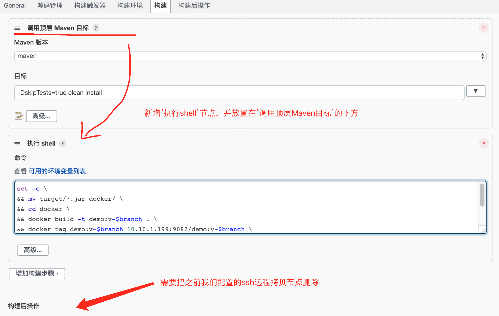

-> 问题：点击构建会报错，如下：

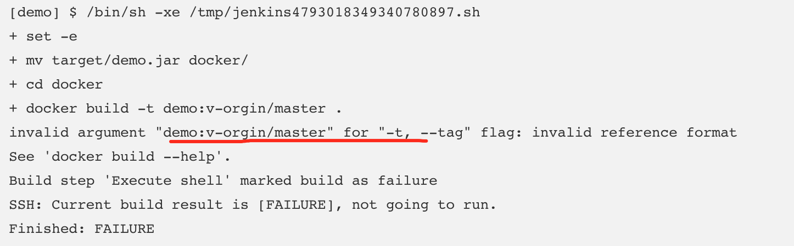

->原因：就是镜像名称定义的不规范，因为我们使用的git分支名，而分支默认都是orgin/开头，而放到镜像中斜杠就不合适了，所以我们在git参数构建时，

将[orgin/]过滤掉，配置如下：使用正则` orgin/(.*) `即可

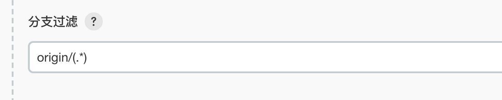

->再次构建，就没问题了。

#### 8.3.3 宿主机拉取镜像并部署容器

> 解决目标：既然是jenkins通知宿主机，那么就可能是多个jenkins的job都有这种通知操作，
>
> 所以我们不能写死拉取镜像的信息，而是通过jenkins的通知将这些参数传递过来，比如拉取镜像的地址、镜像标识等，并且要处理镜像重复等问题。

> 思路：怎么让jenkins给宿主传参数呢？说的比较抽象，其实我们之前已经做过了，就是ssh。
>
> jenkins的job做完构建镜像并推送后，就可以执行ssh连接宿主，然后执行脚本，而jenkins的job中可以设置变量，在执行宿主机脚本是可以直接引用过来，
>
> 而这次脚本比较多，我们就不再jenkins中罗列了，而是直接写入到shell脚本，让jenkins直接调用。

> 脚本内容：在宿主机目录创建shell脚本， vi /share/jenkins/demo/script/publish.sh  
>
> 注意：脚本权限问题，我是root创建，并且jenkins中ssh也是使用的root所以没问题，大家根据自己情况去酌情处理。
>
> ```
> # 定义变量
> repositoryUrl=$1
> jobName=$2
> imageVersion=$3
> remoteImageName=$repositoryUrl/$jobName:$imageVersion #远程私服仓库的完整镜像名称
> echo "remoteImageName is "$remoteImageName
> 
> ### 检查是否存在同名镜像运行的容器，如果存在则需要先删除，然后再删除镜像，然后再拉取新镜像，最后以新镜像启动容器
> 
> #获取已启动的容器ID
> containerId=$(docker ps -a | grep -w "$jobName" | awk '{print $1}')
> if [ "$containerId" != "" ]; then
> docker stop $containerId && docker rm $containerId
> fi
> 
> #如果镜像存在同样先删除
> imageId=$(docker images | grep -w "$repositoryUrl/$jobName" | grep -w "$imageVersion" | awk '{print $3}')
> if [ "$imageId" != "" ]; then
> docker rmi -f $imageId
> fi
> 
> #从私服拉取镜像：如果不允许匿名，则需要先登录，因为我已经设置允许匿名，所以可以不登录直接拉取
> docker image prune -f 
> docker login -u admin -p 123456 $repositoryUrl
> docker pull $remoteImageName
> 
> #启动容器：我们之前启动都是拿docker-compose.yml，但此时因为在宿主机，并没有这么一个docker-compose.yml文件，
> #所以我们可以直接使用docker run运行容器
> docker run -d \
> -p 9099:8080 \
> -v /etc/timezone:/etc/timezone:ro \
> -v /etc/localtime:/etc/localtime:ro \
> --network devops \
> --privileged=true \
> --name $jobName $remoteImageName
> ```
>
> 解释：其实我们jenkins容器已经拿到宿主机的docker执行权了，那这个文件不传到宿主机执行，在本地容器执行也是可以的，
>
> 但由于角色不同，该脚本由docker服务器执行更合适，并且如果是docker集群那么容器执行会很麻烦。
>
> 
>
> 优化：简单起见，或者说为了隔离、可扩展，我们把这个脚本文件放到springboot中，让jenkins帮我们远程拷贝到宿主机的固定目录，然后执行
>
> 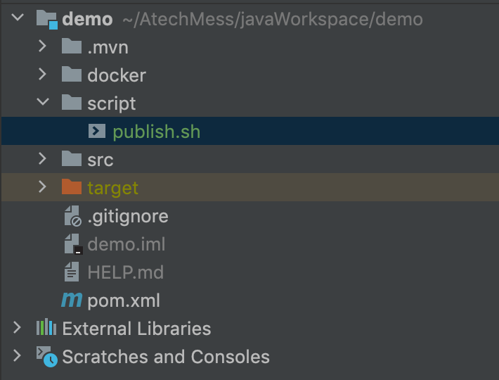

> 参数配置：我们脚本里引用了那么几个参数，哪里来的？
>
> jenkins我们知道可以参数化构建，比如我们用的git参数，当然他也可以指定普通参数，如下，我们在job中增加这些参数：
>
> [当然也可以直接写到脚本执行的后边，我这里就只配一个示意一下，其他参数直接传递]
>
> 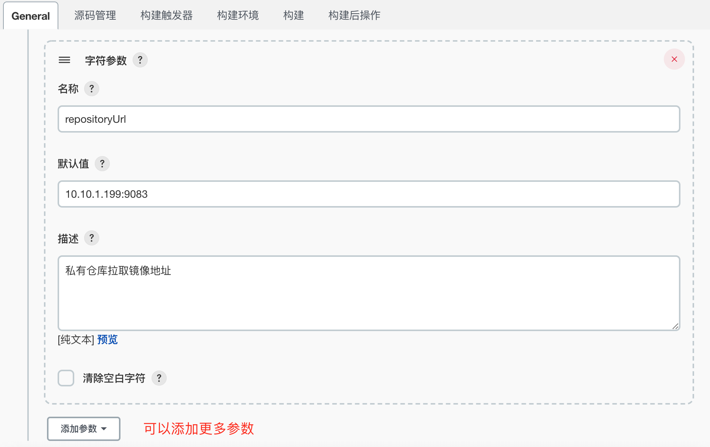
>
> 通过SSH拷贝脚本并执行宿主机指令：
>
> 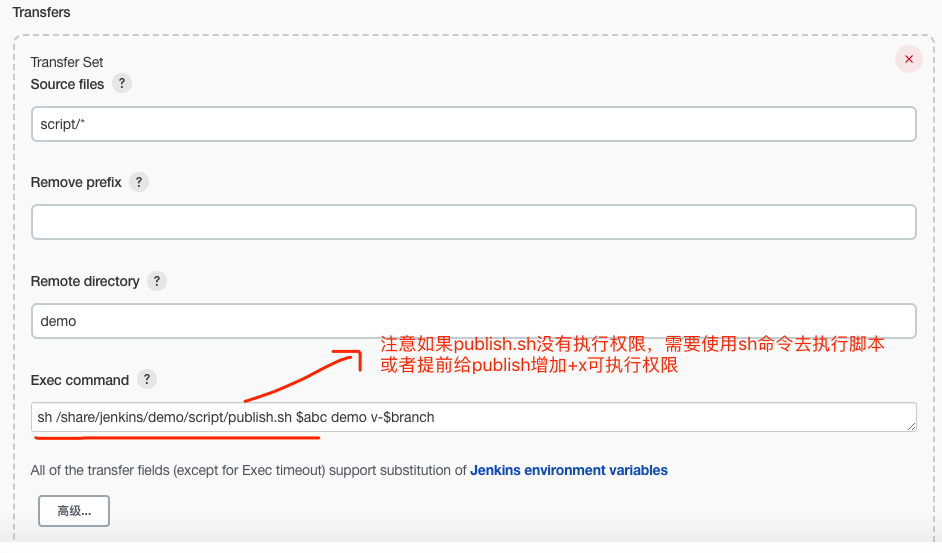
>
> 


## 9.质量安全审计工具：Sonarqube

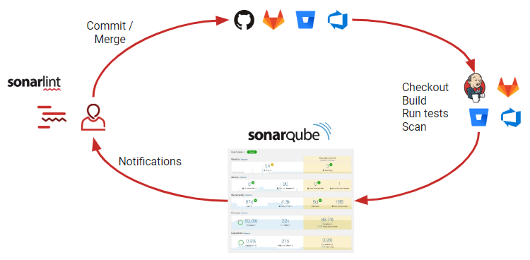

Sonarqube(声呐)大家应该不陌生，通过扫描代码分析代码质量与代码安全，方便我们快速定位代码缺陷、潜在风险。

> 个人建议：作为项目质量智能分析工具，他是个双刃剑，在公司规模足够大并且足够重视代码质量时，sonar会有一个不错的位置；但如果公司规模较小，并且公司不足以把重点放在代码质量上，那么sonar可能会成为一个鸡肋，一句话就是是否有必要上sonar完全看公司的需求以及成本。

作用阶段：我们讨论下sonar应该在什么阶段起作用

- 代码开发阶段实时检测【sonarlint插件，为sonar 8.5版本后提供，需要集成到开发工具如Idea，配置时需要sonarqube服务支持，分析结果会提示在控制台，类似前端eslint作用】
- 代码提交前进行sonar扫描【需集成到本地开发工具，如Idea或Eclipse】
- 提交代码时进行sonar扫描【需集成到gitlab，如sonar-gitlab-plugin，也可结合Gitlab CI进行提交流程控制】
- `构建代码时进行sonar扫描【需集成到jenkins,如SonarQube Scanner插件】`
- 由sonar定期自主扫描代码生成报告【可以用jenkins的定时job】

-> 具体应该部署哪种方案，也需要大家根据自身情况适当选择，没有完美的方案，选择最适合自己的方案即可。

-> 此处我们集成到jenkins做演示。其他方式大家有兴趣可以找我咨询。

### 9.1 Docker容器部署

官网：https://docs.sonarqube.org/latest/setup/install-server/

根据官方文档可知，sonar是支持docker部署的，并且非常简单，sonar默认使用H2数据库，我们也可以指定自己的mysql等数据库。

选用版本：8.9 该版本为LTS长期支持版本，从7.9版本开始sonar必须有jdk11支持并且不再支持Mysql数据库。sonar默认采用H2数据库。

->官方推荐配置：SonarQube扫描器需要版本8或11的JVM，SonarQube服务器需要版本11和最少2G内存，具体大家可以官网看。

->sonar的社区版免费

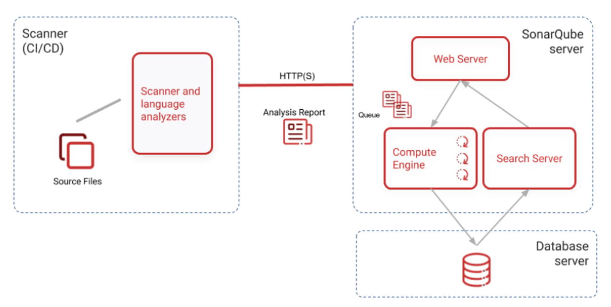

Sonar包括3个组件，Scanner负责扫描代码并分析生成报告->报告交给Sonar服务进行计算->最终结果存入数据库。下边我们通过docker-compose方式启动sonar容器。

> 注意：sonar不能以root身份运行在基于Unix系统上。

```
# vi /docker/sonarqube/docker-compose.yml
# 此处我们使用默认的H2数据库，如果外接数据库，可参考官网docker-compose.yml文件
version: "3"
services:
  sonarqube:
    # 使用一下私服拉取
    image: 10.10.1.199:9083/sonarqube:8.9-community
    restart: always
    container_name: 'sonarqube'
    hostname: 'sonarqube'
    networks:
      - 'exist-net-bloom'
    volumes:
      # 配置文件
      - '/docker/sonarqube/conf:/opt/sonarqube/conf'
      # 保存H2数据和ES索引文件
      - '/docker/sonarqube/data:/opt/sonarqube/data'
      # 保存第三方插件
      - '/docker/sonarqube/extensions:/opt/sonarqube/extensions'
      # 日志
      - '/docker/sonarqube/logs:/opt/sonarqube/logs'
    ports:
      - "9097:9000"
networks:
  exist-net-bloom:
    external:
      name: devops
      
# 如果需要自行修改配置，比如使用其他数据库等，可以在conf目录增加sonar.properties配置文件，具体可到官方获取
# 官方下载地址：https://www.sonarqube.org/downloads/
```

> 访问：10.10.1.199:9097，注意以上docker-compose.yml并未指定上下文，默认为/，可以自行指定。
>
> 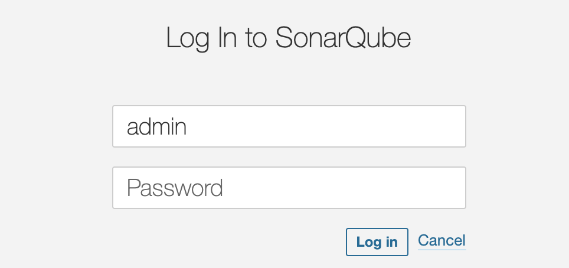
>
> 输入：admin，admin即可
>
> 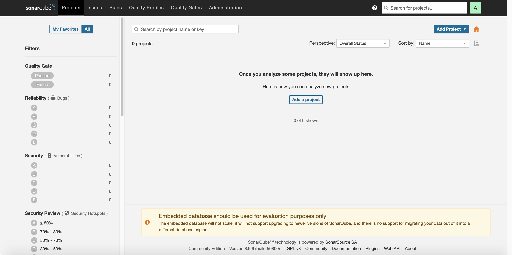
>
> 不过下边有一个黄色警告，他的意思是嵌入式数据库应该只用于测试不能用于生产，那样不利于扩展，并且不支持升级到最新版本的sonarqube，我们这里用的默认H2所以会有提示，如果大家想尝试连接自己的数据，当然不能是Mysql，如果要用mysql可以使用7.9以下的版本，如果要使用单独数据库，通过docker-compose.yml指定几个环境变量就行了：
>
> ```
> environment:
>   SONAR_JDBC_URL: jdbc:postgresql://db:5432/sonar
>   SONAR_JDBC_USERNAME: sonar
>   SONAR_JDBC_PASSWORD: sonar
> ```

> 中文插件安装：
>
> 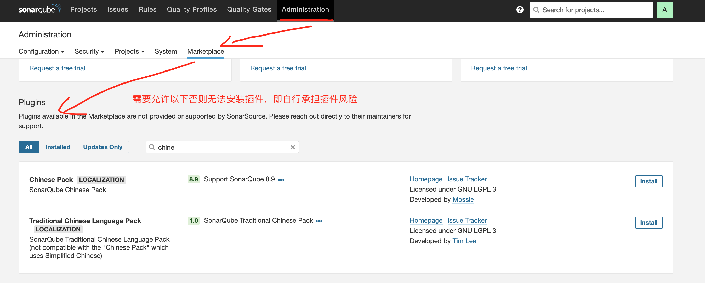
>
> 结果安装失败了，点击按钮后，页面无反应
>
> 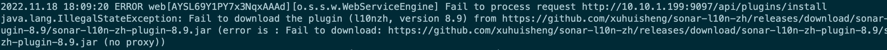
>
> 报错原因是到github上下载插件失败，超时了：docker logs -f sonarqube 可看到报错日志，那理所当然我们认为是网络问题，手动下载吧
>
> https://github.com/xuhuisheng/sonar-l10n-zh/releases/download/sonar-l10n-zh-plugin-8.9/sonar-l10n-zh-plugin-8.9.jar
>
> 
>
> #### `诡异的事情：`出于好奇，想到当前用的H2，会不会跟这个有关呢？于是我尝试了使用postgresql[`结果出乎意料`]
>
> ```
> version: "3"
> services:
>   sonarqube:
>     # 使用一下私服拉取
>     image: 10.10.1.199:9083/sonarqube:8.9-community
>     restart: always
>     container_name: 'sonarqube'
>     hostname: 'sonarqube'
>     networks:
>       - 'exist-net-bloom'
>     volumes:
>       # 配置文件
>       - '/docker/sonarqube/conf:/opt/sonarqube/conf'
>       # 保存H2数据和ES索引文件
>       - '/docker/sonarqube/data:/opt/sonarqube/data'
>       # 保存第三方插件
>       - '/docker/sonarqube/extensions:/opt/sonarqube/extensions'
>       # 日志
>       - '/docker/sonarqube/logs:/opt/sonarqube/logs'
>     depends_on:
>       - postgressql
>     environment:
>       # 避免ip变更，使用hostname连接
>       SONAR_JDBC_URL: jdbc:postgresql://postgressql:5432/sonar
>       SONAR_JDBC_USERNAME: sonar
>       SONAR_JDBC_PASSWORD: sonar
>     ports:
>       - "9097:9000"
>       
>   postgressql:
>     image: 10.10.1.199:9083/postgres:12
>     restart: always
>     container_name: 'postgressql'
>     hostname: 'postgressql'
>     environment:
>       POSTGRES_USER: sonar
>       POSTGRES_PASSWORD: sonar
>     volumes:
>       - '/docker/sonarqube/postgresql:/var/lib/postgresql'
>       - '/docker/sonarqube/postgresql/data:/var/lib/postgresql/data'
>     networks:
>       - 'exist-net-bloom'
> networks:
>   exist-net-bloom:
>     external:
>       name: bloom-net
>       
>       
> # 删除原有容器
> docker-compose down
> # 重新启动容器
> docker-compose up -d
> ```
>
> `启动sonar报错:`
>
> ERROR: [1] bootstrap checks failed. You must address the points described in the following [1] lines before starting Elasticsearch.
> bootstrap check failure [1] of [1]: max virtual memory areas vm.max_map_count [65530] is too low, increase to at least [262144]
> ERROR: Elasticsearch did not exit normally - check the logs at /opt/sonarqube/logs/sonarqube.log
>
> -> 解决方法：在宿主机的/etc/sysctl.conf中增加该配置即可，注意因为容器也是复用宿主的系统配置，所以直接改宿主机即可。
>
> ```
> vi /etc/sysctl.conf  # 新增如下配置
> vm.max_map_count=262144
> 
> # 更新启动容器
> docker-compose up -d
> ```
>
> 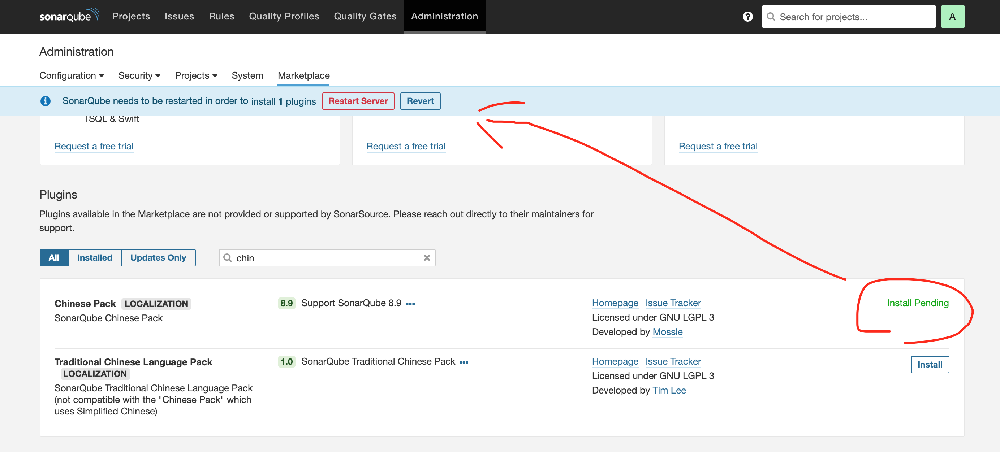
>
> 出乎意料，安装成功了！！！
>
> -> 这。。。,就不是github网络问题吧？
>
> =>> 推测：其实还有一个问题，就是下载插件后无法保存到插件目录，即无法保存到/opt/sonarqube/extensions/plugins，因为被映射到宿主机了，
>
> 如果无权写数据也可能会超时，所以修改宿主机目录权限：chmod -R 777 /docker/sonarqube/extensions
>
> 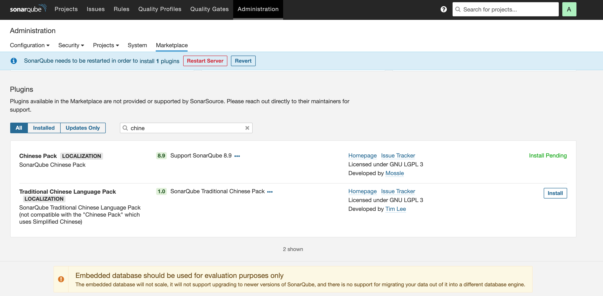
>
> `果然，意料之中的也成功了！！`

那为什么H2数据库就不行，PostgreSQL就可以呢？

我查了下文档，并没有找到答案，可能这就是亲儿子效应吧，H2都不推荐你用你非要用，出问题了吧 。。。，还是乖乖用PostgreSQL才是王道啊！

### 9.2 Sonar客户端配置

由官网文档得知，客户端需要使用Scanner工具完成扫描和上报(sonar早期版本还单独提供有sonarqube runner工具，和scanner类似)，并且Scanner有多重实现方式

https://docs.sonarqube.org/8.9/analysis/overview/

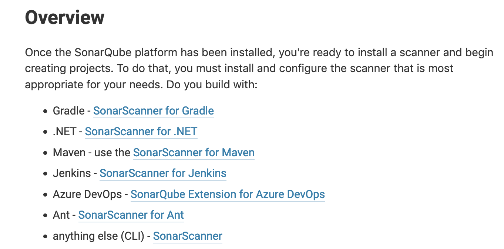

我们这里演示两种方式：Maven和Jenkins

- Springboot工程本地集成Scanner插件
- Jenkins集成Scanner插件


#### 9.2.1 Maven配置

既然是maven当然可以配置到全局settings.xml，也可以配置到springboot项目的pom.xml中。

注意：我们的sonar是需要登录的，所以事先我们先把token生成一下，直接使用用户名密码也可以，用token可以防止密码泄露

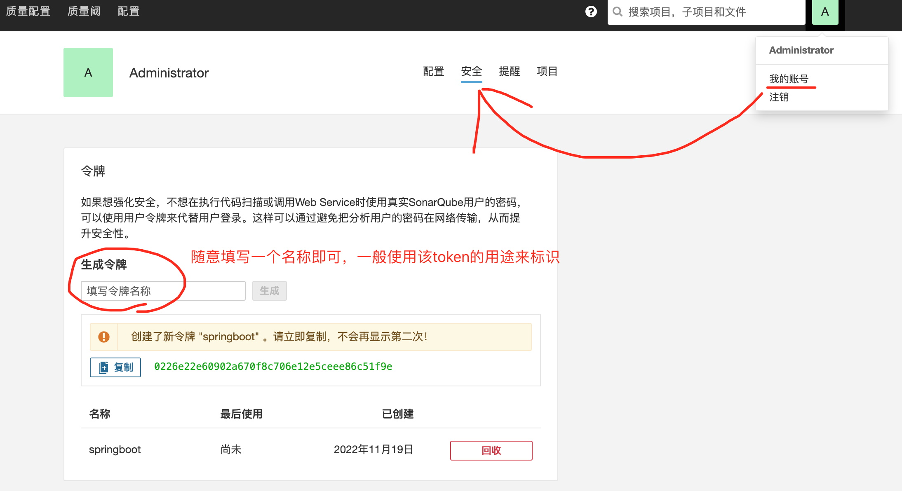

> 配置到settings.xml

```
<settings>
    <pluginGroups>
        <pluginGroup>org.sonarsource.scanner.maven</pluginGroup>
    </pluginGroups>
    <profiles>
        <profile>
            <id>sonar</id>
            <activation>
                <activeByDefault>true</activeByDefault>
            </activation>
            <properties>
                # 指定token，如果使用用户名密码，需要增加<sonar.password>属性
                <sonar.login>712742ca78fb0fda1b7de61086162e2ef5c9f16e</sonar.login>
                <sonar.host.url>http://10.10.1.199:9097</sonar.host.url>
            </properties>
        </profile>
     </profiles>
</settings>
```

> 配置到Springboot项目的pom.xml

```
<build>
  <pluginManagement>
    <plugins>
      <plugin>
        <groupId>org.sonarsource.scanner.maven</groupId>
        <artifactId>sonar-maven-plugin</artifactId>
        <version>3.7.0.1746</version>
      </plugin>
    </plugins>
  </pluginManagement>
</build>
<profiles>
  <profile>
    <id>sonar</id>
    <activation>
      <activeByDefault>true</activeByDefault>
    </activation>
    <properties>
       <sonar.login>712742ca78fb0fda1b7de61086162e2ef5c9f16e</sonar.login>
       <sonar.java.binaries>target</sonar.java.binaries>
       <sonar.host.url>http://10.10.1.199:9097</sonar.host.url>
    </properties>
  </profile>
</profiles>
```

> 测试：在工程根目录执行 mvn sonar:sonar

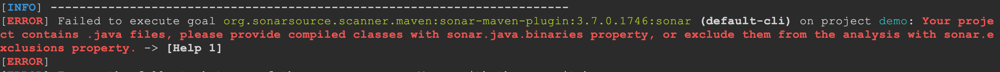

错误：你的工程包含java文件，请使用sonar.java.binaries属性指定class文件目录或使用sonar.exclusions属性排除java文件。

```
# 修正后执行命令，也可以在pom.xml中增加该属性
mvn sonar:sonar -Dsonar.java.binaries=target/

# 关于属性大家可以到官网查看：https://docs.sonarqube.org/8.9/analysis/analysis-parameters/
```

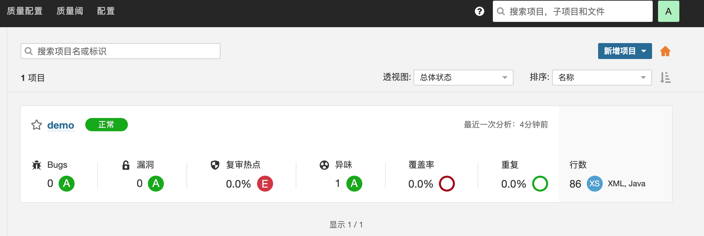

> 覆盖率：这里延伸一下sonar覆盖率的概念，他会在scanner之前将汇总报告生成到target目录，然后由scanner一起上报给sonar服务。
>
> 覆盖率的概念是单元测试的覆盖面囊括了我们源代码的比例，更多的在测试中使用。
>
> 我们看图中覆盖率是0，其实覆盖率要生效需要使用另一个插件，对于java代码的统计汇总需要的是jacoco，其他语言大家也可参考官网。
>
> https://docs.sonarqube.org/8.9/analysis/coverage/
>
> ```
> <plugin>
>   <groupId>org.jacoco</groupId>
>   <artifactId>jacoco-maven-plugin</artifactId>
>   <version>0.8.6</version>
>   <configuration>
>     <!--指定生成.exec文件的存放位置-->
>     <destFile>target/coverage-reports/jacoco-unit.exec</destFile>
>     <!--Jacoco是根据.exec文件生成最终的报告，所以需指定.exec的存放路径-->
>     <dataFile>target/coverage-reports/jacoco-unit.exec</dataFile>
>     <!-- 如果以上都不指定，默认jacoco-unit.exec会存入target/目录，report也会从target目录读取-->
>     <!-- 并且report会将报告存入target/site/jacoco/index.html -->
>   </configuration>
>   <executions>
>     <execution>
>       <id>jacoco-prepare-agent</id>
>       <goals>
>         <goal>prepare-agent</goal>
>       </goals>
>     </execution>
>     <execution>
>       <id>jacoco-report</id>
>       <!-- 指定生成报告的maven目标 -->
>       <phase>verify</phase>
>       <goals>
>         <goal>report</goal>
>       </goals>
>     </execution>
>   </executions>
> </plugin>
> 
> 
> # 执行先生成覆盖率报告，在scanner扫描
> mvn clean verify sonar:sonar
> ```

#### 9.2.2 Jenkins改造

在这里我们主要演示让sonar集成到jenkins，这样jenkins不论是单独的定时任务job还是目前我们demo项目的job，都可以进行按需的分析代码。

我们还是以demo为例，`目标：maven构建打包后进行sonar分析完成扫描代码并上报。`

> ##### `思考：`jenkins需要修改吗？要怎么修改？有几种方案？不修改行吗？
>
> - 不修改：当然行，因为demo工程的pom.xml已经配置了Sonar Scanner，可以通过mvn命令直接使用
>
>   - 缺点：没有配置Scanner的其他job无法实现通过Scanner扫描上报
>
> - 修改方案1：给jenkins中的maven配置文件settings.xml做全局配置
>
>   - 缺点：由于settings.xml配置能力有限，有些特殊配置无法实现
>
> - 修改方案2：与Maven集成Jenkins类似，将Sonarqube-Scanner的安装包装入容器，然后全局工具中配置，再安装对应的jenkins插件，
>
>   这样在job中就可以单独去使用Scanner功能了，而不必依赖于job中springboot工程个体。


> 第一个方案很简单：只需要将job的Maven构建脚本改成：-DskipTests=true clean package verify sonar:sonar 
>
> 如果需要jacoco上报则不能跳过Test：clean package verify sonar:sonar 
>
> 如果不需要jacoco上报：-DskipTests=true clean package sonar:sonar 
>
> -> 打包后进行Scanner扫描上报Sonar。
>
> 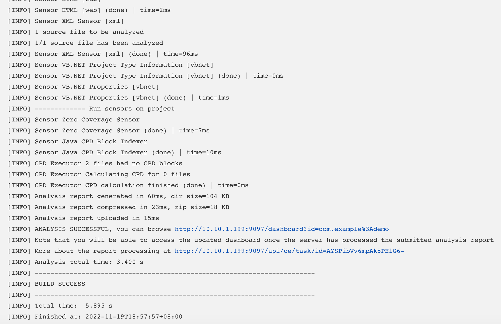
>
> -> 根据jenkins日志片段可知，Scanner已经生效了，并且将代码扫描后上传到了Sonar服务器，此时我们打开Sonar控制台也可以看到上报的demo工程。
>
> `我们可以修改下工程中代码并且提交gitlab，在用jenkins重新构建，可以发现sonar的新上报。`

> 第三种方案：Jenkins中彻底集成Scanner 【第二种也比较简单，大家自行验证下，我试了是没问题的】
>
> 
>
> ①首先下载Scanner安装包：以下哪个地址能下用哪个，我下载的是：sonar-scanner-cli-4.7.0.2747-linux.zip
>
> https://docs.sonarqube.org/8.9/analysis/scan/sonarscanner/
>
> https://binaries.sonarsource.com/?prefix=Distribution/sonar-scanner-cli/
>
> 注意需要使用：unzip解压，如果要构建到Dockerfile，则需先通过yum install -y unzip，我这里直接贴出来Dockerfile文件
>
> 这里我们就不把他构建到Dockerfile了，而是直接解压到jenkins根目录，根目录已经映射出来，所以操作也很方便
>
> 包括jdk、git、maven如果大家觉得没必要打入镜像，都可以这样操作。
>
> ②将安装包解压到/docker/jenkins/home目录
>
> ```
> # apt install unzip 我用的omv是基于Debian
> yum install -y unzip 
> # 解压
> unzip sonar-scanner-cli-4.7.0.2747-linux.zip
> # 改下文件夹名字
> mv sonar-scanner-4.7.0.2747-linux sonar-scanner
> ```
>
> ③Jenkins中安装sonar插件：【SonarQube Scanner For Jenkins】
>
> 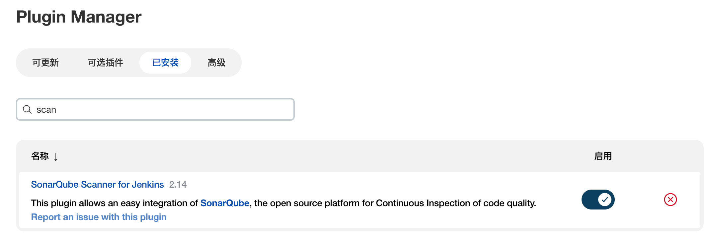
>
> -> 配置sonar路径：系统管理 -> 系统配置 -> SonarQube servers
>
> 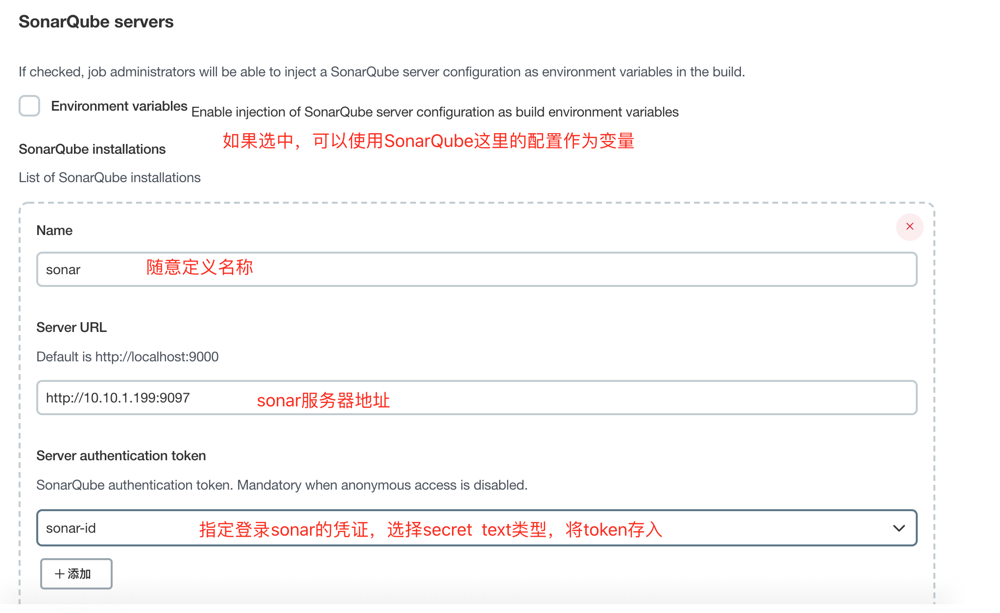
>
> ④全局配置工具：设置sonar-scanner环境目录
>
> 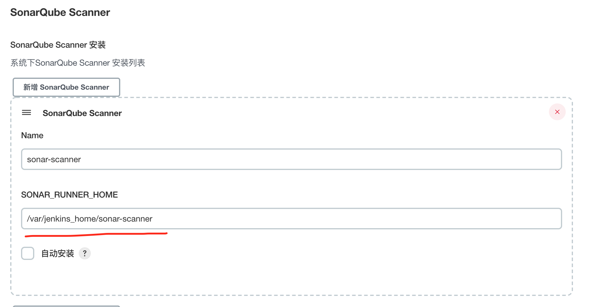
>
> ⑤修改job配置：在maven构建之后增加sonar scanner，即放在推送镜像到私服环节之前
>
> 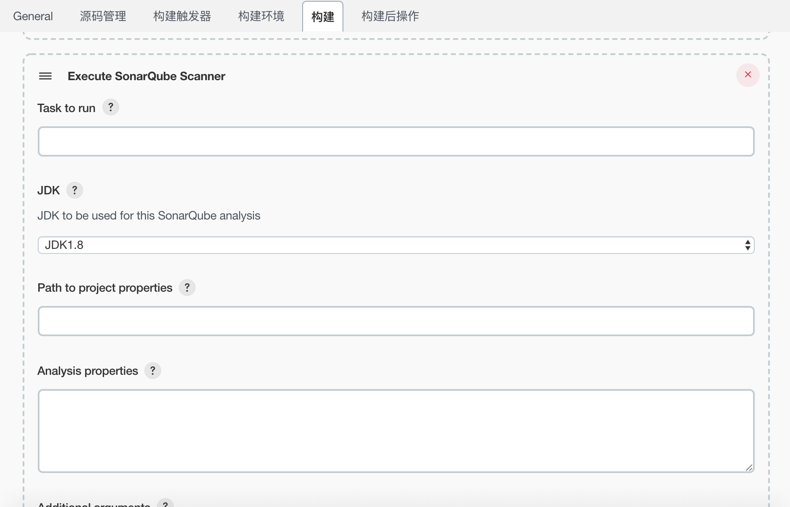
>
> 添加后我们什么都不配运行看下效果：
>
> 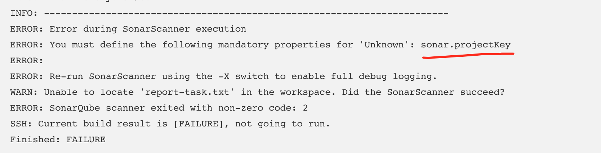
>
> -> 依次尝试后，我们把必要参数全部配置好：
>
> 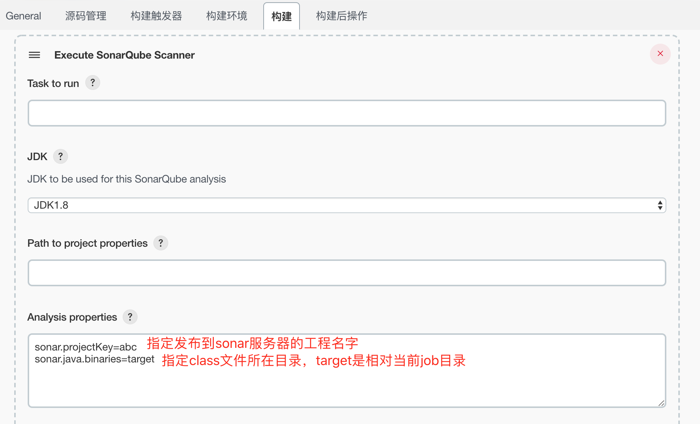
>
> -> 再看sonarqube控制台，已经发布上来了。
>
> 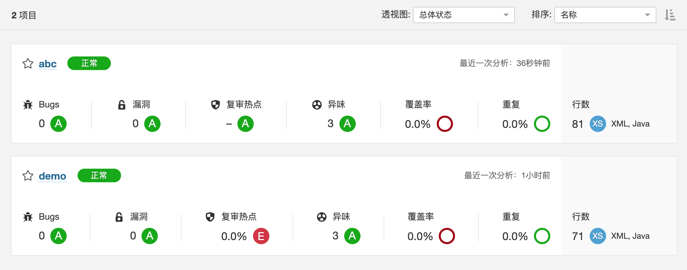


> ##### 至此：我们讲了DevOps各个阶段所涉及到的中间件，以及怎么通过jenkins这个大管家来协调运作，最终实现持续开发、持续集成、持续部署。


> #### `问题：会不会觉得jenkins的配置越来越繁琐，并且复杂，可能会有一点儿，如果工程多了，维护起来比较麻烦`


## 10.Jenkins流水线：Pipeline


### 10.1 流水线基本概念

官方中文手册：https://www.jenkins.io/zh/doc/book/pipeline/，我们最好在结合英文文档去看，因为翻译过来的中文比较乱。

> Jenkins pipeline是一套插件，它支持实现和集成 *continuous delivery pipelines* 到Jenkins，即实现CD持续部署的功能。
>
> Jekins的流水线插件会在安装Jenkins时通过“建议安装”的方式自动安装上，如果大家建议安装时失败了，可以单独下载Pipeline plugin去安装一下。
>
> 流水线提供了一组可扩展的工具，通过 [Pipeline domain-specific language (DSL) syntax](https://www.jenkins.io/zh/doc/book/pipeline/syntax)(pipeline有自己的语法DSL，基于groovy语法)对从简单到复杂的交付流水线进行建模。

Jenkins流水线的定义，需要创建一个`Jenkinsfile文本文件`，该文件除了可以直接定义在Jenkins的job中还可以被提交到代码仓库管理(如：gitlab)，这样流水线将会作为我们开发项目的一部分，像其他代码一样进行跟踪管理，所以建议使用gitlab管理jenkinsfile的方式去实施Jenkins的流水线。


`说白了：jenkins 流水线 就是通过一个file文件来实现jenkins job的功能。`


流水线的特点：为什么选择流水线？通过jenkins的配置不好吗？

- 流水线可以通过代码仓库管理，方便我们进行迭代、审核等；
- 流水线文件独立于jenkins的job，而配置方式比较难实现独立
- 流水线可以在流程阶段做更丰富的操作，比如暂停，审核等交互式操作；
- 流水线支持更多的插件扩展


图中是一个通过管道(pipeline流水线)实现的从开发到生产的过程，其中每一个步骤都可以通过Jenkins的流水线的DSL语法去建模。

`概念：SCM=>软件配置管理，他有很多实现工具，比如我们常用的gitlab就是一个SCM工具，而在本文中提到SCM我们默认使用的就是gitlab。`


> Jenkins流水线的语法有2种：
>
> - 脚本式：2014年12月
> - 声明式：2017年2月，为更简便易用而生
>
> 实际中我们的jenkinsfile中一般会混用两种语法。


#### 10.1.1 流水线语法概念


- pipeline：是用户定义的一个CD流水线模型，就是说他是我们定义的jenkinsfile的跟节点，流水线起始于`pipeline块` 。pipeline块中一般会包含`stages块`去完成一个应用程序构建、 测试和部署的阶段。
- node(节点)：它是Jenkins环境的一个机器并且能够执行流水线文件。
- stage(阶段)：`stage` 块中定义了不同的任务，比如 "Build", "Test" 和 "Deploy" 阶段, 这些不同的任务可以通过多种插件去可视化展示或者也可以展示Jenkins执行pipeline的进度和状态。
- step(步骤)：是stage块中的一个任务，他可以告诉Jenkins去做什么，比如在Build节点，在这个任务中可以让Jenkins去执行make命令，注意需要使用sh "make"方式执行，不能直接通过make去执行。


`注意：`[stages](https://www.jenkins.io/doc/book/pipeline/#stage)块和[steps](https://www.jenkins.io/doc/book/pipeline/#step)块在声明式和脚本是语法中都可以使用。

> 声明式语法举例：创建一个Jenkinsfile
>
> ```json
> // pipeline块作为jenkinsfile的根节点
> pipeline {
>     agent any      // 指定可以在任何空闲的代理上执行以下的stages块，代理指的是我们jenkins服务器，如果是集群的话就是其中的某个节点（声明式中必须要有agent）
>     stages {       // 通过stages包括多个stage
>         stage('Build') {     //通过stage定义一个任务，这个任务我们取名叫做”Build“，即代表构建阶段要执行的步骤
>             steps { // 通过steps包括多个step，而每个step就是我们要执行的任务的具体内容，比如执行一个shell脚本等
>                 echo "hello build"
>             }
>         }
>         stage('Test') { // 定义测试阶段
>             steps { // 测试阶段需要执行的步骤
>                 echo "hello test"
>             }
>         }
>         stage('Deploy') { // 定义部署阶段
>             steps { //部署阶段需要执行的步骤
>                 echo "hello deploy"
>             }
>         }
>     }
> }
> ```

> 脚本式语法举例：创建一个Jenkinsfile
>
> ```json
> // 该节点和声明式中的agent是一个意思，表示在任意jenkins节点上执行以下stages，他不需要一个顶级的pipeline块，而是直接执行节点或任一节点执行以下阶段
> node {
>     // 在脚本式语法中stage块是可选的，即可以直接使用steps来定义步骤，但是如果定义了stage，该stage将可以在jenkins的图像化界面中展示
>     stage('Build') { 
>         // 其实展示的就是"Build"名字，而对于声明式语法stage是一定要有的，如果不想展示图形化可以专门使用脚本式语法，然后不添加stage即可。            
>         echo "hello build"           
>     }
>     stage('Test') { 
>         // 这个里边定义的和声明式就一样了，定义当前步骤的steps
>         echo "hello test"      
>     }
>     stage('Deploy') { 
>         echo "hello deploy"   
>     }
> }
> ```


#### 10.1.2 声明式/脚本式语法

https://www.jenkins.io/zh/doc/book/pipeline/syntax/

> 1.注释：Jenkinsfile文件中可以使用两种注释方式
>
> - // 注释内容
> - /* .. 注释内容 .. */


> 2.使用环境变量：jenkins提供了很多内置的环境变量都可以在Jenkinsfile中使用，可以通过如下地址查看：
>
> http://10.10.1.199:9078/pipeline-syntax/globals
>
> `使用方法：`类似访问Groovy的map属性，关键字是env：`${env.BUILD_ID}` 
>
> ```
> pipeline {
>  agent any
>  stages {
>      stage('Example') {
>          steps {
>              echo "Running ${env.BUILD_ID} on ${env.JENKINS_URL}"
>          }
>      }
>  }
> }
> ```
>
> `注意：可以通过printenv或env将已有的环境变量输出`

> 3.设置变量：声明式和脚本式有所不同
>
> 声明式语法：`environment`指令(块)
>
> ```
> pipeline {
>   agent any
>   // 当前文件全局生效
>   environment { 
>     CC = 'clang'
>   }
>   stages {
>     stage('Example') {
>         // 局部生效，所有stage内的steps中可以使用
>         environment { 
>             DEBUG_FLAGS = '-g'
>         }
>         steps {
>             sh 'printenv'
>         }
>     }
>   }
> }
> ```
>
> 脚本式语法：需要使用一个step为`withEnv`的命令来定义变量
>
> ```
> node {
>   /* .. 
>   	withEnv中设置的变量只能在当前块中生效\
>   	就是将环境变量添加到PATH中
>   .. */
>   withEnv(["PATH+MAVEN=${tool 'M3'}/bin"]) {
>     sh 'mvn -B verify'
>   }
> }
> ```
>
> **${tool 'M3'}：其中tool是Jenkinsfile的工具命令，就是要使用一个工具，完整写法如：tool name: 'maven3.8.6', type: 'maven'
> 其中name是我们配置的jenkins全局工具中的名称，而类型就是工具的名字，此处M3来自官网，即他定义了一个全局工具叫M3，此处是给环境变量设置了maven的bin目录，
> 以便sh中的mvn命令得以正常执行，当然也可以直接不设置变量，通过sh "${tool 'M3'}/bin/mvn -B verify",注意是双引号，单引号不能执行插值语法**

> 4.动态设置变量：
>
> 所有的脚本执行完后都会有返回状态returnStatus`或`returnStdout
>
> `注意：groovy是可以支持三种引号`
>
> - 单引号：和我们java中定义字符串一样，不支持解析插值语法，即无法获取${变量名}的值
> - 双引号：可以进行字符串的拼接，且可以执行插值表达式(${变量名})
> - 三引号：支持字符串换行，`注意：`三引号也分三个单引号和三个双引号，意思和单引号、双引号一样，只不过是这里可以换行，如`['''或"""]`
>
> `注意：`我们知道shell脚本执行结果是0或非0，而Jenkinsfile中采用了groovy中使用shell脚本获取返回值状态或标准输出的语法：
>
> - 获取标准输出的shell脚本
> - 获取执行状态的shell脚本
> - 无需返回值的shell脚本
>
> ```
> // 获取标准输出
> // 第一种
> result = sh returnStdout: true ,script: "<shell command>"
> // 返回结果末尾会有空格，所以trim()一下
> result = result.trim()
> // 第二种
> result = sh(script: "<shell command>", returnStdout: true).trim()
> // 第三种
> sh "<shell command> > commandResult"
> result = readFile('commandResult').trim()
> 
> // 获取执行状态
> // 第一种
> result = sh returnStatus: true ,script: "<shell command>"
> result = result.trim()
> // 第二种
> result = sh(script: "<shell command>", returnStatus: true).trim()
> // 第三种
> sh '<shell command> > status'
> def r = readFile('status').trim()
> 
> //无需返回值，仅执行shell命令
> //最简单的方式
> sh '<shell command>'
> 
> ```
>
> 动态定义变量Jenkinsfile脚本如下：
>
> ```
> pipeline {
>     agent any 
>     environment {
>         // 使用 returnStdout
>         CC = """${sh(
>                 returnStdout: true,
>                 script: 'echo "clang"'
>             )}""" 
>         // 使用 returnStatus
>         EXIT_STATUS = """${sh(
>                 returnStatus: true,
>                 script: 'exit 1'
>             )}"""
>     }
>     stages {
>         stage('Example') {
>             environment {
>                 DEBUG_FLAGS = '-g'
>             }
>             steps {
>                 // 输出所有变量
>                 sh 'printenv'
>             }
>         }
>     }
> }
> ```

> 5.凭证：jenkins中我们可以创建与第三方进行鉴权的凭证，比如我们之前创建的凭证ID有：gitlab、sonar-key
>
> 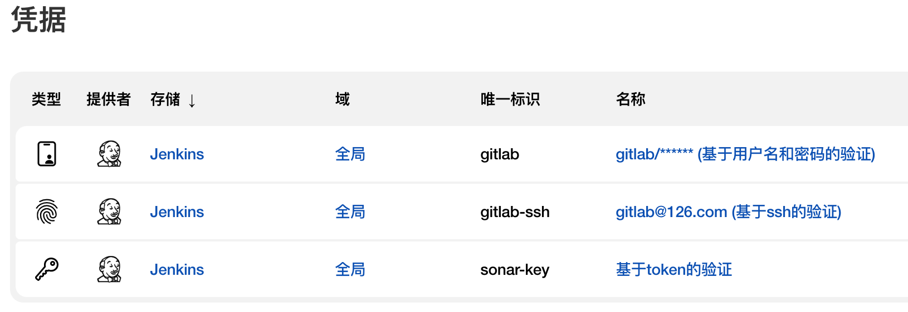
>
> `用法：在environment块中使用credentials('凭证ID')为变量赋值，然后通过在脚本中使用变量进行鉴权`
>
> ```
> pipeline {
>     agent any
>     environment {
>         // 基于用户名和密码方式的凭证赋值，可以使用$USERNAME_PASSWORD_KEY使用凭证，内容格式为[username:passwd]
>         // 用户名密码的凭证，除了会赋值外，jenkins还会自动创建2个变量，名字为当前定义的变量后加"_USR"和"_PSW"，即可以单独获取用户名和密码
>         USERNAME_PASSWORD_KEY = credentials('gitlab')
>         // 基于Secret文本方式的凭证赋值，可以通过$SONAR_KEY使用凭证
>         SONAR_KEY = credentials('sonar-key')
>     }
>     stages {
>         stage('Example stage 1') {
>             steps {
>                 // 
>             }
>         }
>     }
> }
> ```
>
> `注意：如果要生成其他凭证，比如ssh秘钥或证书，那么需要使用jenkins提供的【片段生成器】,选用withCredentials: Bind credentials to variables来生成脚本`
>
> http://10.10.1.199:9078/job/p1/pipeline-syntax/
>
> 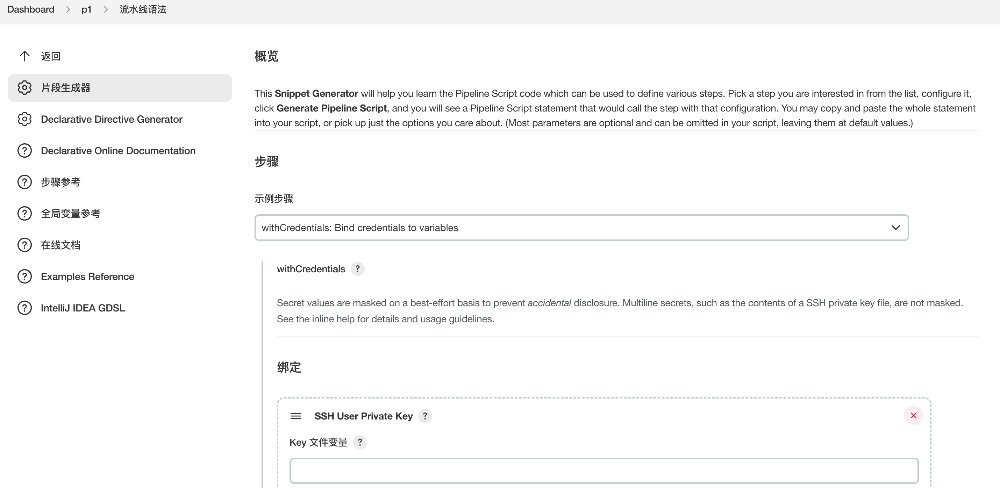
>
> 
>
> ```
> // 注意：keyFileVariable可以用来接收我们配置的ssh的证书信息，比如我指定了私钥内容，可以通过指定keyFileVariable='ABC',然后通过$ABC来获取私钥内容
> withCredentials([sshUserPrivateKey(credentialsId: 'gitlab-ssh', keyFileVariable: '')]) {
>     // some block
> }
> ```

> 6.字符串插值：使用groovy语法
>
> ```
> // 单引号、双引号、三引号都可以
> def singlyQuoted = 'Hello'
> def doublyQuoted = "World"
> 
> echo 'Hello Mr. ${singlyQuoted}'  // 注意：单引号不能解析表达式，将会原样输出
> echo "I said, Hello Mr. ${doublyQuoted}"
> ```

> 7.参数：配置完的参数都会作为`params`内置变量的属性被使用。
>
> - 声明式语法：可以通过在`parameters指令`中定义参数
> - 脚本式语法：可以通过`properties步骤，类似withEnv`
>
> ```
> pipeline {
>     agent any
>     // 指定参数
>     parameters {
>         // 参数名=Greeting， 值=Hello
>         stringname: 'Greeting', defaultValue: 'Hello', description: 'How should I greet the world?')
>     }
>     stages {
>         stage('Example') {
>             steps {
>                 // 使用内置params属性引用参数
>                 echo "${params.Greeting} World!"
>             }
>         }
>     }
> }
> ```

> 8.故障处理
>
> - 声明式：使用`post指令`支持对多个条件进行处理，**包括：always、unstable、success、failure和changed **
> - 脚本式：使用groovy内置语法try...catch...finally
>
> ```
> pipeline {
>     agent any
>     stages {
>         stage('Test') {
>             steps {
>                 sh 'make check'
>             }
>         }
>     }
>     // 后处理阶段
>     post {
>         // 不管前边阶段什么结果都执行
>         always {
>             echo "always is printed!"
>         }
>         // 前边阶段失败才会执行
>         failure {
>             // mail to: team@example.com, subject: 'The Pipeline failed :('
>             echo "failure is printed!"
>         }
>         // 前边阶段成功才会执行
>         success {
>             echo "success!"
>         }
>     }
> }
> ```
>
> ```
> node {
>     stage('Test') {
>         try {
>             sh 'make check'
>         }
>         finally {
>             // 通过junit插件实现生成xml测试报告到target目录
>             junit '**/target/*.xml'
>         }
>     }
> }
> ```

> 9.多代理指定：`agent指令`，前边我们只配置过agent：any，并且都在顶级pipeline块中配置的，属于全局作用域
>
> 一个Jenkinsfile还可以给不同的stage阶段配置不同的agent代理。这样不同的阶段可以被不同的jenkins节点去执行。
>
> `注意：`jenkins集群或单机都可以指定label标签：系统管理->节点管理
>
> ```
> pipeline {
>     // 该属性为必填属性，所以全局先定义成不启用jenkins节点
>     agent none
>     stages {
>         stage('Build') {
>             // 指定Build阶段使用任何一个jenkins节点都可执行
>             agent any
>             steps {
>                 checkout scm
>                 sh 'make'
>                 // stash 是一个暂存命令插件，可以将内容暂存到jenkins master节点，通过unstash取出存储的内容
>                 stash includes: '**/target/*.jar', name: 'app' 
>             }
>         }
>         stage('Test on Linux') {
>             // 指定Test on Linux阶段，只能使用被标签为linux的jenkins节点执行
>             agent { 
>                 label 'linux'
>             }
>             steps {
>                 unstash 'app' 
>                 sh 'make check'
>             }
>             post {
>                 always {
>                     junit '**/target/*.xml'
>                 }
>             }
>         }
>         stage('Test on Windows') {
>             // 指定Test on Windows阶段，只能使用被标签为windows的jenkins节点执行
>             agent {
>                 label 'windows'
>             }
>             steps {
>                 unstash 'app'
>                 bat 'make check' 
>             }
>             post {
>                 always {
>                     junit '**/target/*.xml'
>                 }
>             }
>         }
>     }
> }
> ```
>
> 脚本式可以使用node指令：如果要指定标签，则通过node('label'){...}

> 10.步骤step的参数简化写法：就是如果一个step语句可以省略参数外部的括号
>
> 在groovy中创建map的方式如[key1:value1, key2:value2]，而step中多数命令都是以map作为参数：
>
> - `省略参数外部的所有括号`
>
> ```
> git([url: 'git://example.com/amazing-project.git', branch: 'master'])
> 
> // ==> 简化方式
> git url: 'git://example.com/amazing-project.git', branch: 'master'
> ```
>
> - `只有一个参数时，除了括号参数名也可省略`
>
> ```
> sh([script: 'echo hello'])
> 
> // ==> 简化方式
> sh 'echo hello'
> ```

> 11.并发执行：`脚本式语法的高级应用`，作为基于groovy的语法，脚本式语法几乎可以直接使用groovy的所有语法而无需修改
>
> 优化：第9个案例中，Test on Linux和Test on Windows两个阶段是串行执行，我们此处改为并发执行
>
> `指令：parallel`
>
> ```
> stage('Test') {
>     // 并发执行，此处指定的linux是一个parallel的一个分支而已，随意取名，不必和jenkins节点的label相同
>     parallel linux: {
>         // 脚本式语法选择linux标签的jenkins节点执行
>         node('linux') {
>             checkout scm
>             try {
>                 unstash 'app'
>                 sh 'make check'
>             }
>             finally {
>                 junit '**/target/*.xml'
>             }
>         }
>     },
>     // parallel的另一个并发执行的分支
>     windows: {
>         node('windows') {
>             /* .. snip .. */
>         }
>     }
> }
> ```

> 12.options：可以设置一些jenkins底层对于当前配置此属性块的pipeline的属性限制
>
> 比如：当前流水线失败后是否可以重试、是否打印时间戳、是否设置超时时间等
>
> ```
> pipeline {
>     agent any
>     // 设置1小时超时时间，超过1小时该job还没运行完则终止执行，也可以配置在stage阶段块内部，但设置项较少，参考官网看一下
>     options {
>         timeout(time: 1, unit: 'HOURS') 
>     }
>     stages {
>         stage('Example') {
>             steps {
>                 echo 'Hello World'
>             }
>         }
>     }
> }
> ```

> 13.input：可以在执行某个stage阶段时，通过图形化界面与用户交互，即确认后才能继续执行流水线任务，当然也可以取消执行。
>
> ```
> pipeline {
>     agent any
>     stages {
>         stage('Example') {
>             input {
>                 message "Should we continue?"
>                 ok "Yes, we should."
>                 submitter "alice,bob"
>                 parameters {
>                     string(name: 'PERSON', defaultValue: 'Mr Jenkins', description: 'Who should I say hello to?')
>                 }
>             }
>             steps {
>                 echo "Hello, ${PERSON}, nice to meet you."
>             }
>         }
>     }
> }
> ```

> 14.when：指令允许流水线根据给定的条件决定是否应该执行stage阶段。
>
> 参考官网：https://www.jenkins.io/zh/doc/book/pipeline/syntax/#when

> 15.script：声明式中如果想嵌入脚本，即执行定义变量、方法等groovy语法，需要使用script指令来嵌入
>
> ```
> pipeline {
>     agent any
>     stages {
>         stage('Example') {
>             steps {
>                 echo 'Hello World'
>                 // 执行脚本式语法脚本
>                 script {
>                     def browsers = ['chrome', 'firefox']
>                     for (int i = 0; i < browsers.size(); ++i) {
>                         echo "Testing the ${browsers[i]} browser"
>                     }
>                 }
>             }
>         }
>     }
> }
> ```

> 16.tools：可以将我们配置到全局工具中的工具导入到环境变量PATH中，方便我们下文直接使用命令，否则就需要使用绝对路径。
>
> 目前只支持：**maven**、**jdk**、**gradle**
>
> ```
> pipeline {
>     agent any
>     tools {
>         // 注意"maven3.8.6"是我们全局工具中定义的名字
>         maven "maven3.8.6"
>     }
>     stages {
>         stage('Example') {
>             steps {
>                 // 此处可以直接使用maven的命令而无需指定绝对路径
>                 sh 'mvn --version'
>             }
>         }
>     }
> }
> ```

#### 10.1.3 Jenkinsfile For Docker

Jenkinsfile中可以直接调用docker，比如构建一个镜像、推送镜像、启动容器等，都可以在agent指令中使用，

此时表示通过jenkins节点来运行docker容器，即docker容器作为执行Jenkinsfile的代理机器，也就是说jenkinsfile的阶段会交给docker容器去执行。[注意理解]

`这和我们之前的案例，由jenkins来构建镜像并推送镜像时有区别的，此处启动的docker容器主要作用是运行jenkinsfile的step步骤，当然我们也可以让该容器通过执行step去完成我们之前案例中的构建镜像、推送镜像的功能`


`前提：需要安装Docker Pipeline插件，否则agent中指定docker是无法被识别为代理节点的`

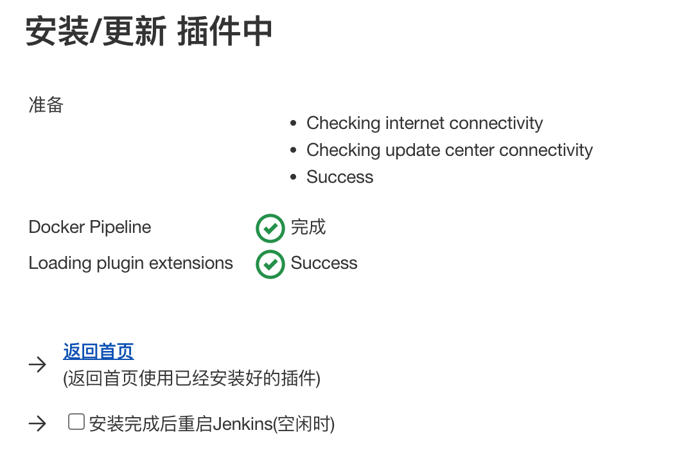

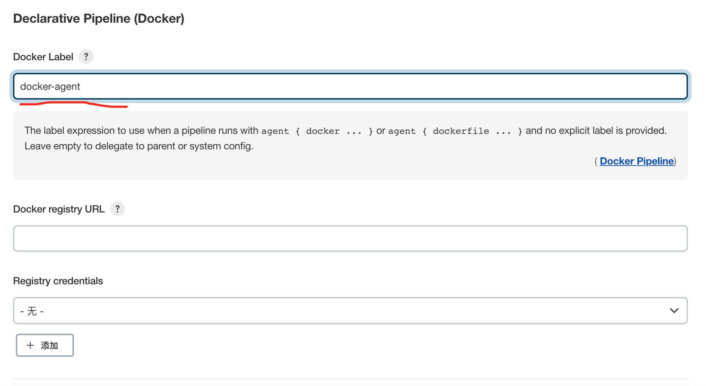

```
pipeline {
    agent {
        // 让jenkins节点调用本地的docker服务(比如之前我们映射的docker宿主机的docker服务)去启动一个容器
        // 去执行Jenkinsfile后边的stages阶段，即在容器内部执行node --version
        docker { image 'node:7-alpine' }
    }
    stages {
        stage('Test') {
            steps {
                sh 'node --version'
            }
        }
    }
}
```

构建完成后会删除容器：日志如下

```
Started by user admin
Replayed #15
[Pipeline] Start of Pipeline
[Pipeline] node
Running on Jenkins in /var/jenkins_home/workspace/p1
[Pipeline] {
[Pipeline] isUnix
[Pipeline] withEnv
[Pipeline] {
[Pipeline] sh
+ docker inspect -f . node:7-alpine
.
[Pipeline] }
[Pipeline] // withEnv
[Pipeline] withDockerContainer
Jenkins seems to be running inside container babd00931aa08fa1bdfeaf62ec3fbccc4c7a32f285973a3339cb3f3a56d3413f
$ docker run -t -d -u 1000:1000 -w /var/jenkins_home/workspace/p1 --volumes-from babd00931aa08fa1bdfeaf62ec3fbccc4c7a32f285973a3339cb3f3a56d3413f -e ******** -e ******** -e ******** -e ******** -e ******** -e ******** -e ******** -e ******** -e ******** -e ******** -e ******** -e ******** -e ******** -e ******** -e ******** -e ******** -e ******** -e ******** -e ******** -e ******** -e ******** -e ******** -e ******** -e ******** -e ******** -e ******** node:7-alpine cat
$ docker top 0f98c57f3079ecd6606c4d3b81d365f57a11ce2feea406b88ac17f393e568446 -eo pid,comm
[Pipeline] {
[Pipeline] stage
[Pipeline] { (Test)
[Pipeline] sh
+ node --version
v7.10.1
[Pipeline] }
[Pipeline] // stage
[Pipeline] }
$ docker stop --time=1 0f98c57f3079ecd6606c4d3b81d365f57a11ce2feea406b88ac17f393e568446
$ docker rm -f --volumes 0f98c57f3079ecd6606c4d3b81d365f57a11ce2feea406b88ac17f393e568446
[Pipeline] // withDockerContainer
[Pipeline] }
[Pipeline] // node
[Pipeline] End of Pipeline
Finished: SUCCESS
```

#### 10.1.4 共享库Shared Libraries

随着jenkins pipeline项目越来越多，冗余代码也越来越多，所以share library诞生。

> 流水线支持在外部仓库中创建【共享库】，然后加载到现有流水线中使用，已达到复用的功能。


> 共享库的目录结构是有要求的：如下
>
> 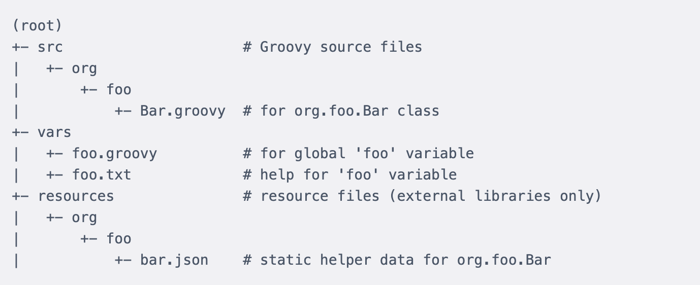
>
> - src目录：源代码，可以定义类、变量、方法等；当执行jenkins pipeline时，该目录内容会被加载到pipeline项目的classes目录
>
> - vars目录：以.groovy定义的文件，文件名被加载成环境变量名，可通过变量名获取文件中定义的变量或方法(通过def定义变量或方法)；
>
>   .txt文件将会作为.groovy同名文件的说明文档，可以在jenkins的全局变量页面查看到此文档，用来说明对应的.groovy中有哪些变量或方法，
>
>   ​	尽管是.txt结尾，但可以是html、markdown等内容。
>
> - resources目录：该目录的内容允许Jenkinsfile中的step步骤指令“libraryResource”来加载该目录的非.groovy文件，只能从外部共享库加载文件，而jenkinsfile所在的项目中的内容不能通过libraryResource来加载。通俗点说存放资源文件，如配置文件，方便我们在Jenkinsfile中读取。

> ##### `共享库配置到jenkins：在scm中创建完仓库后，还需要告诉jenkins，通过jenkins和scm配置好关联后，我们的pipeline项目(Jenkinsfile文件)才能使用@Library引用共享库。`
>
> 路径：**Manage Jenkins » Configure System » Global Pipeline Libraries**
>
> 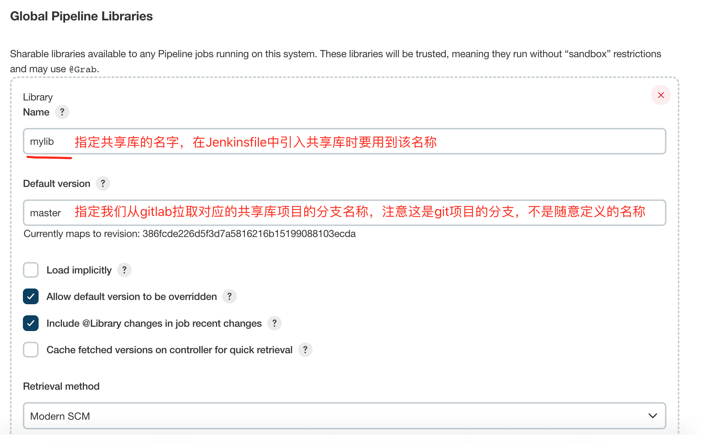
>
> `注意：如果Default version写错了，jenkins会有错误提醒的。`
>
> 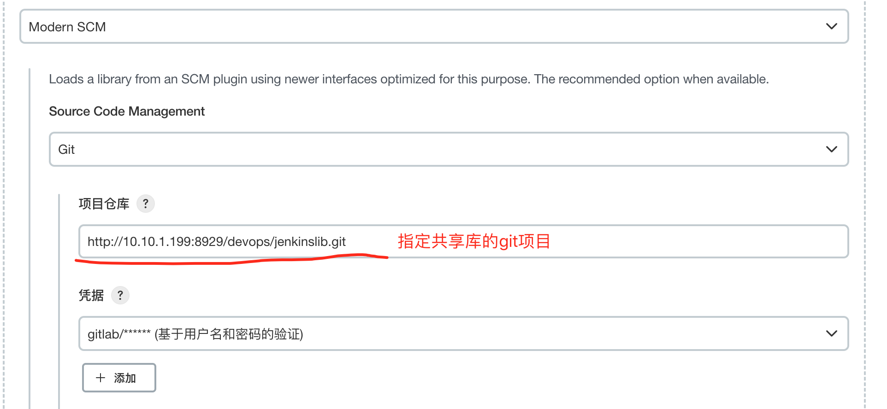

> #### `src目录定义的源码：2种方式`
>
> - ##### class类文件：不能直接使用sh或git等Jenkinsfile中的命令
>
>   ```
>   // 文件名src/org/devops/ClassTest.groovy
>   package org.devops
>   
>   /*
>     在class类中定义的方法中，是不能执行我们Jenkinsfile中要执行的sh或git等命令的，只能使用groovy原生语法
>     如果需要使用sh等命令，可以将变量和方法定义到class外部，即删除class定义即可
>   */
>   class ClassTest implements Serializable {
>     def steps;
>     
>     ClassTest(steps) {
>         this.steps = steps;
>     }
>   
>     def hello(args) {
>       // 这种情况如果想使用sh或git等Jenkinsfile中使用的命令，可以通过Jenkinsfile中调用该方法时传递过来再执行
>       // 此处就是执行sh命令，只不过我们将pipeline的this传递过来了
>       this.steps.echo args
>     }
>   }
>   
>   ```
>
> - ##### 非class类文件：可以直接使用Jenkinsfile中的命令
>
>   ```
>   // 文件名src/org/devops/NoClassTest.groovy
>   package org.devops
>                 
>   def hello(args) {
>     // 可以直接使用
>     echo "NoClassTest is $args"
>   }
>   ```

> #### `var目录创建变量文件：`
>
> ##### 该目录创建的文件和src中非class类似，只不过该文件会作为jenkins全局变量存在，而src中的文件会加载到classes目录可以被Jenkinsfile调用。
>
> ```
> // 文件名var/abc.groovy
> def info(message) {
>     echo "INFO: ${message}"
> }
> 
> def warning(message) {
>     echo "WARNING: ${message}"
> }
> 
> // 如果要定义字段作为全局变量需要使用注解@groovy.transform.Field
> @groovy.transform.Field
> def ABC_F = "字段变量"
> ```
>
> ##### `无需指定package，所以比较简单`

> Jenkinsfile中使用：
>
> 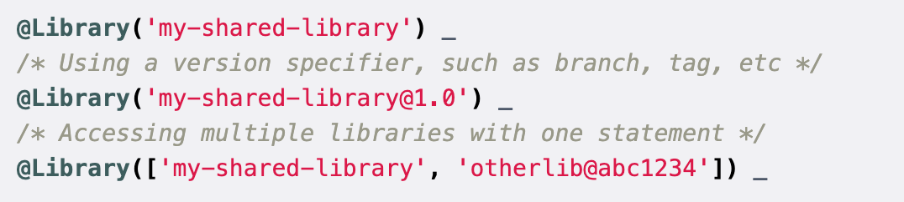
>
> `注意：`导入只有src类库的共享库，可以通过注解@Library('mylib@master') import packageName+className，这样groovy编译器会自动将类库加载到jenkins方便直接使用；
>
> 而如果只有var的共享库，则可以使用注解@Library('mylib@master') _ ，这样更整洁，不必增加多个import语句，而`_`符号是可以被解析的。
>
> ```
> // 引入共享库，指定名称和版本
> @Library('mylib@master') _
> 
> // 定义变量 
> def classTest = new org.devops.ClassTest(this)
> // 虽然没有class但可以通过文件名直接创建
> def noClassTest = new org.devops.NoClassTest()
> 
> pipeline {
>     agent any
>     stages {
>         stage('Hello') {
>             steps {
>                 // 声明式语法需要script指令来执行脚本
>                 script {
>                     // 此处我们传递的是this参数
>                     echo "$classTest.steps"
>                     classTest.hello('测试打印参数')
>                   
>                     // noclass的测试
>                     noClassTest.hello("NoClassTestArgs")
>                     
>                     // 文件名自动加载为环境变量 
>                     abc.info 'Starting'
>                     abc.warning 'Nothing to do!'
>                 }
>             }
>         }
>     }
> }
> ```
>
> 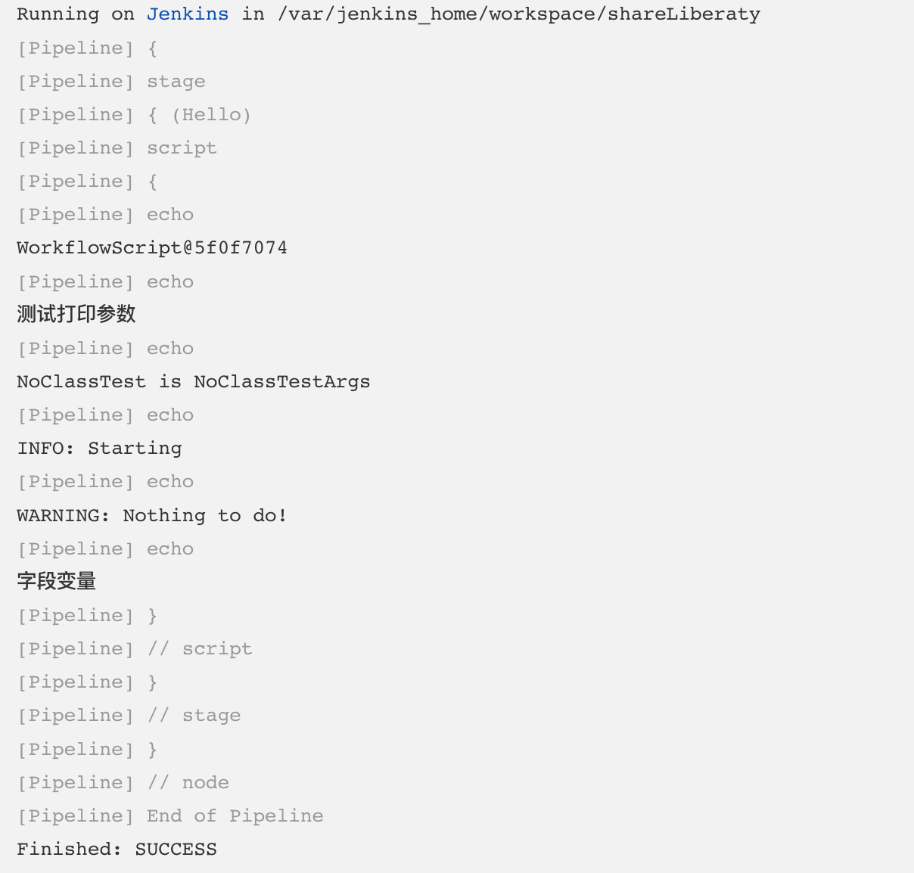

> `动态加载：[了解]`
>
> - 只有var的共享库可以直接：`library 'mylib@master'`该语句后，就可以直接使用var中定义的变量
>
> - 只有src的共享库可以直接：def lib = library('mylib@master').org.devops，可以直接导入package包
>
>   使用lib.NoClassTest.new().hello("动态调用参数")
>
> 
>
> `在共享库中定制Jenkinsfile的step步骤：[了解]`就是说我们在Jenkinsfile中常用的步骤sh或git，像这种step步骤，我们可以在共享库中通过var中定义变量来实现，
>
> 比如我们要定义一个step叫做：sayHello
>
> 使用的时候就可以像使用sh或git那样：sayHello 'abc'
>
> 定义方法：创建文件var/sayHello.groovy
>
> ```
> // vars/sayHello.groovy
> // 通过定义一个特殊的方法call来实现，参数name默认值我这里指定为human
> def call(String name = 'human') {
>     // Any valid steps can be called from this code, just like in other
>     // Scripted Pipeline
>     echo "Hello, ${name}."
> }
> ```
>
> 那么我们执行:
>
> sayHello 'abc'  => 输出 "Hello, abc"
>
> Sayhello  => 输出 "Hello human"

**实际使用，使用src还是var，其实都可以，看大家习惯，但var会作为全局变量，这个注意一下不要重名或冲突即可。**


### 10.2 流水线应用


#### 10.2.1 BlueOcean图形化

可以通过插件的方式安装到jenkins，搜索“Blue Ocean”，安装后重启即可。


由于兼容问题，BlueOcean依赖的插件有些是失败的，我们需要一个个去单独解决一下，记下名字，我们去离线下载插件。

> 或者我们想使用的话将jenkins升级到最新版本即可，我们这里主要使用SCM方式管理jenkinsfile，所以就不再去纠结安装BlueOcean了，大家可以自己尝试一下。


> 使用blueocean需要结合gitlab：需要先创建一个空工程，然后由blueocean来在工程中创建Jenkinsfile文件
>
> 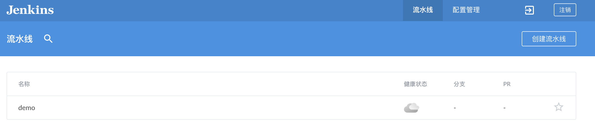
>
> 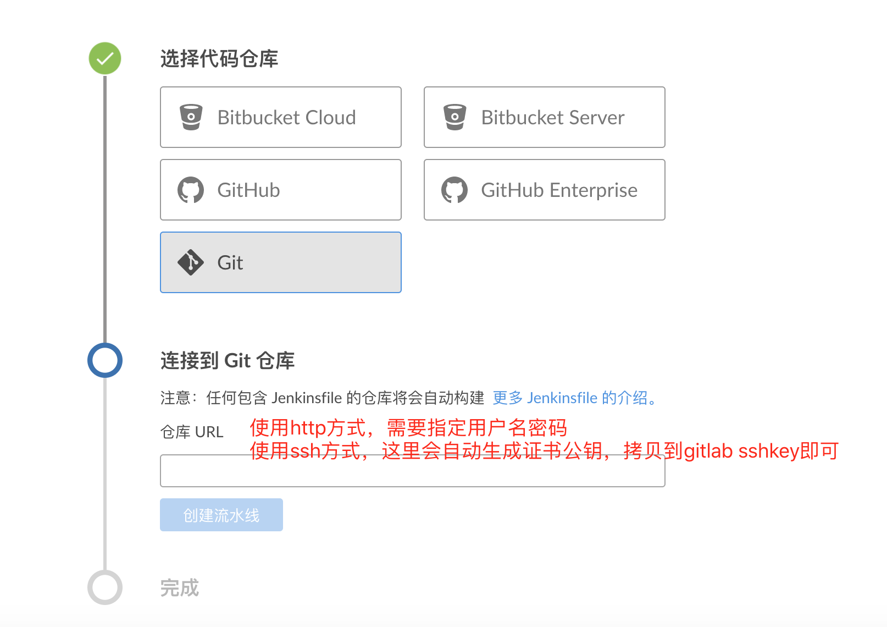
>
> 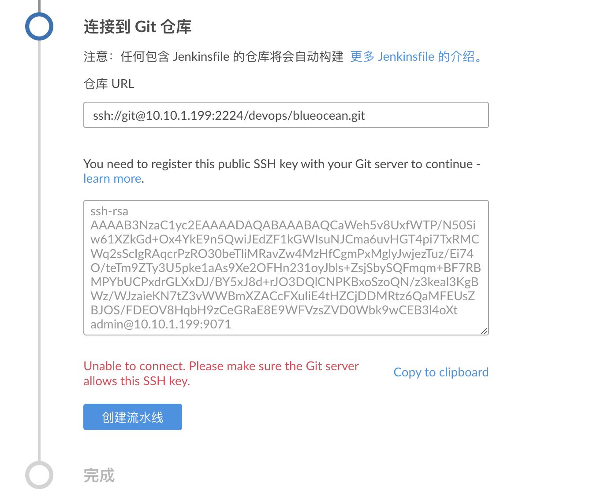
>
> 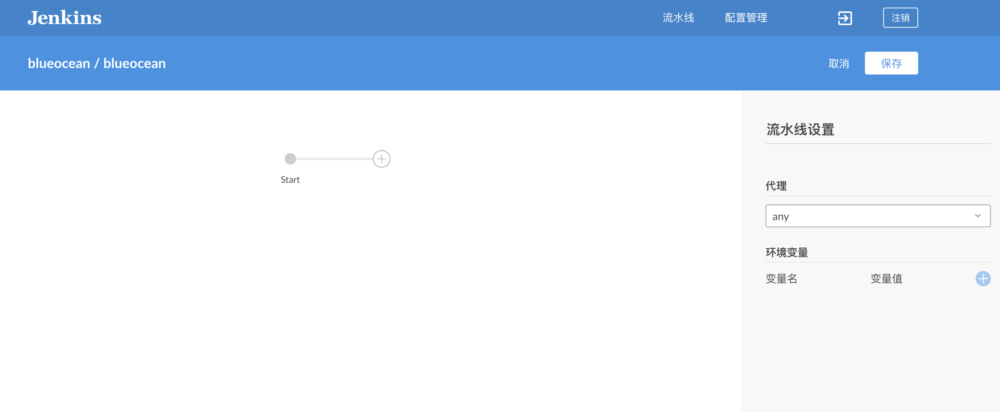
>
> 没有Jenkinsfile则会创建，如果有则会读取展示
>
> 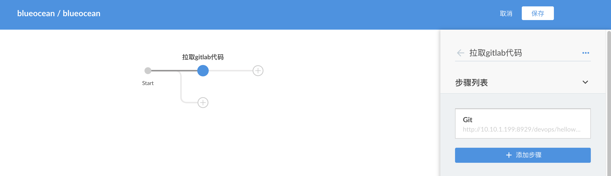
>
> 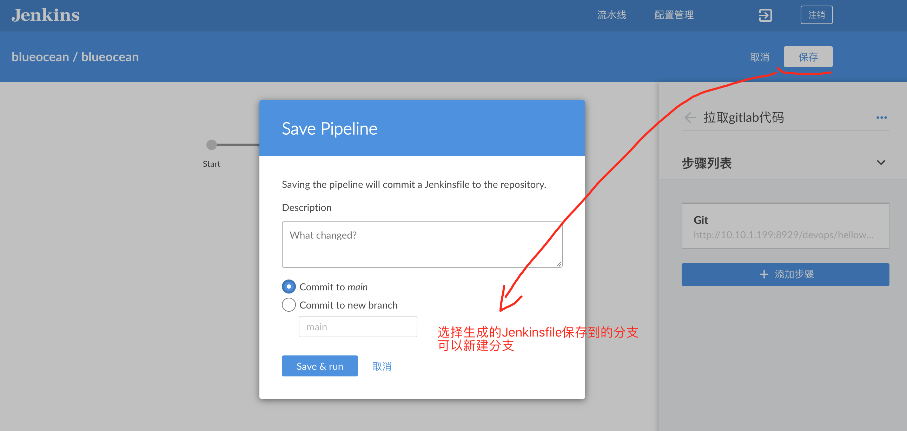
>
> 
>
> ##### `个人建议：BlueOcean虽然美观，但并不稳定且还在开发中，所以不建议使用，我们主要使用scm方式开发Jenkinsfile，可以结合jenkins ui的生成器。`

#### 10.2.2 jenkins ui

通过jenkins来创建jenkinsfile文件，可以借助一些生成器辅助我们创建脚本。

全局变量：

http://10.10.1.199:9078/pipeline-syntax/globals

片段生成器：

http://10.10.1.199:9078/job/p1/pipeline-syntax/

指令生成器：

http://10.10.1.199:9078/directive-generator


#### 10.2.3 使用scm管理

比如我们这里使用scm是gitlab，用它来管理jenkinsfile文件，这样这个文件就可以直接放到我们的springboot工程，当然也可以单独创建一个包含jenkinsfile的工程单独维护。


> 拓展：基于SCM我们可以创建jenkins的"多分支流水线"job，他可以自动帮我们把一个具有多个branch分支的工程，根据不同分支中不同Jenkinsfile分别去执行流水线。
>
> 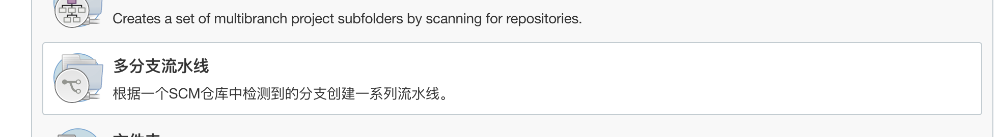
>
> 这样构建时，他会把所有包含Jenkinsfile分支的工程分别执行一下Jenkinsfile的构建任务。


### 10.3 最佳实践：案例

我们将之前的案例，使用流水线构建一下


#### 10.3.1 搭建一个Jenkinsfile模型

```
pipeline {
    agent any

    stages {
        stage('拉取gitlab项目代码') {
            steps {
                echo "拉取git代码"
            }
        }
        stage('构建代码') {
            steps {
                echo "通过maven构建代码"
            }
        }
        stage('代码质量审计') {
            steps {
                echo "通过sonar进行代码质量审计"
            }
        }
        stage('构建镜像/推送镜像') {
            steps {
                echo "构建docker镜像并推送私服"
            }
        }
        stage('拉取镜像/发布容器') {
            steps {
                echo "宿主机拉取镜像并发布启动微服务容器"
            }
        }
    }
}

```


#### 10.3.2 创建pipeline job

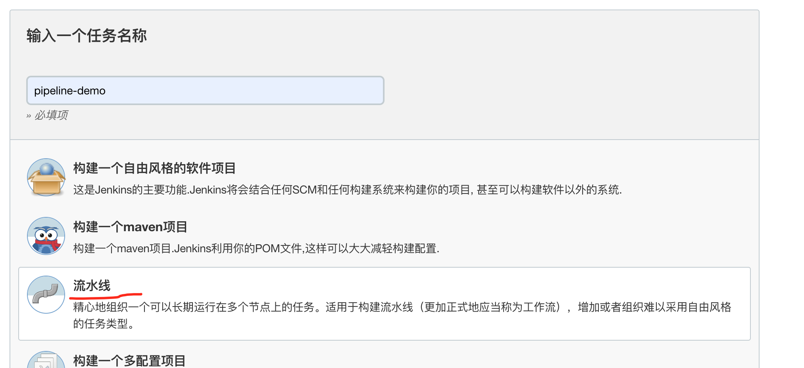


> 指定基于git参数为分支的构建配置,而此时如果我们选择构建，则会报错，因为还没有指定git仓库配置
>
> 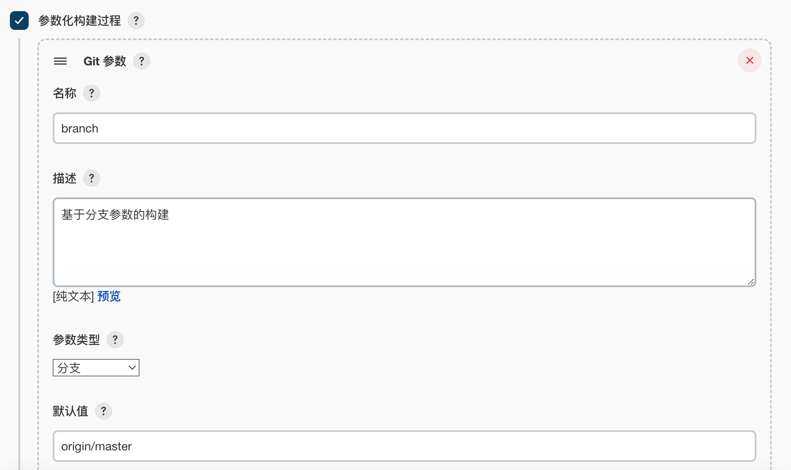
>
> 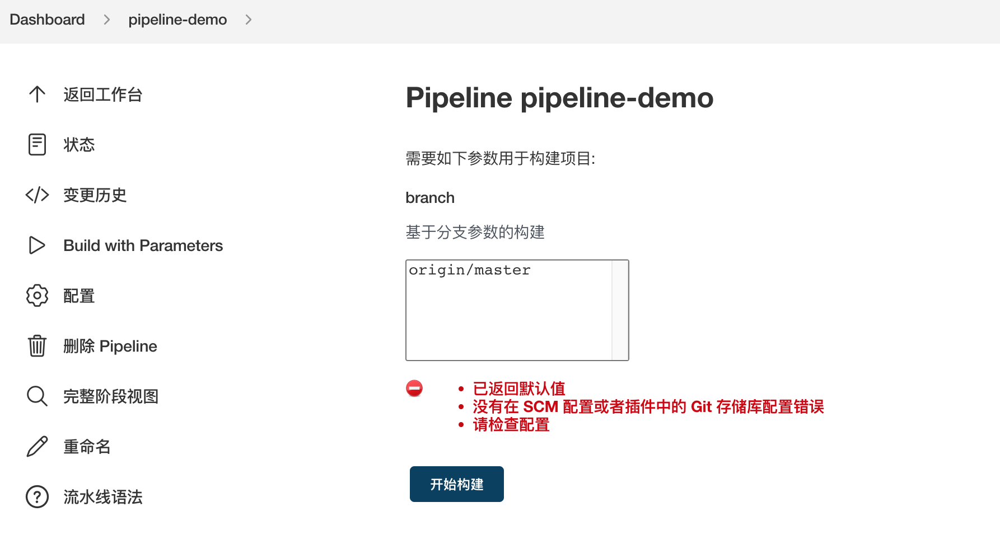
>
> 此时，我们需要通过pipeline的阶段-步骤来完成git仓库的配置，我们选择语法生成工具，如下
>
> 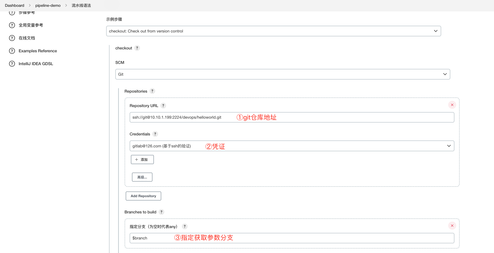
>
> `注意：`配置完scm后，需要我们先构建一下，然后git参数才能正常显示，这里是jenkins的一个算是小bug吧，不运行一次他检测不到配置的scm仓库。

> 接下来我们来生成maven的构建脚本：
>
> 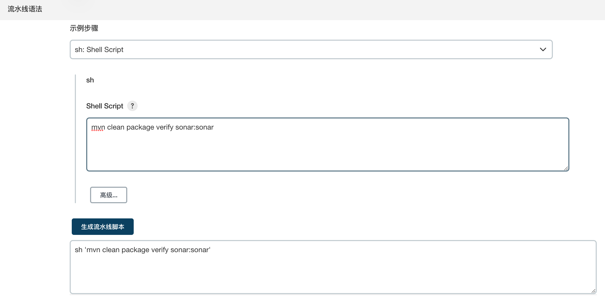

> 当然我们也可以将sonar的配置单独拎出去：而sonar是集成到jenkins中的，所以也是执行shell脚本，通过命令来运行，
>
> 此处我们借助sonar-scanner插件的pipeline脚本来执行，这样可以复用我们配置到jenkins中的sonar环境，如下：
>
> 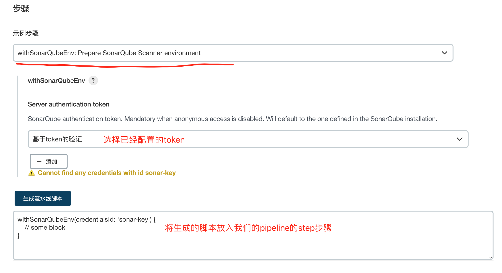
>
> ```
> withSonarQubeEnv(credentialsId: 'sonar-key') {
>     // some block
> }
> ```
>
> 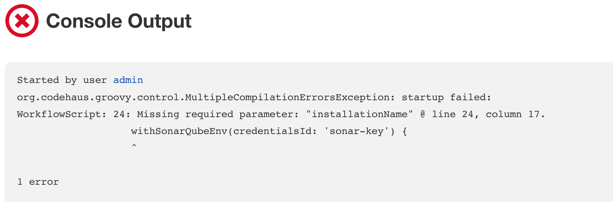
>
> 这里运行后有个报错，是因为生成器丢了一个参数，我们把他加上：
>
> `注意：因为sonar-scanner本身不支持覆盖率的生成而是借助jacoco生成报告，然后由scanner上报给sonar服务进行分析，即sonar不能生成报告而是只能分析，所以我们依然借助maven去生成覆盖率报告`
>
> ```
> // name是我们在系统配置中设置的name
> withSonarQubeEnv(installationName: 'sonar', credentialsId: 'sonar-key') {
>   sh "$SCANNER_HOME/sonar-scanner -Dsonar.java.binaries=target -Dsonar.projectKey=$JOB_NAME"
> }
> ```
>
> 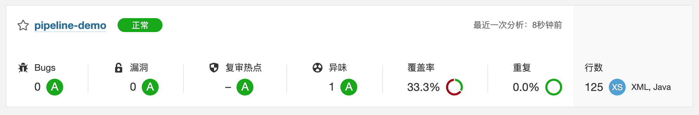

> 构建镜像/推送镜像到私服：
>
> 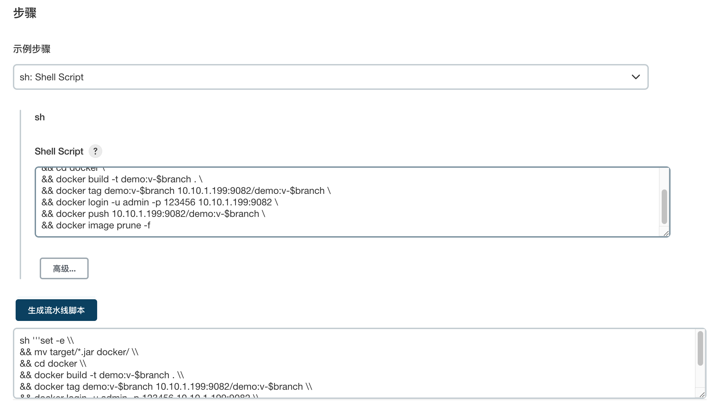
>
> 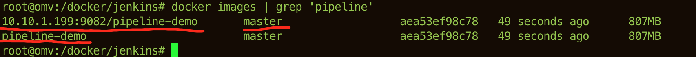

> 最后远程通知宿主机拉取镜像并部署容器：
>
> 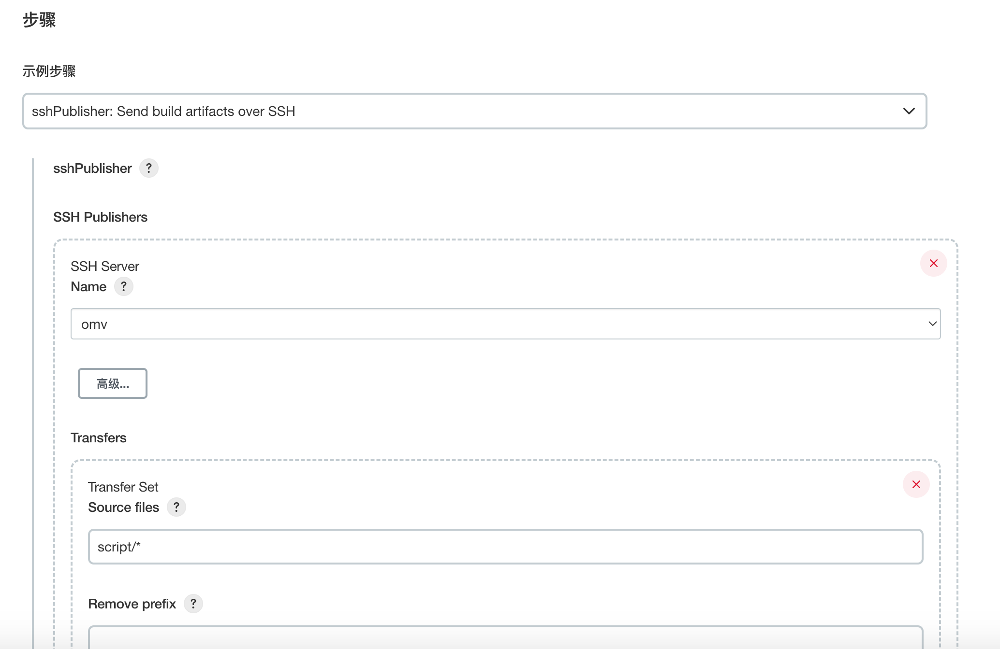
>
> 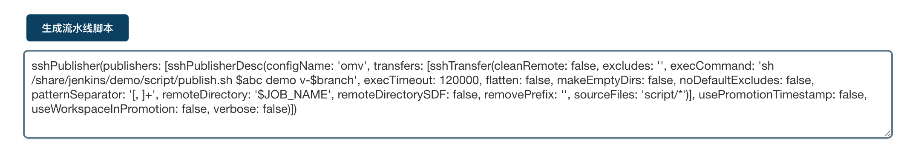
>
> 最后我们稍微调整下变量的定制：
>
> ```
> sshPublisher(publishers: [sshPublisherDesc(configName: 'omv', transfers: [sshTransfer(cleanRemote: false, excludes: '', execCommand: "sh /share/jenkins/demo/script/publish.sh $PUBLIC_REGISTRY $JOB_NAME $branch", execTimeout: 120000, flatten: false, makeEmptyDirs: false, noDefaultExcludes: false, patternSeparator: '[, ]+', remoteDirectory: '$JOB_NAME', remoteDirectorySDF: false, removePrefix: '', sourceFiles: 'script/*')], usePromotionTimestamp: false, useWorkspaceInPromotion: false, verbose: true)])
> ```
>
> `注意：最后我们可以把verbose参数设置成true，这样远程执行的日志就可以打印到jenkins了。`

#### 10.3.3 创建Jenkinsfile

```
pipeline {
    agent any

    tools {
        // Install the Maven version configured as "M3" and add it to the path.
        maven "maven3.8.6"
    }
    
    environment {
        SCANNER_HOME = "${tool 'scanner4.7'}/bin"
        
        // docker registry
        PRIVATE_REGISTRY = '10.10.1.199:9082'
        PUBLIC_REGISTRY = '10.10.1.199:9083'
        USER = "admin"
        PWD = "123456"
    }
    
    stages {
        stage('拉取gitlab项目代码') {
            steps {
                // 检出代码
                checkout([$class: 'GitSCM', branches: [[name: '$branch']], extensions: [], userRemoteConfigs: [[credentialsId: 'gitlab-ssh', url: 'ssh://git@10.10.1.199:2224/devops/helloworld.git']]])
            }
        }
        stage('构建代码') {
            steps {
                // 执行shell脚本 
                sh 'mvn clean package verify'
            }
        }
        stage('代码质量检测') {
            steps {
                // name是我们在系统配置中设置的name
                withSonarQubeEnv(installationName: 'sonar', credentialsId: 'sonar-key') {
                    sh "$SCANNER_HOME/sonar-scanner -Dsonar.java.binaries=target -Dsonar.projectKey=$JOB_NAME"
                }
            }
        }
        stage('构建镜像/推送镜像') {
            steps {
                sh """set -e \\
                && mv target/*.jar docker/ \\
                && cd docker \\
                && docker build -t $JOB_NAME:$branch . \\
                && docker tag $JOB_NAME:$branch $PRIVATE_REGISTRY/$JOB_NAME:$branch \\
                && docker login -u $USER -p $PWD $PRIVATE_REGISTRY \\
                && docker push $PRIVATE_REGISTRY/$JOB_NAME:$branch \\
                && docker image prune -f"""
            }
        }
        stage('拉取镜像/发布容器') {
            steps {
                sshPublisher(publishers: [sshPublisherDesc(configName: 'omv', transfers: [sshTransfer(cleanRemote: false, excludes: '', execCommand: "sh /share/jenkins/demo/script/publish.sh $PUBLIC_REGISTRY $JOB_NAME $branch", execTimeout: 120000, flatten: false, makeEmptyDirs: false, noDefaultExcludes: false, patternSeparator: '[, ]+', remoteDirectory: '$JOB_NAME', remoteDirectorySDF: false, removePrefix: '', sourceFiles: 'script/*')], usePromotionTimestamp: false, useWorkspaceInPromotion: false, verbose: true)])
            }
        }
    }
}
```


#### 10.3.4 提取共享库

如上我们有一些公共的变量，这些变量我们都可以定义到share liberary，方便其他流水线复用。

> 复用我们之前创建的jenkinslib项目，我们增加一个var/dockerVar.groovy
>
> `缺点：定义一个变量就需要@groovy.transform.Field注解，严重冗余，这时候我们可以通过src中定义类，将变量包装成属性即可，这个大家自己试一下就行了`
>
> ```
> // docker registry
> @groovy.transform.Field
> PRIVATE_REGISTRY = '10.10.1.199:9082'
> @groovy.transform.Field
> PUBLIC_REGISTRY = '10.10.1.199:9083'
> @groovy.transform.Field
> USER = "admin"
> @groovy.transform.Field
> PWD = "123456"
> ```
>
> jenkinsfile做一下调整：同样创建在jenkinslib工程，目录：jenkinsfiles/docker.jenkinefile
>
> `只是拿环境变量来做一个演示`
>
> ```
> @Library('mylib@master') _
> 
> pipeline {
>     agent any
> 
>     tools {
>         // Install the Maven version configured as "M3" and add it to the path.
>         maven "maven3.8.6"
>     }
>     
>     environment {
>         SCANNER_HOME = "${tool 'scanner4.7'}/bin"
>     }
>     
>     stages {
>         stage('拉取gitlab项目代码') {
>             steps {
>                 // 检出代码
>                 checkout([$class: 'GitSCM', branches: [[name: '$branch']], extensions: [], userRemoteConfigs: [[credentialsId: 'gitlab-ssh', url: 'ssh://git@10.10.1.199:2224/devops/helloworld.git']]])
>             }
>         }
>         stage('构建代码') {
>             steps {
>                 // 执行shell脚本 
>                 sh 'mvn clean package verify'
>             }
>         }
>         stage('代码质量检测') {
>             steps {
>                 // name是我们在系统配置中设置的name
>                 withSonarQubeEnv(installationName: 'sonar', credentialsId: 'sonar-key') {
>                     sh "$SCANNER_HOME/sonar-scanner -Dsonar.java.binaries=target -Dsonar.projectKey=$JOB_NAME"
>                 }
>             }
>         }
>         stage('构建镜像/推送镜像') {
>             steps {
>                 sh """set -e \\
>                 && mv target/*.jar docker/ \\
>                 && cd docker \\
>                 && docker build -t $JOB_NAME:$branch . \\
>                 && docker tag $JOB_NAME:$branch $dockerVar.PRIVATE_REGISTRY/$JOB_NAME:$branch \\
>                 && docker login -u $dockerVar.USER -p $dockerVar.PWD $dockerVar.PRIVATE_REGISTRY \\
>                 && docker push $dockerVar.PRIVATE_REGISTRY/$JOB_NAME:$branch \\
>                 && docker image prune -f"""
>             }
>         }
>         stage('拉取镜像/发布容器') {
>             steps {
>                 sshPublisher(publishers: [sshPublisherDesc(configName: 'omv', transfers: [sshTransfer(cleanRemote: false, excludes: '', execCommand: "sh /share/jenkins/demo/script/publish.sh $dockerVar.PUBLIC_REGISTRY $JOB_NAME $branch", execTimeout: 120000, flatten: false, makeEmptyDirs: false, noDefaultExcludes: false, patternSeparator: '[, ]+', remoteDirectory: '$JOB_NAME', remoteDirectorySDF: false, removePrefix: '', sourceFiles: 'script/*')], usePromotionTimestamp: false, useWorkspaceInPromotion: false, verbose: true)])
>             }
>         }
>     }
> }
> 
> ```
>
> 我们新建一个jenkins job：pipeline-demo-sharelib，使用通过scm获取jenkinsfile文件，
>
> `注意：`我们这里将jenkinsfile名字前缀设置成了变量，这样我们可以随意使用其他前缀的文件，并且记住我们jenkinsfile中使用了git参数branch，不要漏掉
>
> 但我们不能通过当前工程的分支来作为参数了，因为当前工程拉取的是jenkinslib工程，而不是HelloWorld了，当然大家也可以做一下映射，我这里改成手动数据，简单演示一下
>
> 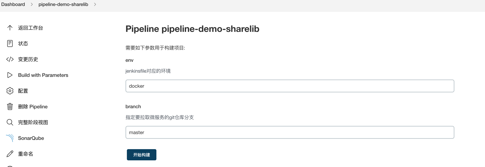
>
> 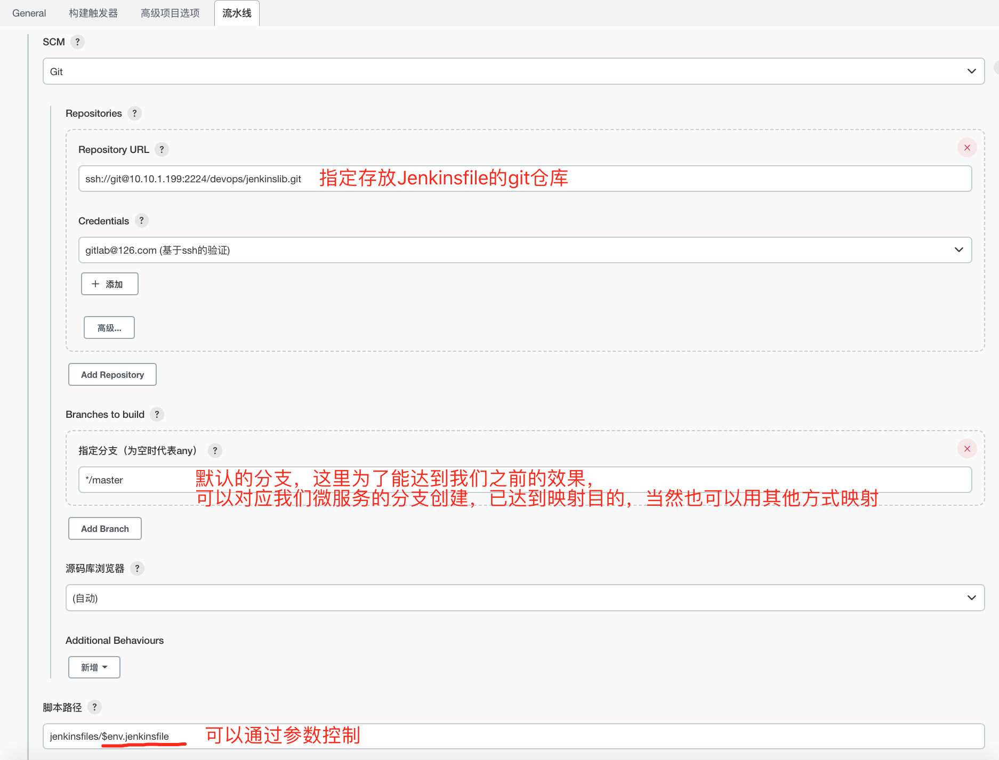
>
> 


