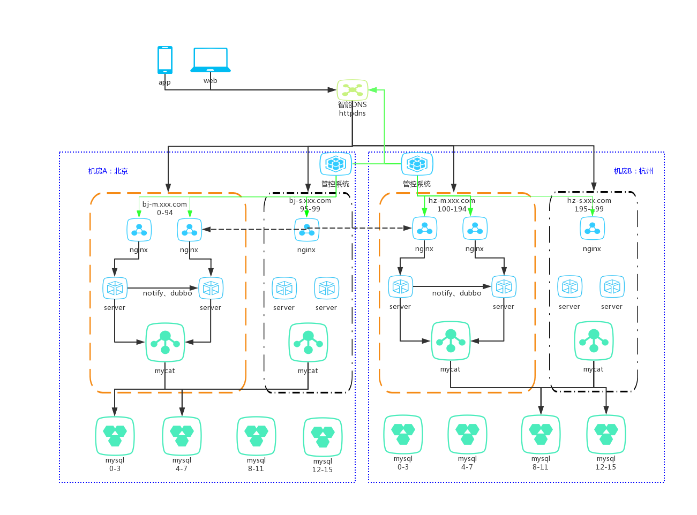

| 文档版本 | 修订时间   | 修订人 | 描述                                    |
| -------- | ---------- | ------ | --------------------------------------- |
| v1.0.0   | 2018/04/25 | 杨海波 | 创建word文件，适用于多活1.0             |
| V2.0.0   | 2019/06/01 | 韩振超 | 调整文档结构和内容，适用于多活2.2及以上 |

# 模块介绍

多活控制台是一个可以动态分配机房流量的管理系统。具有以下功能模块：

- 流量监控：监控机房、业务、路由值的实时流量和统计数据
- 流量管理：配置和迁移流量
- 业务管理：管理业务和业务规则
- 基础配置：配置机房、nginx节点等基础信息
- 流量迁移：定义请求在多个机房之间的路由规则，支持按精确路由值、路由模值、城市等维度划分流量
- Redis同步：指定任意两个机房的redis实例双向同步
- 日志列表：记录关键操作

# 系统架构图

> 考虑到部署的复杂性，生产环境中小流量分片已经去掉