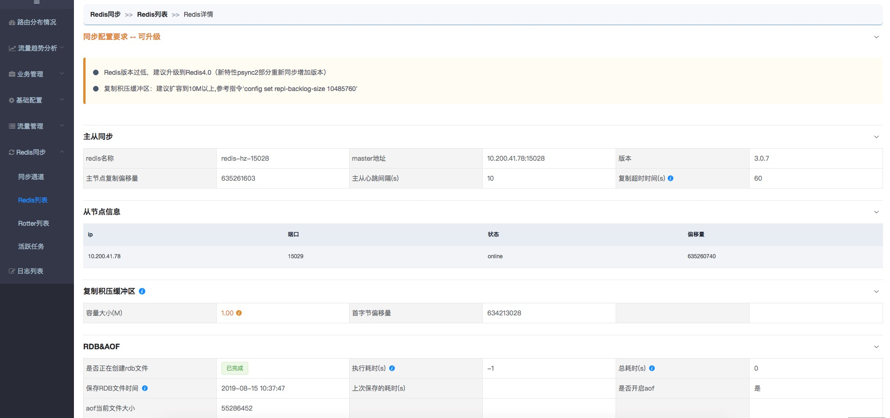
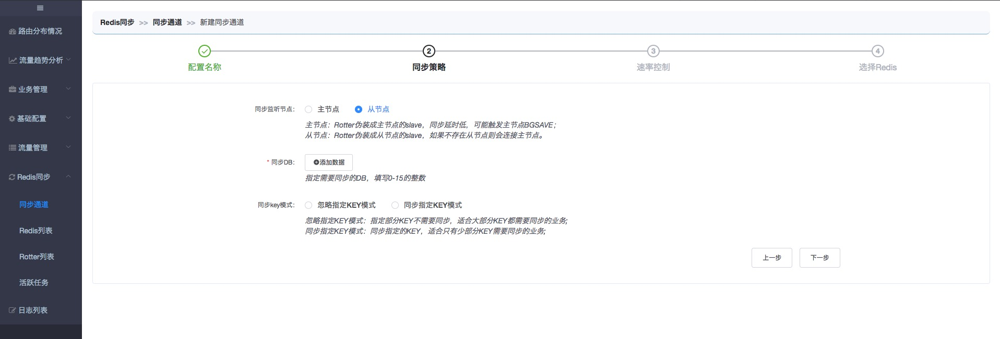

## release 2.3

#### 发布时间

2019-08-26

#### 新增功能

1. 【Rotter】创建同步任务时可以选择连接Redis主节点还是从节点

2. 【Rotter】支持管理端查看Redis信息，包含是否满足同步要求、主从节点列表、复制积压缓冲区的信息

   

#### 优化功能

1. 优化新建同步任务流程，一步完成创建同步任务

2. 每个配置项的描述从需要鼠标移到提示icon展示改为直接展示在配置下方

   

3. Rotter历史报表数据在平均值的基础上增加峰值

4. 优化source redis断开连接后重试机制

5. Redis同步全指令支持

#### Bug Fix

1. 全量dump造成内存溢出
2. 二进制数据同步之后反序列化失败