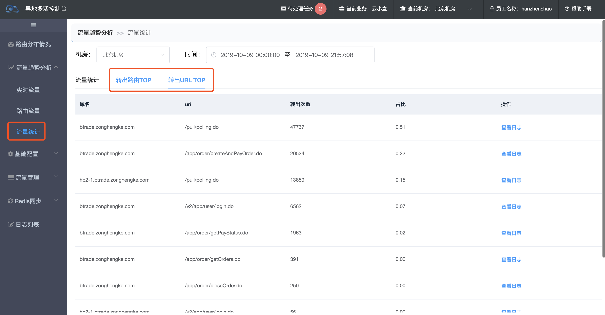
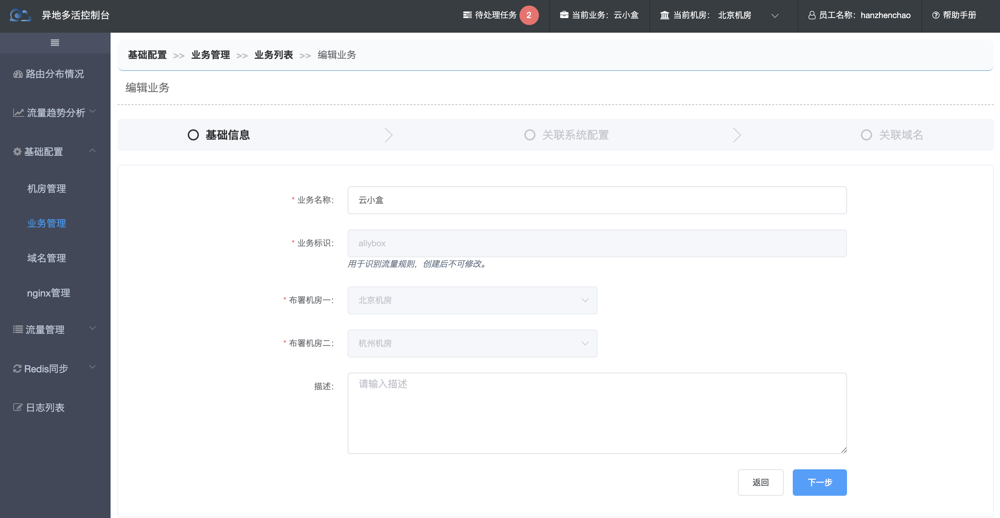
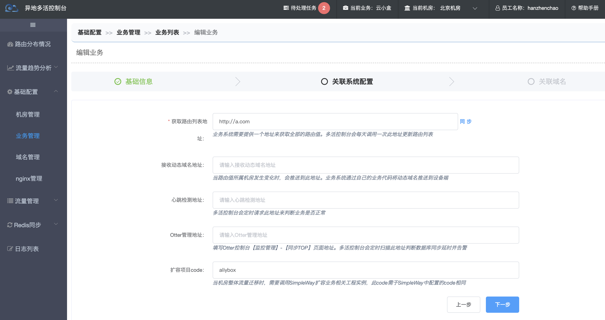
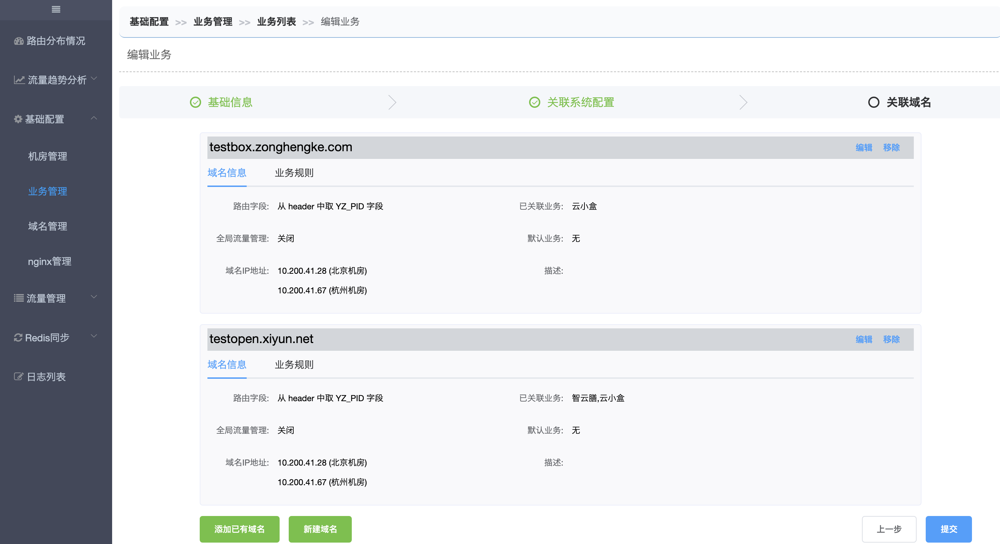

## release 2.4(当前版本)

#### 发布时间

2019-10-09

#### 【新增功能】

1. Nginx lua定时上报Nginx节点列表，以及每个Nginx节点关联的域名，以便新建业务时能快速选择业务关联的域名和Nginx节点

2. 流量统计新增转出路由TOP10，转出URL TOP10

   

#### 【优化功能】

1. 去除多活平台服务分组概念，匹配生产环境实际情况

2. 优化业务新建、编辑流程，采用向导式交互。流程分三步

   a. 基础信息配置

   

   b. 关联系统配置

   

   c. 关联域名

   

3. 新建域名不需要手动写域名，直接从Nginx上报的域名列表中选择，如果不存在，则说明该域名没有配置lua脚本，需要联系运维同学；

4. 路由规则只推送至业务自己的Nginx节点，减少lua占用的Nginx内存大小

5. 流量统计和实时流量监控拆成两个页面；

6. 实时流量可以查看整个机房的流量，原先只能查看本业务的流量

7. 基础域名IP变更策略从全部流量迁出后变更改为超过90%流量迁出后变更

8. 域名管理菜单从流量管理挪到基础配置下

9. 域名列表能看到域名挂载哪些Nginx节点上；Nginx节点列表可以看到每个Nginx关联了哪些域名

10. 路由流量监控页面能看到每个路由所属城市

11. 【Rotter】重写jedis restore接口，修复restore过期时间问题

12. 【Rotter】支持 Set数据删除保护，精简删除保护KEY长度，调整为rotter:delete:md5

13. 【Rotter】调整重试策略，尽早发现并上报异常