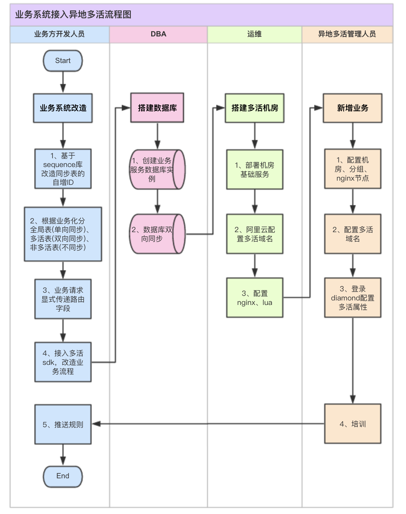
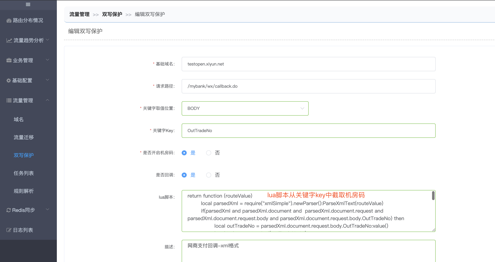
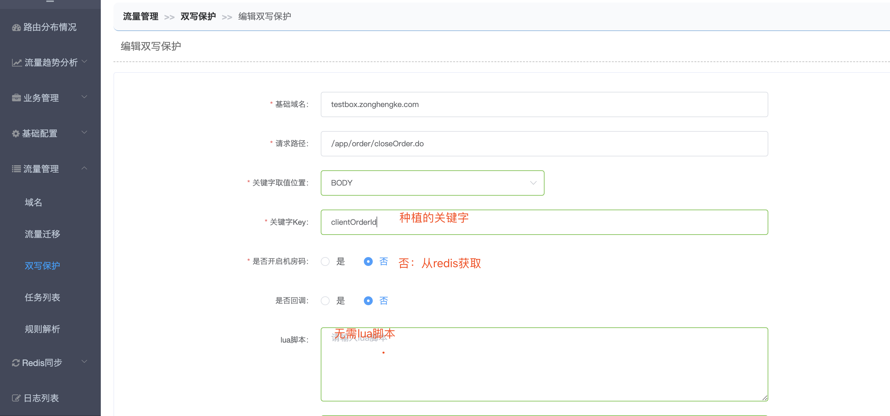

# 异地多活接入说明

#### 目录：

- 1、异地多活接入流程图
  - [1.1业务方开发人员](http://multi-idc.box.zonghengke.com/book/_book/use_multi_idc.html#developer)
  - [1.2DBA](http://multi-idc.box.zonghengke.com/book/_book/use_multi_idc.html#DBA)
  - [1.3运维](http://multi-idc.box.zonghengke.com/book/_book/use_multi_idc.html#SA)
  - [1.4多活平台管理人员](http://multi-idc.box.zonghengke.com/book/_book/use_multi_idc.html#multi_admin)
- [2、引入maven依赖](http://multi-idc.box.zonghengke.com/book/_book/use_multi_idc.html#maven)
- 3、多活工具包的API手册
  - [3.1、获取路由值所属个机房和动态域名](http://multi-idc.box.zonghengke.com/book/_book/use_multi_idc.html#api1)
  - [3.2、获取所在机房名称](http://multi-idc.box.zonghengke.com/book/_book/use_multi_idc.html#api2)
  - [3.3、获取当前机房的动态域名](http://multi-idc.box.zonghengke.com/book/_book/use_multi_idc.html#api3)
  - [3.4、获取当前机房的域名前缀](http://multi-idc.box.zonghengke.com/book/_book/use_multi_idc.html#api4)
  - [3.5、获取当前机房码](http://multi-idc.box.zonghengke.com/book/_book/use_multi_idc.html#api5)
  - [3.6、双写保护关键字种植](http://multi-idc.box.zonghengke.com/book/_book/use_multi_idc.html#api6)
- [4、下载](http://multi-idc.box.zonghengke.com/book/_book/use_multi_idc.html#download)

------

## 1、异地多活接入流程图

[](http://multi-idc.box.zonghengke.com/book/_book/image/异地多活接入流程图.png)

------

### 1.1、业务方开发人员

判断业务可以接入多活后，需要开展一些工作：

#### 1.1.1、基于sequence库改造同步表的主键ID

所有需要同步的表都必须有主键ID，而且从各机房的sequence库获取。防止双机房产生的主键ID一致。

#### 1.1.2、根据业务划分表，供dba搭建otter使用

- 全局表：单向同步，A机房那个可写，B机房可读。A机房宕机可读不可写。（注册表等）

- 多活表：双向同步，A可写可读。A机房宕机不影响B机房的服务。（订单表、session表等）

  注：session表不同步的话，迁移路由时会导致登录失败！！！

- 非多活表：不同步。（sequence库、diamond库 等）

#### 1.1.3、业务请求显示传递路由字段

客户端请求时需要携带业务定义好的路由值 （云小盒：商户ID；智云膳：商户ID；纵横客：城市编码），可以放header、body、form、cookie。由多活平台配置取值规则后，nginx即可获取路由值进行跳转。

#### 1.1.4、[接入多活sdk](http://multi-idc.box.zonghengke.com/book/_book/use_multi_idc.html#maven)，改造业务流程

- **1.1.4.1 用户登录**

  **背景**：用户登录前并不知道自己的路由值，Nginx只能将请求转发到后端server，需要保证登录业务和后续请求打在一个服务分片，防止重复登录

  **解决**：登录验证成功后，调用多活API【[获取路由值所属个机房和动态域名](http://multi-idc.box.zonghengke.com/book/_book/use_multi_idc.html#api1)】验证是否属于当前机房。

   是：执行登录逻辑并返回路由值和动态域名。

   否：返回动态域名和路由值让客户端使用动态域名重新登录。

- **1.1.4.2 支付回调**

  **背景**：客户端扫码支付，路由至A机房创建订单，**并向第三方支付平台发起支付请求**，需要保证第三方支付平台的回调地址一定落在A机房，防止数据库同步异常导致更新订单状态失败。

  **解决**：

  - **1.1.4.2.1 流水号加入机房码标识 【推荐！！！！！！】**

    调用多活API【[获取当前机房码](http://multi-idc.box.zonghengke.com/book/_book/use_multi_idc.html#api5)】获取机房码（社餐华北-1，社餐华东-2，团餐华北-3，团餐华东-4，西二旗-5），放入流水号中指定的位置。 在多活平台配置双写规则。 [](http://multi-idc.box.zonghengke.com/book/_book/image/双写规则-机房码.png)

  - **1.1.4.2.2 回调请求可以添加自定义字段**

    将机房码放入自定义字段中，在多活配置双写规则（如上图），关键字key和lua脚本改为自定义字段即可。

  - **1.1.4.2.3 回调请求可以使用动态域名**

    支付网关在向第三方支付平台发起支付请求时，需要将回调地址配置成本机房的动态域名。

  - **1.1.4.2.4 上述都不支持，在多活redis种植关键字**

    支付网关发起支付时，调用多活API【[双写保护关键字种植](http://multi-idc.box.zonghengke.com/book/_book/use_multi_idc.html#api6)】将关键字(流水号)写入到redis。

    在多活平台配置双写规则。

    [](http://multi-idc.box.zonghengke.com/book/_book/image/双写规则-redis.png)

- **1.1.4.3 更多场景**

  请自行脑补...

------

### 1.2、DBA

coming soon ...

------

### 1.3、运维

coming soon ...

------

### 1.4、多活平台管理人员

coming soon ...

------

## 2、引入maven依赖

```html
<!--多活工具包 -->
<dependency>
  <groupId>com.xy</groupId>
  <artifactId>multi-idc-utils</artifactId>
  <version>2.2.20190501</version>
</dependency>

<!--diamond客户端 -->
<dependency>
  <groupId>com.taobao.diamond</groupId>
  <artifactId>diamond-client</artifactId>
  <version>3.0-SNAPSHOT</version>
</dependency>
```

- 多活工具包：提供丰富的API，方便快捷的判断路由值所属机房以及当前业务系统所在机房等信息，更多信息请参见【多活工具包的API手册】。

- diamond客户端：多活工具包依赖diamond客户端获取路由规则！

  【[下载](http://multi-idc.box.zonghengke.com/book/_book/use_multi_idc.html#download)】

------

## 3、多活工具包的API手册

#### 3.1、获取路由值所属个机房和动态域名

```java
MultiIdcResponseModel model = MultiIdcHelper#getMerchantDynamicDomain(String merchantId, String defaultDomain, String bizCode)

参数：
String merchantId：路由值
boolean defaultDomain：默认域名。未匹配到规则或非多活域名时，返回默认域名
String bizCode：业务码。例：aliybox（云小盒的业务码）,zhk（纵横客的业务码）

返回值:
MultiIdcResponseModel
String merchantId：路由值
boolean currentServiceGroup：商户是否为当前服务分片商户
String dynnamicDomain：动态域名，结合调用方传递的基础域名和动态域名前缀生成
```

------

#### 3.2、获取所在机房名称

```java
String idcName = MultiIdcHelper#getIdcName()

参数：
无

返回值：
String idcName：所在机房名称，例：华北机房
```

------

#### 3.3、获取当前机房的动态域名

```java
String dynamicDomain = MultiIdcHelper#getIdcDynamicDomain(String defaultDomain)

参数：
string defaultDomain：默认域名。未匹配到规则或非多活域名时，返回默认域名。例：abc.com

返回值：
String dynnamicDomain：动态域名，结合机房域名前缀和默认域名生成。例：bj-0.abc.com
```

------

#### 3.4、获取当前机房的域名前缀

```java
String code = MultiIdcHelper#getServiceGroupCode()

参数：
无

返回值：
String code：域名前缀。例：bj-0
```

------

#### 3.5、获取当前机房码

```java
String code = MultiIdcHelper#getIdcCode()*

参数：
无

返回值：
String code：当前机房码。例：1
```

------

#### 3.6、双写保护关键字种植

```java
boolean isSuccess = MultiIdcHelper#mark(String keyword,[int minute])

参数：
String keyword : 种植的关键字，业务方保证唯一性。例：订单号等
int minute：保护时间(单位：分钟)。非必填，默认2小时

返回值：
String isSuccess：是否种植成功。true-成功，false-失败。
```

注：配置双写规则请参考【[双写规则](http://multi-idc.box.zonghengke.com/book/_book/double_write_rule.html)】

------

## 4、下载

多活SDK： [multi-idc-utils-2.2.20190501.jar](http://10.100.21.13:8081/nexus/service/local/repositories/releases/content/com/xy/multi-idc-utils/2.2.20190501/multi-idc-utils-2.2.20190501.jar)

diamond客户端： diamond-client-3.0SNAPSHOT