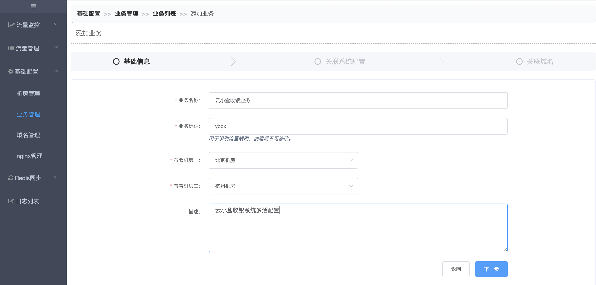
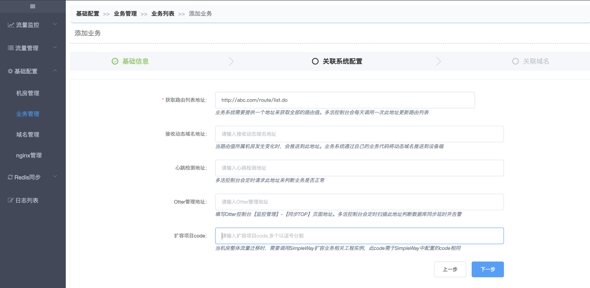
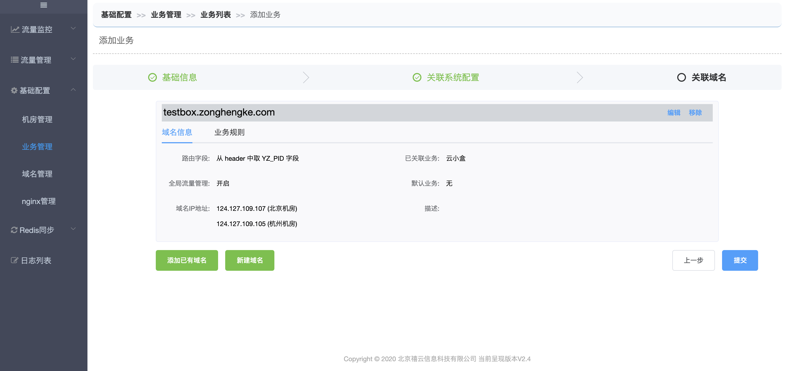
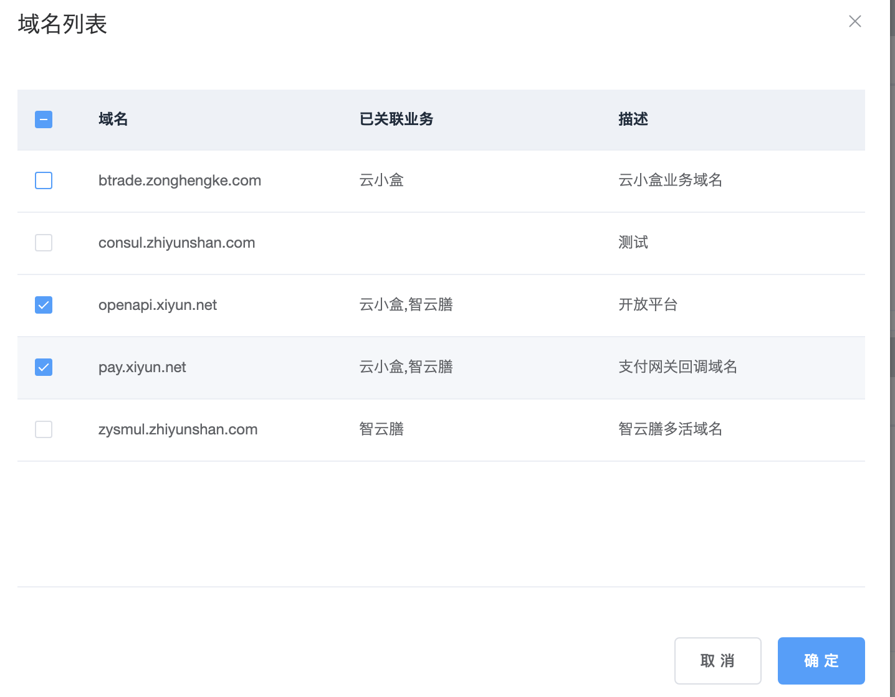

# 添加业务

 要想知道什么业务可以接入多活，首先要先清楚多活系统日常是如何操作的以及对业务系统的影响。

下面我列举下多活系统日常操作：

1、迁移个别路由的流量

 A**【机房】**流量较少，将一部分**【路由】**从B机房迁移至A！

2、切机房

 A机房服务异常或者宕机，将A机房的请求都迁移至B并将所有**【域名】**的IP指向B机房！

上述操作中，涉及到的三个关键属性：

- 机房：业务系统必须在双机房部署，切机房间的网络隔离。

- 路由：业务系统请求里(header、body、form、cookie)必须携带，可以参考数据库分库的路由字段。

   例：商户（云小盒、智云膳），城市code（纵横客）。

- 域名：业务系统对外的域名使用阿里云解析(暂时只支持阿里云平台)。

当你从业务中提取了上述三个属性后，我们就可以在多活平台里【基础配置-业务管理】创建业务了。

### 1、基础信息

关键属性：

- 业务标识：用于区分不同的业务以及识别流量规则。创建后不可更改！
- 部署机房：目前只支持双机房。

### 2、关联系统配置

关键属性：

- 获取路由列表地址：业务系统需要提供一个地址来获取该业务的全量路由值。多活控制台会每天调用一次此地址更新路由。
- 其他属性非必填，具体作用见文本框下的提示。

### 3、关联域名

- 添加已有域名：一般是选择共享域名，例如：开放平台、统一支付网关使用的域名。 
- 新建域名：请参考[【添加多活域名】](http://multi-idc.box.zonghengke.com/book/_book/domain.html)，点击确定，返回列表。

### 4、点击【提交】，业务创建完毕。