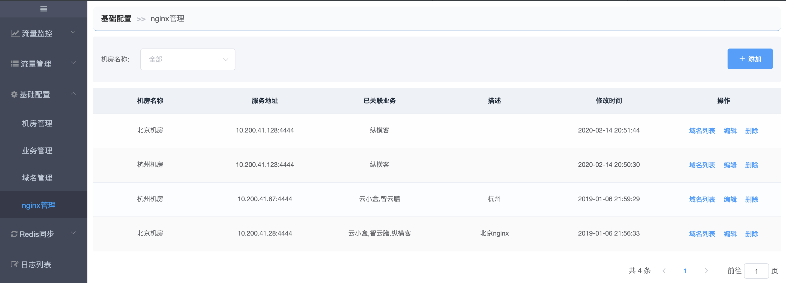

# 添加nginx节点

## Nginx节点

【基础配置-nginx节点】展示Nginx列表。

nginx节点一般不需要人为添加，因为我们在nginx上的lua脚本加了定时上报nginx的内网ip和监听的serverName(域名)的功能。也就是说在配置多活的域名之前，需要运维将nginx服务配置好并启动（只要不挂载slb就不会有流量进来）。

如果nginx上报失败，可以先点击【+添加】人为添加nginx节点，后续再查明问题原因。