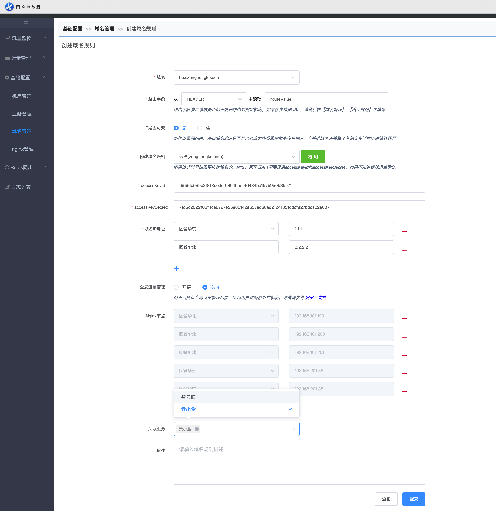
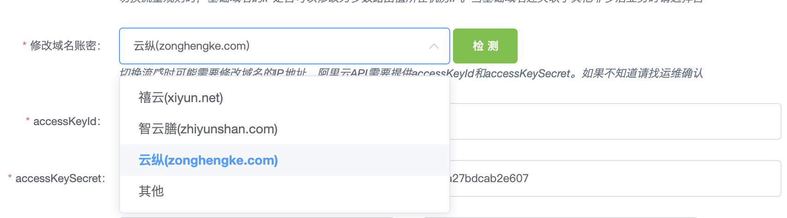
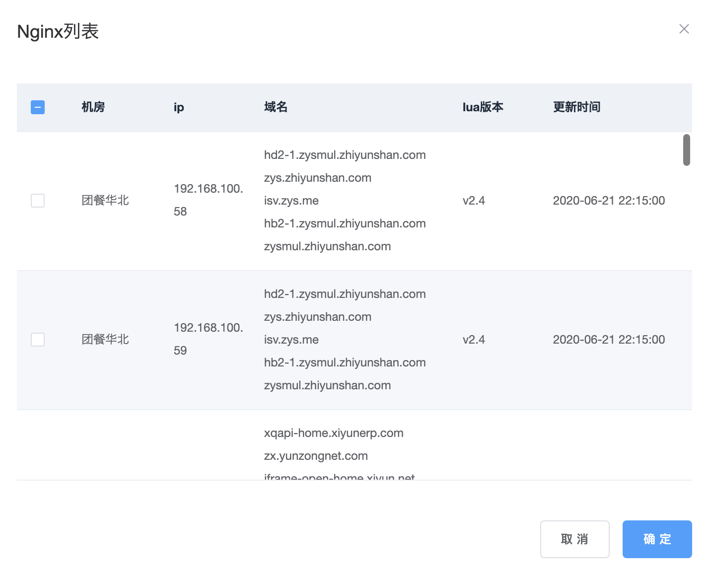
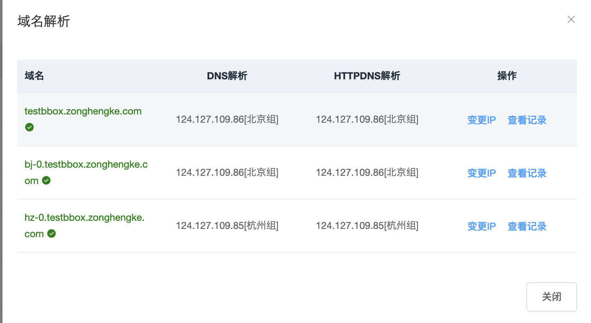

# 添加多活域名

管控平台配置多活域名主要有三点作用：

\1) 告诉Nginx哪些请求需要进入多活逻辑

\2) 定义该域名下所有请求获取路由字段的方式

\3) 流量迁移时修改动态域名的解析结果，让客户端请求能直接打到指定机房

## 添加多活域名步骤如下：

- [1、发邮件给运维](http://multi-idc.box.zonghengke.com/book/_book/domain.html#step1)
- [2、多活平台添加域名](http://multi-idc.box.zonghengke.com/book/_book/domain.html#step2)
- [3、检查域名解析是否正确](http://multi-idc.box.zonghengke.com/book/_book/domain.html#step3)
- [4、推送URL规则](http://multi-idc.box.zonghengke.com/book/_book/domain.html#step4)

------

### 步骤1、发邮件给运维

纵横客新增快小盒域名 `testbbox.zonghengke.com`。

邮件告知运维！

1.1、运维登录阿里云添加域名解析，新增3个域名解析。

 基础域名：`testbbox.zonghengke.com`

 动态域名：`bj-0.testbbox.zonghengke.com`;`hz-0.testbbox.zonghengke.com`

1.2、将基础域名和动态域名添加到对应的accountId账号下，客户端解析需要配置accountId去获取解析。

1.3、nginx配置servername为基础域名+动态域名， 启动nginx，nginx-lua会将nginx和域名信息上报至多活平台。

------

### 步骤2、多活平台添加域名

【流量管理->域名】点击【创建】  添加域名需要填如下必填字段

- \1) 域名：基础域名 `testbbox.zonghengke.com`。

- \2) 路由字段：从【cookie/header/form/body】中读取路由字段标识key。

  *路由字段决定请求是否能正确地路由到指定机房，如果存在特殊URL，请稍后在【域名管理】-【路径规则】中填写。*

**注意：路由字段和字段来源不可随意更改，需要根据客户端请求的实际情况填写。且该域名下如果增加新的url，该url获取路由字段的方式应尽量保持和原有方式一致，如果因业务原因实在不能保持一致，需要在路径规则中填写该url的取值方式。否则会导致请求不受路由规则的约束，直接打到请求域名对应的后端server，最终有可能导致两个机房同时修改了同一条数据造成数据冲突。**

- 3)Ip是否可变：基础域名的IP在切流量时是否可以修改。

- 4)修改域名账密：切换流感时可能需要修改域名的IP地址，阿里云API需要提供accessKeyId和accessKeySecret。可根据二级域名，选择统一的账密或其他，如果检测不通过，请找运维确认。

  

  注：accessKeyId和accessKeySecret已做加密展示。

- 5)域名IP地址：动态域名的IP。切机房/机房恢复时，域名根据此项配置变更IP。

- 6）全局流量管理：阿里云提供全局流量管理功能，实现用户访问就近的机房。找运维同学确认是否需要开启。

- 7）nginx节点：自动匹配此域名在哪些nginx节点的servername配置了。如果有遗漏，还可以添加。

  

- 8）关联业务：选择哪些业务使用到了这个域名（可以多选）。

  注：在创建/编辑业务时，创建或者编辑域名时，自动关联了业务。

### 步骤3、检查域名解析是否正确

返回域名列表，找到新增的域名，点击域名解析。

### 步骤4、推送url规则

【流量管理-任务列表】找到待推送的域名规则，点击查看同步规则。 