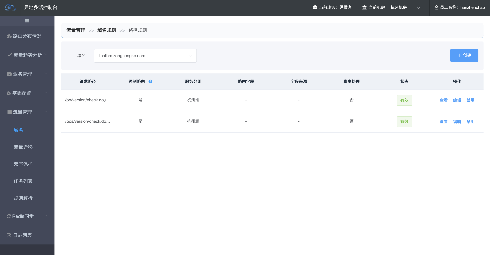
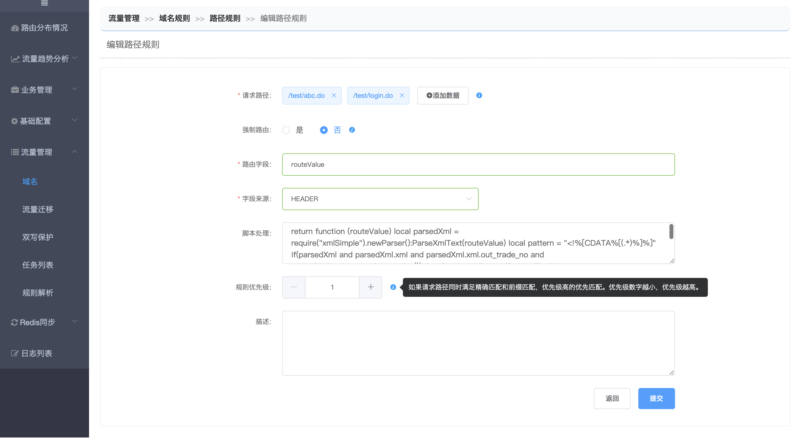
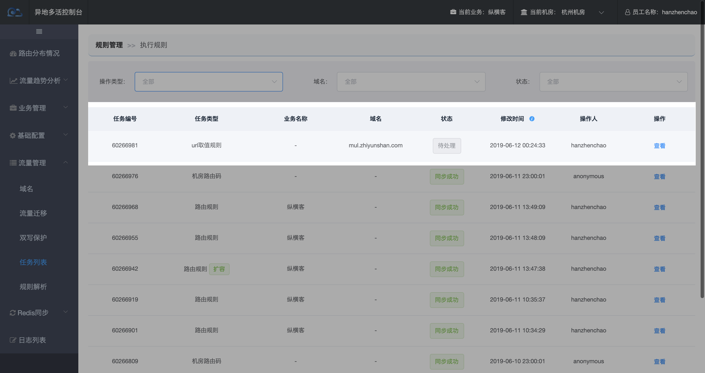

# 路径规则

> 指特定URL的路由取值规则。 当域名下存在URL和默认路由字段的取值方式不一致时，可以通过设置路径规则来指定。路径规则分为强制路由和非强制路由。强制路由用于满足业务需要依赖数据库来保证强一致性的请求，比如设备注册。

【流量管理-域名列表-更多-路径规则】

- 强制路由：会忽略url取值规则(路由字段、字段来源、脚本)和路由规则，直接将请求转发到指定机房分组。
- 非强制路由：根据取值规则(路由字段、字段来源、脚本)从URL中获取路由值，再根据业务规则获取所属业务，从而获取到该业务下的路由规则，最后判断路由值所属机房。

------

##### 添加路径规则

【流量管理-域名列表-更多-路径规则】点击【创建】/【编辑】

路径规则包含以下关键字段：

- 请求路径：
  - 数组格式，可以填写多个规则相同的URL；
  - URL必须以斜线“/”开头；
  - 同一域名下所有路径规则URL不可重复。
  - 路径最后一段可以填写*
- 强制路由：是否忽略取值规则和路由规则，强制路由到指定机房分组
- 脚本处理：从请求中获取的路由字段需要执行的LUA脚本，用于处理路由字段解密或者截取等操作。目前用在了网商银行的回调接口上，网商银行的回调不能携带路由字段也不能使用动态域名，只有一个第三方流水号会原封不动的传回来，所以我们将商户ID加在第三方流水号后面，Nginx获取到请求中流水号后再执行相应脚本，截取到真正的商户ID
- 优先级：设定该域名下各组URL取值规则之间的匹配顺序，数值越小越先匹配。比如路径规则中配置了一个/a/*,/a/b.do，我们肯定希望优先匹配/a/b.do的规则，这时只要保证/a/b.do的优先级小于/a/*就可以了

------

**点击提交，创建待推送的URL取值规则，并引导执行同步规则！**

