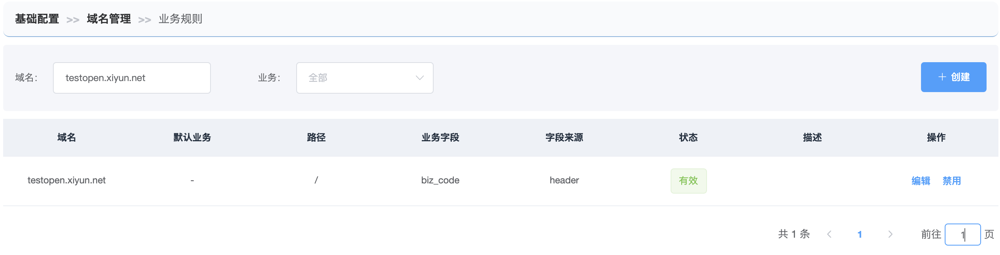

# 添加业务规则

> 定义如何从url请求中获取所属的业务，为后面获取该业务下的路由规则做铺垫。

------

【基础配置-域名管理】选择域名操作列的【更多-业务规则】

例1： `testbox.zonghengke.com` 是云小盒业务的专用域名。

- 默认业务：云小盒
- 路径：（全部路径）/
- 业务字段：空
- 字段来源：空

例2:

`testopen.xiyun.net`是共享域名，云小盒业务和智云膳业务都在使用这个域名，且访问的路径一样。

- 默认业务：空
- 路径：（全部路径）/
- 业务字段：例biz_code
- 字段来源：header/form/body/cookie

例3:

`testopen.xiyun.net`是共享域名，云小盒业务和智云膳业务都在使用这个域名，但访问的路径不一样。

/a/*路径下的请求都是云小盒业务的

- 默认业务：云小盒
- 路径：/a/
- 业务字段：例biz_code
- 字段来源：header/form/body/cookie

/b/* 路径下的请求都是智云膳业务的

- 默认业务：智云膳
- 路径：/b/
- 业务字段：例biz_code
- 字段来源：header/form/body/cookie

------

### 添加业务规则

点击【创建】/【编辑】

**点击提交，创建待推送的业务规则，并引导执行同步规则！**

