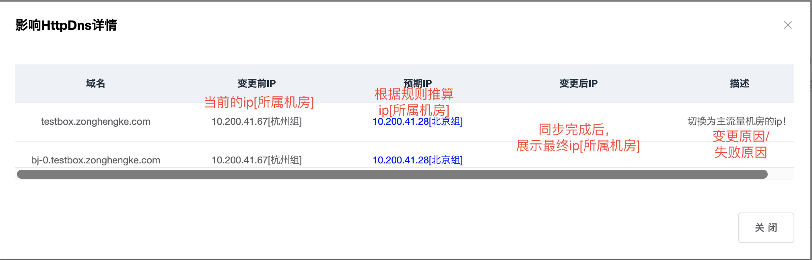

# 路由流量迁移

> 将某个或多个路由的请求指定到某个机房。

步骤：

- [1、修改路由所属机房](http://multi-idc.box.zonghengke.com/book/_book/route_change.html#step1)
- [2、检查待处理的任务](http://multi-idc.box.zonghengke.com/book/_book/route_change.html#step2)
- [3、同步规则](http://multi-idc.box.zonghengke.com/book/_book/route_change.html#step3)
- [4、检查规则是否生效](http://multi-idc.box.zonghengke.com/book/_book/route_change.html#step4)

### 步骤1、修改路由所属机房

【流量管理->流量迁移->按城市切】 

- 1、支持多样化展示：支持树形和平级展示
- 2、支持模糊查询 分组名|省名|省拼音|省拼音缩写|城市名|城市拼音|城市拼音缩写|路由值|北京组|湖北省|hubei|hbs|武汉市|wuhanshi|whs|180
- 3、支持全选：选中为全选，再次点击取消全选
- 4、点击迁移到对应机房：将勾选的路由值迁移到对应机房
- 5、点击提交：创建待推送任务并指引去任务列表。注：【当路由未发生变化时，按钮不可点击】

------

### 步骤2、检查待处理的任务

【流量管理->任务列表】 根据 规则类型|业务|状态 定位步骤1修改的规则。

点击【查看】进入详情页！

多人或多次修改规则只会生成一条待处理的任务！所以在同步规则之前务必检查当前最新的规则是否正确！

1、检查影响的路由个数：上一次规则和本次待推送规则对比，变化的路由个数，点击【查看】预览详情。 2、影响的httpdns数：本次待推送规则执行后，需要变更ip的域名，点击【查看】预览详情。 如果没有预期的域名，请参考[【影响httpdns数】与预期不一致?](http://multi-idc.box.zonghengke.com/book/_book/Q_ip.md) 

3、修改的操作人和时间：鼠标移动至此，浮层展示所有参与修改本次待推送规则的操作人和时间点！ 

4、展示推送的完整规则：推送给各个节点的完整规则。

- 当北京机房的规则占比达到阈值(在diamond配置，默认值60%)时，推送给北京机房的规则将简化为[0-31]的模值规则，而杭州机房的规则将是精确路由值。反之，同理。
- 当北京和杭州机房的规则占比小于60%时，北京机房推送精确路由值+【0-15】的模值规则，杭州机房推送精确路由值+【16-31】的模值规则。(各机房分配一半的模值规则是考虑到新商户的请求不在精确路由值内，也能固定机房访问)

------

### 步骤3、同步规则

点击同步，将当前规则推送至各个节点！

**注：如果某个节点失败，状态会显示同步失败，并展示失败原因，操作列也会显示重试按钮。 我们可以选择重试失败的节点或者回滚整个规则(只有最近的一次失败记录才能够回滚或重试) 更多信息请参见[【推送规则失败】**

------

### 4、检查规则是否生效

各个节点推送成功后，如何检查规则是否生效？请参见[我迁移了一个路由值，如何验证是否生效?](http://multi-idc.box.zonghengke.com/book/_book/route_change_check.html)