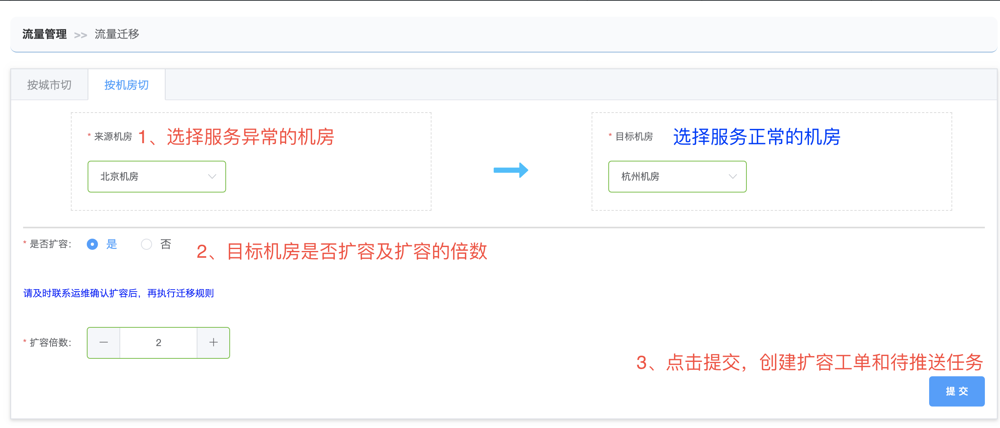
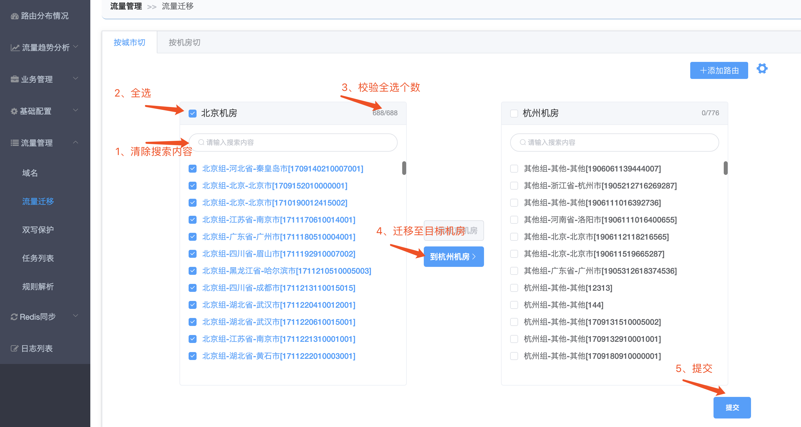
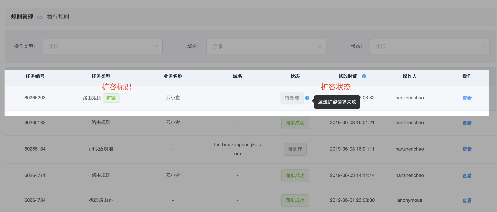
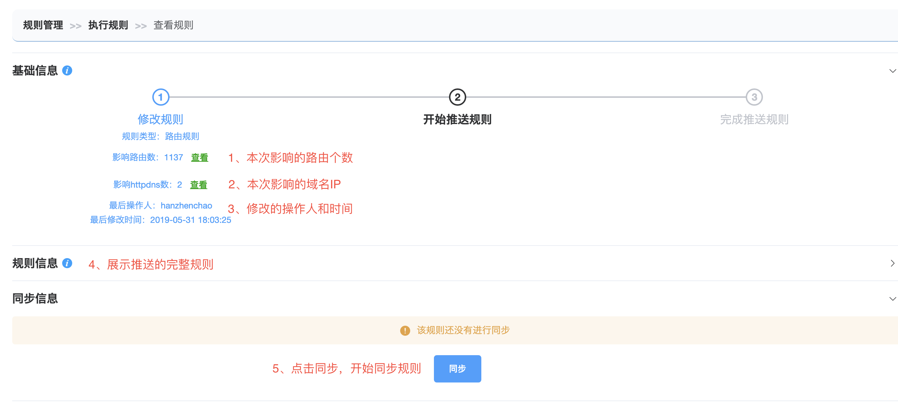
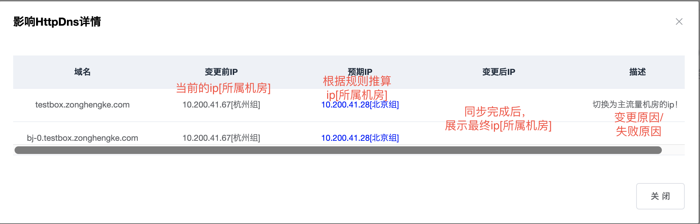
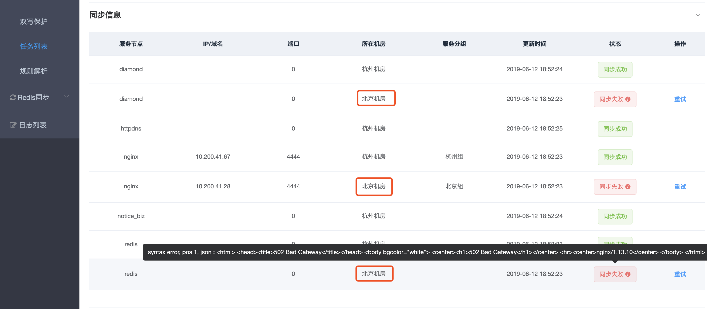

# 切机房

## 适用场景

\1) 机房出现断网、停电或者关键服务宕机短时间内不能恢复

\2) 业务调整需要摘掉机房的全部流量

## 步骤：

 **登录正常机房的多活管控平台**

- 1、将所有路由迁移至正常机房
  - [方式1、按机房切](http://multi-idc.box.zonghengke.com/book/_book/idc_change.html#step1_1)
  - [方式2、按城市切](http://multi-idc.box.zonghengke.com/book/_book/idc_change.html#step1_2)
- [2、检查待处理的任务](http://multi-idc.box.zonghengke.com/book/_book/idc_change.html#step2)
- [3、执行同步](http://multi-idc.box.zonghengke.com/book/_book/idc_change.html#step3)
- [4、检查规则是否生效](http://multi-idc.box.zonghengke.com/book/_book/idc_change.html#step4)

### 步骤1、将所有路由迁移至正常机房

#### 方式1、按机房切

【流量管理->流量迁移->按机房切】  1、选择来源机房和目标机房：

- 来源机房：选择服务异常的机房。
- 目标机房：选择服务正常的机房。

2、扩容及扩容倍数：

- 是否扩容：若目标机房承载不了来源机房的请求，请选择扩容。
- 扩容倍数：以目标机房目前各服务运行的实例数为基础，选择扩容倍数。

3、提交

- 创建扩容工单：在运维的simpleway系统里会生成一条扩容工单，请联系运维同事确认并执行！
- 创建待推送任务：将所有路由值的所属机房变更为目标机房，生成待推送任务。

#### 方式2、按城市切

【流量管理->流量迁移->按城市切】

 步骤介绍：看图行事。

------

### 步骤2、检查待处理的任务

多人或多次修改规则只会生成一条待处理的任务！所以在同步规则之前务必检查当前最新的规则是否正确！

根据 【规则类型|业务|状态】 定位步骤1修改的规则。

【流量管理->任务列表】 

- 扩容标识：只有步骤1勾选了扩容才会展示此标识。
- 扩容状态：展示当前扩容工单的进展状态。
  - 扩容中：simpleway系统成功创建扩容工单，执行中或等待执行。
  - 扩容成功：目标机房扩容成功。
  - 扩容失败：目标机房扩容失败，请联系运维手动扩容！

**扩容的任何状态下都可以继续执行同步规则！**

点击【查看】进入详情页！

------

1、检查影响的路由个数：上一次规则和本次待推送规则对比，变化的路由个数，点击【查看】预览详情。 2、影响的httpdns数：本次待推送规则执行后，需要变更ip的域名，点击【查看】预览详情。 如果没有预期的域名，请参考[【影响httpdns数】与预期不一致?](http://multi-idc.box.zonghengke.com/book/_book/Q_ip.md) 

3、修改的操作人和时间：鼠标移动至此，浮层展示所有参与修改本次待推送规则的操作人和时间点！ 

4、展示推送的完整规则：推送给各个节点的完整规则。

由于切机房操作将所有的路由值都指向了目标机房。所以全部规则是【0-31】的模值规则(全部指向目标机房)。精简了规则的内容。

### 步骤3、同步规则

点击【同步】，将当前规则推送至下列节点！

- Notice_biz：通知第三方业务系统(云小盒)，给本次迁移机房的商户的在线设备推送动态域名。

- httpdns：修改阿里云的域名ip解析。

- diamond：存储路由规则，供多活工具包使用。

- redis：存储路由规则，供nginx初始化规则使用。

- nginx：使用路由规则，将请求转发至正确机房。

  上图失败的节点都是北京机房的，是因为北京机房宕机，无法通知。

  如果北京机房的业务系统宕机，slb和多活服务正常，北京机房的节点也都是同步成功。

------

### 4、检查规则是否生效

各个节点推送成功后，如何检查规则是否生效？请参见[我切了机房，如何验证是否生效?](http://multi-idc.box.zonghengke.com/book/_book/idc_change_check.html)