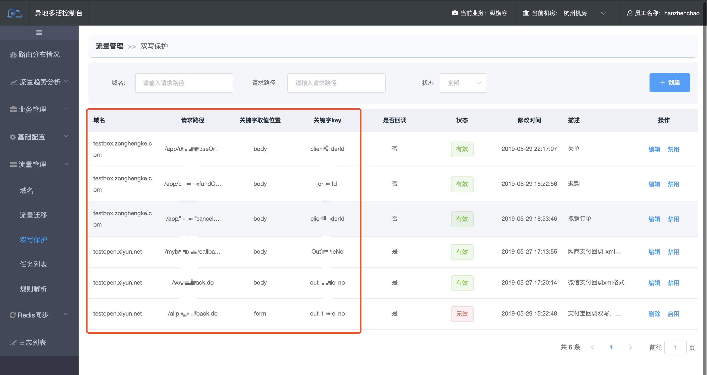
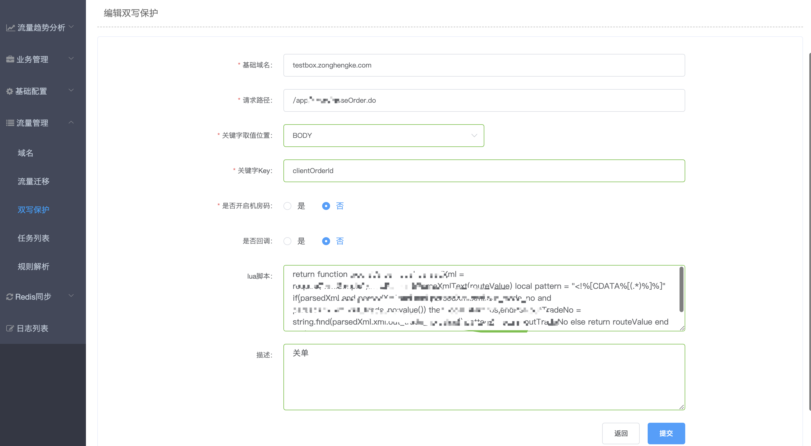
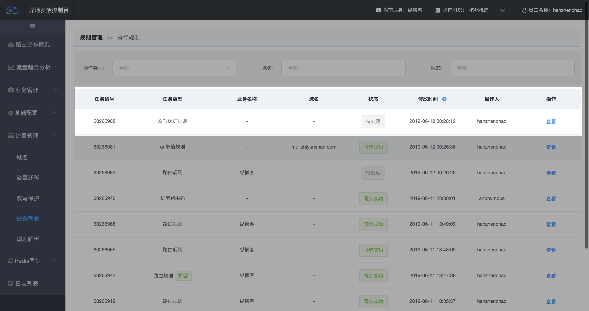

# 如何保证数据一致性？

> 双机房的数据库同步使用的是otter双向同步，网络不稳定时有一定的延迟。为了防止订单等关键性业务的数据一致性，需要避免同一笔订单的创建、支付回调、关单等操作在不同机房进行写库操作。

【流量管理->流量迁移->双写规则】

如上图所示：

- 【域名+请求路径】: 判断是否双写规则的请求。
- 【关键字取值位置+关键字key】/【脚本】: 获取种植的关键字，然后从redis里获取关键字对应的机房，并将请求转发至正确机房！
- 【操作列-禁用】：禁用后，该url将走路径规则和路由规则。
- 【操作列-启用】：启用后，该url将走双写规则。

### 如何添加双写规则

双写规则包含以下关键字段：

- 基础域名：`test.zonghengke.com`,必须是多活域名。
- 请求路径：必须以斜线“/”开头；
- 关键字位置：body/header/form/cookie
- 关键字key：字段名称
- lua脚本：lua脚本获取关键字。【lua脚本非空时，忽略关键字位置和关键字key】
- 是否开启机房码：否-获取关键字从redis获取机房信息。是-获取机房码，从机房码规则中获取机房信息。【1，2-社餐；3，4-团餐】
- 是否回调：预留字段

**点击【提交】创建待推送任务，找到待推送任务并同步规则生效。**

