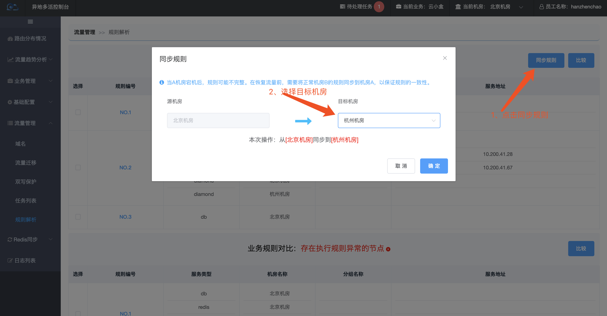

## 规则对比出现多条规则编号怎么办？

需要分情况处理这个问题：

- **只有一个数据库节点出现规则不一致：**

  此情况应该为数据同步有问题，延时较大或者同步已经停止，只需要等待数据同步完成或者DBA帮忙手动同步数据即可。

- **存在Nginx或者Diamond节点规则不一致且不一致的一方没有流量：**

  此情况应该为不一致的一方灾后恢复之前的状态，在有流量的机房操作规则同步即可

- **存在Nginx或者Diamond节点规则不一致且不一致的一方有流量：**

  此时规则不一致需要立即编辑规则，生成推送任务并同步至各个节点，尝试将规则修复为一致。如果推送失败，可以考虑摘除异常节点所在的分片或者机房流量