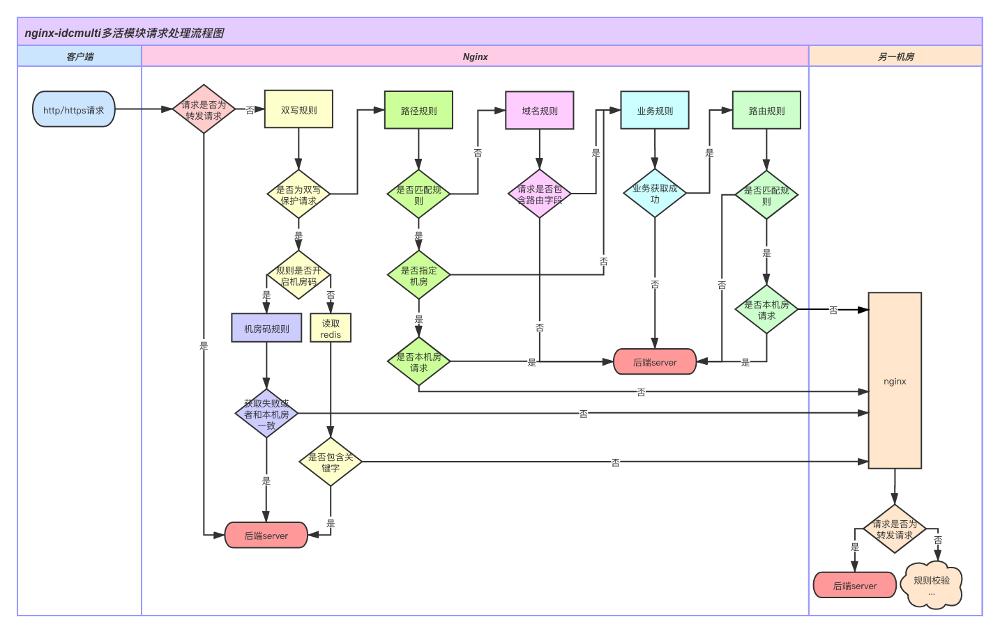
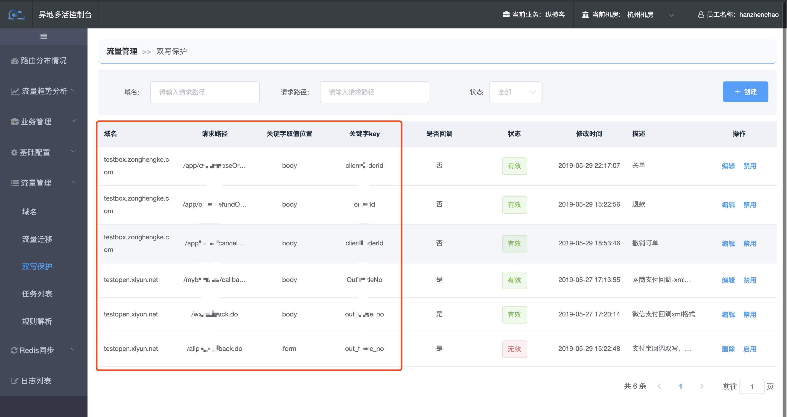
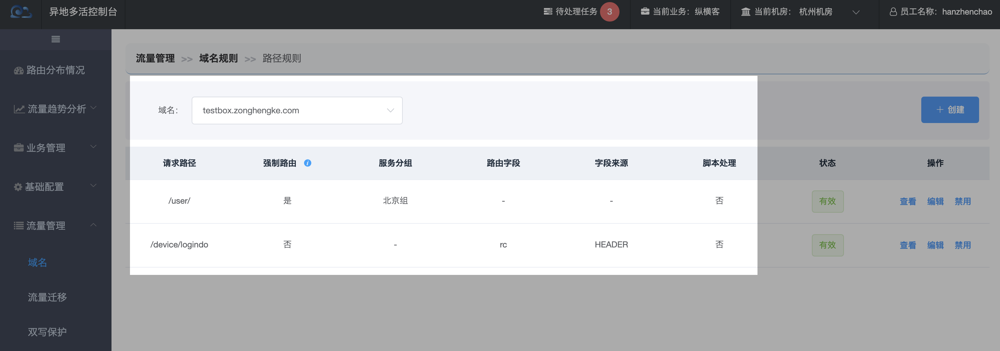
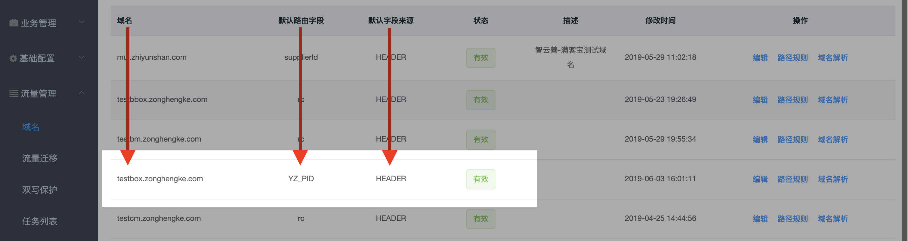
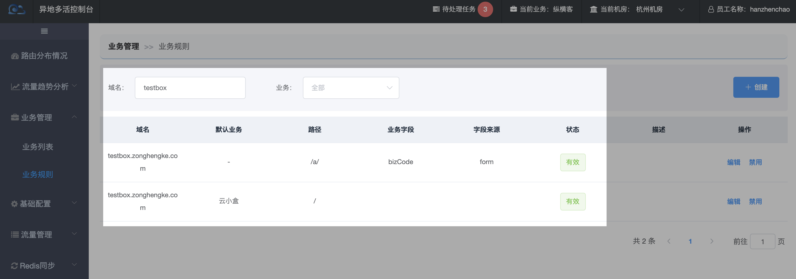

# Nginx是如何路由一个请求的？

nginx存储了【[双写规则](http://multi-idc.box.zonghengke.com/book/_book/double_write_rule.html)】、【机房码规则】(配置在diamond)、【[路径规则](http://multi-idc.box.zonghengke.com/book/_book/url_rule_path.html)】、【[域名规则](http://multi-idc.box.zonghengke.com/book/_book/url_rule_domain.md)】、【[业务规则](http://multi-idc.box.zonghengke.com/book/_book/biz_rule.html)】、【路由规则】。nginx是如何根据这些规则决定一个请求到最终机房的呢？？？

## nginx处理多活请求流程图

[](http://multi-idc.box.zonghengke.com/book/_book/image/lua流程图.png)

## 举例说明：

客户端发来一个http 请求：

```java
    Request URL: http://testbox.zonghengke.com/order/createOrder.do
    Request Method: POST
    Request Headers*:
        Host: testbox.zonghengke.com
        YZ_PID:123
        (IDC:bj-0)
        (BIZ:yxh)
    Form Data:
        postSn:G0112A0345
        orderId:122121212121
        ....
```

### 步骤1、判断是否为转发请求：

lua转发请求时，会在请求的header里新增属性 IDC：机房前缀(标注从哪个机房跳转来的),BIZ：业务（所属业务）。

**是转发请求**，直接指向后台server，不再做规则判断，防止死循环跳转。

非转发请求，请看步骤2。

### 步骤2、双写规则：

[](http://multi-idc.box.zonghengke.com/book/_book/image/double_rule_list.png)

提取关键信息：

**域名**：`testbox.zonghengke.com`

**路径**：/order/createOrder.do，/order/*

判断是否匹配双写规则！

是：是否开启机房码？

 是：继续判断机房码规则，获取失败或者机房码是本机房，直接指向后台server，反之跳转机房。

 否：从redis获取种植的关键字。未获取到就指向后台server，反之取机房标识，本机房不跳转，反之跳转。

否：继续匹配路径规则，请看步骤3

### 步骤3、匹配路径规则

[](http://multi-idc.box.zonghengke.com/book/_book/image/nginx_route_url_rule.png)

 `testbox.zonghengke.com`配置了两个路径规则，

- testbox.zonghengke.com/user/,强制路由到北京机房，不匹配

- testbox.zonghengke.com/device/login.do，路由值在Header的rc字段，不匹配

  继续匹配域名规则

### 步骤4、匹配域名规则

[](http://multi-idc.box.zonghengke.com/book/_book/image/nginx_route_domain_rule.png)

根据域名规则，Header里的YZ_PID就是路由值。

若路由值获取为空，指向后台server。

此次请求的路由值是YZ_PID:123，继续匹配业务规则，请看步骤5

### 步骤5、匹配[业务规则](http://multi-idc.box.zonghengke.com/book/_book/biz_rule.html)找出所属业务

[](http://multi-idc.box.zonghengke.com/book/_book/image/nginx_route_bizrule.png)

`testbox.zonghengke.com`配置了两个规则，

- testbox.zonghengke.com/a/,业务是form表单的bizCode字段，不匹配
- testbox.zonghengke.com/，业务是云小盒，匹配

所以所属业务为云小盒。

### 步骤6、获取该业务的路由规则

根据步骤5中获取的业务，找到该业务的路由规则！

- 1、精确匹配路由值=123的规则。 匹配成功，获取机房信息，本机房不跳转；非本机房，跳转！ 匹配失败，继续第2步
- 2、模值匹配：将123按算法取模，匹配模值所在机房。 匹配成功，获取机房信息，本机房-不跳转；非本机房-跳转！ 匹配失败，本机房-不跳转