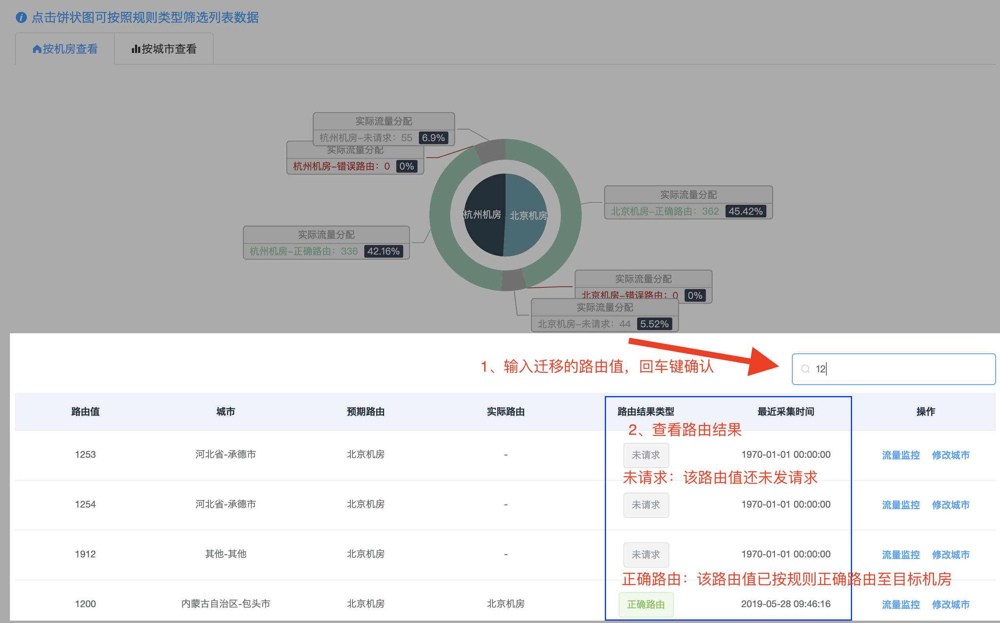
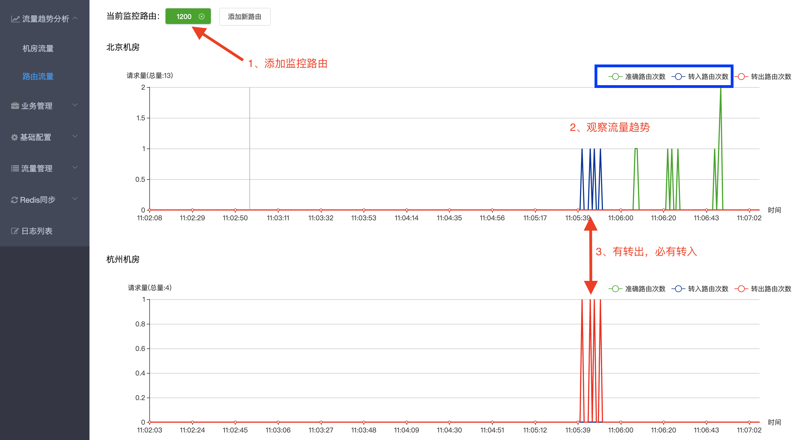

# 我迁移了一个路由值，如何验证是否生效?

将一个或多个路由值迁移至目标机房后(迁移流量请参考【[如何迁移路由流量](http://multi-idc.box.zonghengke.com/book/_book/route_change.html)】)，同步规则，确保所有节点成功后，可按照以下方式验证！

**方法1：[首页路由分布检索](http://multi-idc.box.zonghengke.com/book/_book/route_change_check.html#step1)**

**方法2：[路由流量监控](http://multi-idc.box.zonghengke.com/book/_book/route_change_check.html#step2)**（**推荐**）

------

### 方法1:首页路由分布检索

【[路由分布情况](http://multi-idc.box.zonghengke.com/book/_book/route_area.md)】 

1、输入迁移的路由值，回车键确认。支持精确和模糊搜索。

2、查看路由结果。

- 未请求：为收到包含该路由值的请求。（继续等待或者采用方式2观察！）
- 正确路由：已收到该路由值的请求，并且路由到了预期机房。（迁移已生效！）
- 错误路由：已收到该路由值的请求，但路由到了非预期机房。（迁移未生效！请采用方式2继续观察）

------

### 方法2:路由流量监控

【[流量趋势分析->路由流量](http://multi-idc.box.zonghengke.com/book/_book/routes_flow_monitor.md)】 

1、添加路由【1200】监控。 添加方式：

- 手动添加
- 在方法1中的列表页，找到要监控的路由值，操作列点击【流量监控】按钮,自动跳转到路由流量页，只选中当前路由值监控即可。

2、观察流量趋势图：

如果目标机房【北京机房】只有蓝色和绿色的线条，说明请求到了目标机房，迁移已生效！

- 转入路由：蓝色线条。（说明请求第一次到了其他机房，nginx规则判断路由到北京机房）
- 准确路由：绿色线条。（说明请求到了北京机房，nginx规则判断无需跳转！）

如果源机房【杭州机房】没有或者只有红色线条，说明请求转出到了目标机房，迁移已生效！

- 转出路由：红色线条。（说明请求第一次到了杭州机房，nginx规则判断不是本机房路由，需要转出到目标机房！）