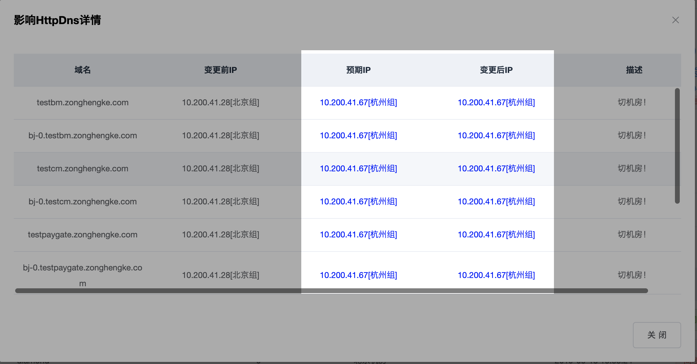
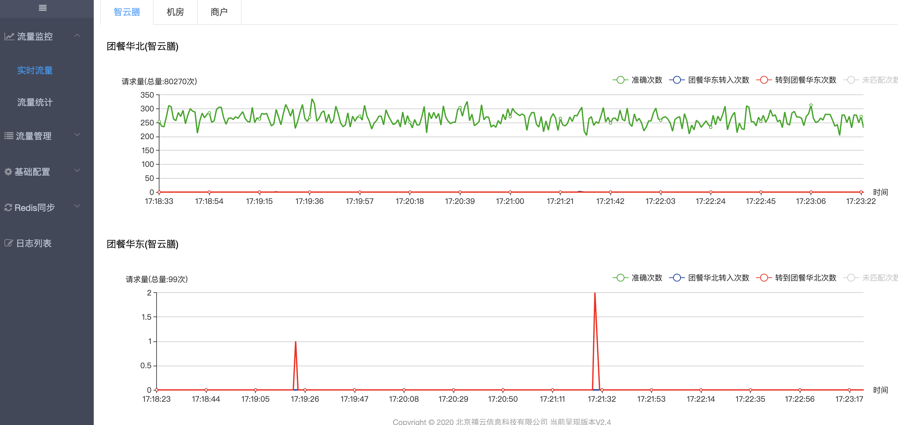

# 我切了机房，如何验证是否生效?

- [步骤1：域名IP是否正确](http://multi-idc.box.zonghengke.com/book/_book/idc_change_check.html#step1)
- [步骤2：路由流量分布](http://multi-idc.box.zonghengke.com/book/_book/idc_change_check.html#step2)
- [步骤3：机房流量是否正常](http://multi-idc.box.zonghengke.com/book/_book/idc_change_check.html#step3)

------

### 步骤1:域名IP是否正确

1、检查该业务的所有域名(共享域名除外)是否都将ip指向目标机房！

 域名缺失：[Q_ip](http://multi-idc.box.zonghengke.com/book/_book/Q_ip.md)

2、对比【预期IP】和【变更后IP】

- 一致：修改HttpDns正确。

- 不一致：【流量管理-域名-域名解析】选择域名，点击【变更ip】

  

------

### 步骤2:路由流量分布

【流量管理-流量分布】

目标机房的路由占比达到100%。

------

### 步骤3:机房流量监控

情景1:A机房宕机，SLB不可用，A机房迁移至B机房。

 A机房没有流量(获取失败)，B机房流量突增。

情景2:业务调整需要摘掉A机房的全部流量，A机房迁移至B机房。

 A机房都是转出流量，并且慢慢减少（DNS缓存更新）。B机房准确和转入流量增多，并且准确流量慢慢增加，转入慢慢减少。