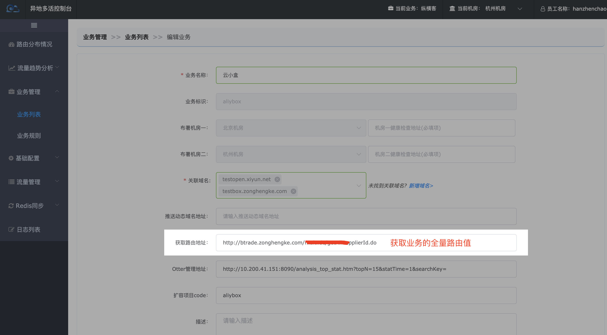
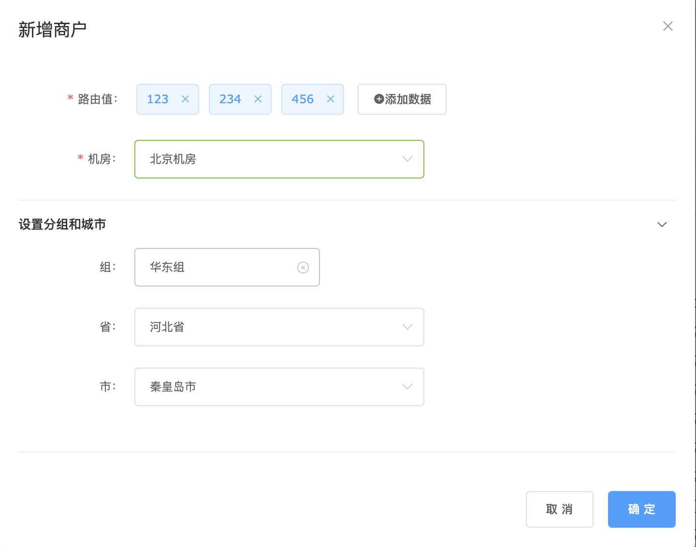
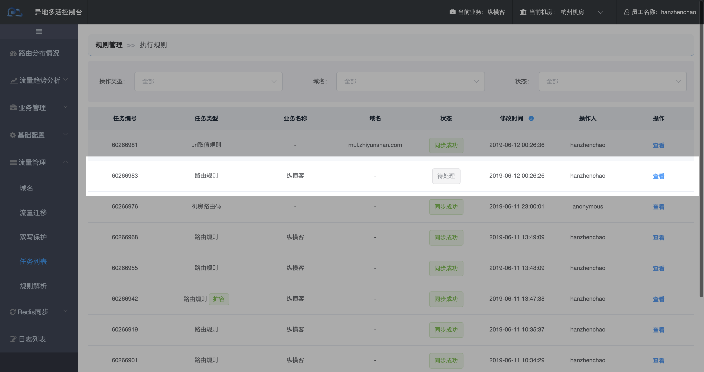

# 如何添加路由值

### 方法1、定时任务同步

在【**业务管理-业务列表**】选择业务点击【**编辑**】，配置了获取业务方全量路由值的地址。定时将新增的路由值，按当前的路由规则计算出所属机房并更新入库。定时任务维护在jobcenter。

Q1、新增了业务，如何立即同步全部路由值？

A：新增业务时，系统会立即请求获取全量路由值。后续会每天晚上同步一次！

### 方法2、手动添加

在【**流量管理-流量迁移-(tab页)按城市切**】点击 添加路由。

**点击【提交】，如果新增的路由值所属机房与其模值所在机房一致，将不会创建待推送任务。反之创建待推送任务并引导去执行规则！**

