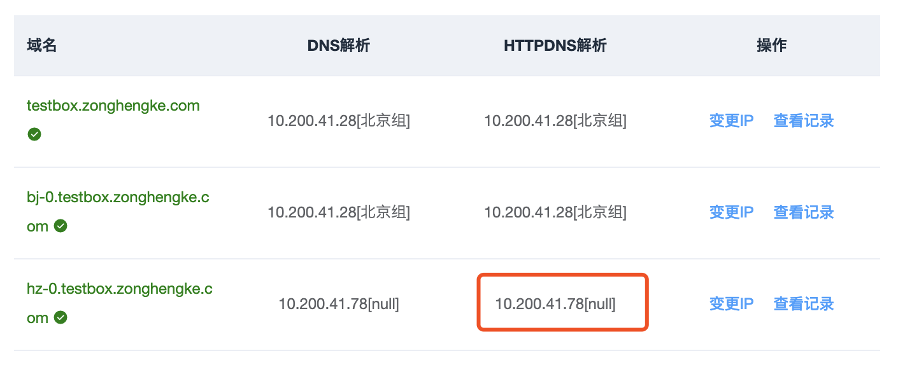
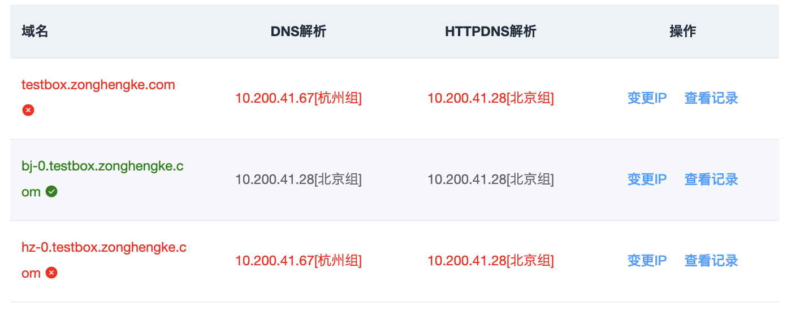
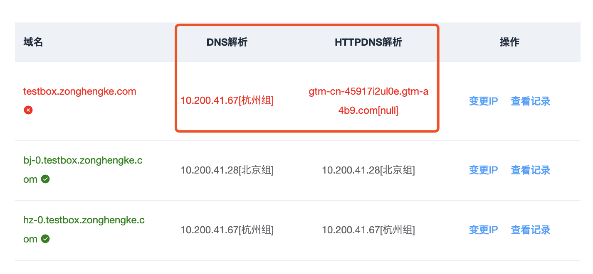

# httpdns解析和dns解析不一致怎么办？

#### 情景1:HTTPDNS解析的IP 未匹配分组名称！

**非正常！！！[手动变更IP](http://multi-idc.box.zonghengke.com/book/_book/Q_modify_IP.html),请立即与业务方负责人和运维确认！**

------

#### 情景2:HTTPDNS解析对，DNS解析不对

正常，DNS服务通常会缓存域名的解析结果，等待DNS服务更新缓存即可。

我们购买了阿里云解析的企业旗舰版，DNS一般会在1分钟左右就会刷新。

如果DNS长时间没有变更，有可能是这个区域的DNS有缓存。DNS缓存默认设置是48小时。

最终会一致！

------

#### 情景3:HTTPDNS解析为CNAME，DNS解析为IP

如果testbox.zonghengke.com配置了GTM策略(基础域名解析类型是CNAME)，Httpdns解析就是正常。DNS解析的IP是根据GTM策略返回的真实IP(登录杭州机房的多活平台，返回杭州机房的IP；登录北京的，返回北京机房IP)。

始终不一致！