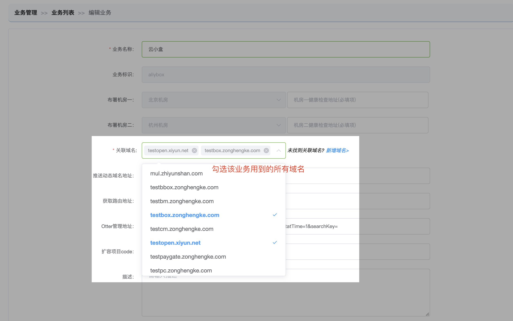
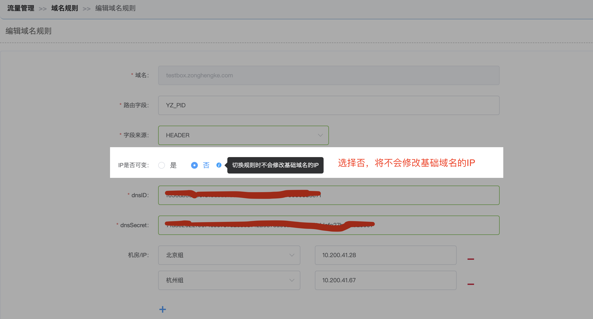

# 【影响httpdns数】与预期不一致怎么办?

#### 检查步骤：

- [1、业务未关联该域名](http://multi-idc.box.zonghengke.com/book/_book/Q_httpdns_diff.html#1)
- [2、域名的IP是否可变选择了【否】](http://multi-idc.box.zonghengke.com/book/_book/Q_httpdns_diff.html#2)
- [3、大流量机房路由值小于小流量机房](http://multi-idc.box.zonghengke.com/book/_book/Q_httpdns_diff.html#3)
- [4、域名关联了多个业务(仅限'切机房'操作)](http://multi-idc.box.zonghengke.com/book/_book/Q_httpdns_diff.html#4)

##### 上述都没问题：

[请联系我们](http://multi-idc.box.zonghengke.com/book/_book/callMe.html)

#### 1、业务未关联该域名

进入【基础配置-业务管理-业务列表】，选择当前业务，点击编辑，查看**"关联域名"** 

------

#### 2、域名的IP是否可变选择了**"否"**

进入【流量管理-域名】，选择域名，点击编辑，查看**"IP是否可变"** 

------

#### 3、大流量机房路由值小于一定的比例

场景描述：业务所在A，B机房，A为主流量，B为小流量，基础域名默认指向主流量机房。A宕机后，所有流量迁移至B，基础域名和动态域名都将变为B的IP。当A机房恢复时，将迁移流量至A，当A的路由个数占总个数的10%(diamond可配置)以上，默认域名的IP将变为A机房的IP，否则只变更A机房的动态域名的IP。

------

#### 4、域名关联了多个业务(仅限切机房操作)

多个业务都使用同一个域名，我们称之为共享域名。 共享域名在切机房时，需要判断它所关联的所有业务的路由值是否都已迁移至目标机房。

- 否-ip保持不变
- 是-变更为目标机房的ip